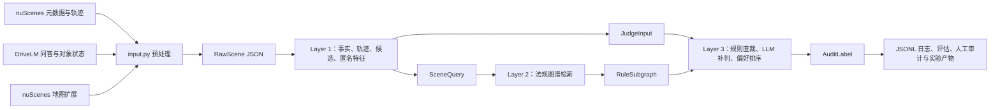

# RegGround-AV：用法规和可追溯证据审计自动驾驶候选轨迹

RegGround-AV 是一个面向研究的**离线轨迹审计与偏好标注系统**。它把自动驾驶场景、候选轨迹、交通法规图谱和大语言模型放到同一条可审计流水线中，回答两个问题：

1. 每条候选轨迹在当前可见证据下，是可以通过、应当否决，还是证据不足？
2. 在可以通过的候选中，哪一条相对更值得选择？

系统不会控制车辆，也不是实时驾驶软件。它的用途是生成研究标签、复现实验、分析失败原因和制作人工审查材料。任何输出都不应被当作现实道路上的驾驶指令、法律意见或完整交通法规解释。

> 第一次接触本项目时，建议先读“5 分钟快速开始”和“从输入到输出发生了什么”。只想了解或测试代码时，不需要 API 密钥，也不要直接启动真实运行器。

## 先用一分钟理解项目

可以把本项目想成一个有明确分工的“轨迹评审小组”：

- 第一层负责看数据：从 nuScenes、DriveLM 和地图中提取红灯、行人、停止线、候选速度等事实；
- 第二层负责查规则：根据事实从一个小型法规图谱中找到当前可能适用的规则；
- 第三层负责裁决：能用确定性几何规则判断的先直接判断，其余再交给 LLM；
- 最后把输入指纹、裁决来源、引用法规、失败和降级信息写入 JSONL，供复核和评分。

整个系统最重要的设计不是“永远给出答案”，而是：

- 候选必须匿名，不能把 `ground_truth`、`illegal` 等隐藏身份泄露给裁判；
- LLM 只能引用本次检索到的法规；
- 证据不足时必须保留 `uncertain`，不能偷偷当成通过；
- 被否决或不确定的轨迹不能进入最终选择；
- 自动规则与同源 benchmark 的一致，只能说明实现口径一致，不能自称准确率；
- 输入、代码、图谱或 prompt 语义变化后，要建立新实验版本，不能与旧结果混算。

## 项目能做什么，不能做什么

### 能做什么

- 把 nuScenes 分散的 JSON 表、DriveLM 问答和地图扩展整理为统一的 `RawScene` 数据；
- 从场景中提取信号灯、行人、对向车辆、路口和停止线等结构化事实；
- 从真实自车轨迹生成多种候选轨迹，并计算速度、停车、冲突区和时序交互特征；
- 将候选匿名化，隔离真实/合成来源和 benchmark 标签；
- 根据场景事实检索法规子图；
- 使用共享谓词和 LLM 生成 `cleared`、`vetoed` 或 `uncertain` 裁决；
- 只在 `cleared` 候选中做成对偏好比较并选出最终候选；
- 保存完整的审计日志、运行指纹、阶段诊断和评估结果；
- 生成几何盲审、人工标注、影子评估和 2×2 消融实验材料。

### 不能做什么

- 不读取摄像头或激光雷达原始点云并实时驾驶；
- 不覆盖所有城市、国家或全部交通法规；
- 不保证 LLM 的语义判断一定正确；
- 不把 `citation_validity=1` 等同于“法规适用完全正确”；它只表示引用 ID 在允许集合内；
- 不把合成轨迹名为 `illegal` 当成最终违规真值；最终 benchmark 仍由轨迹特征和共享谓词重新计算；
- 不把 `ground_truth` 轨迹天然视作合规或最优；
- 不把 `uncertain` 视作错误、通过或否决；它表示当前输入不足以形成闭环判断；
- 不提供现实道路上的法律保证或安全保证。

## 原始实验规模

下面的数字来自整理本代码仓库时使用的原始实验工作区，便于新人理解规模，并不是新的在线实验结果。为了控制仓库体积并避免分发第三方数据，这个公开代码版不包含表中提到的数据集、运行日志和生成产物：

| 项目 | 当前内容 |
|---|---:|
| mini 预处理输入 | `data/layer1/raw_scene_dataset_mini.json`，13 条 `RawScene` |
| trainval 预处理输入 | `data/layer1/raw_scene_trainval.json`，2,294 条 `RawScene` |
| 冻结评估单元 | `artifacts/eval_set_v1.json`，259 个场景 × 场景类型单元 |
| 冻结 v2 运行 | 259 条记录，174 条在准入阶段跳过，85 条进入完整裁决 |
| 完整裁决候选 | 85 × 6 = 510 条，其中规则引擎裁定 128 条、LLM 裁定 382 条 |
| 冻结运行失败 | 0 |
| 公开代码版自动测试 | 406 项：404 项通过，2 项因未发布私有标注 sidecar 而跳过 |

原始工作区的冻结结果保存在 `logs/eval_set_v2_full_v4_1.jsonl` 和 `results/`。这些目录不随代码版发布；如需复现实验，应先按后文准备数据并生成自己的新产物。表中数字必须结合版本、准入分母、是否跳过和是否可评分来解释，不能只摘一个百分比。

### 当前最重要的限制：A133 停止线几何口径

当前版本的 `governing_stop_line_signed_m` 和候选侵入深度存在“字段声明的几何语义”与“既有实现口径”不完全一致的问题，而且这个量参与候选生成和红灯谓词。已有冻结 v2 结果仍可按当时实现复现，但不应被描述成最终正确的停止线几何口径。

修复这类问题会改变候选本身，因此正确做法是：修复后建立新版本、重新生成候选、重新运行，再与旧版本分开报告，而不是直接覆盖旧日志。

## 关键术语

| 术语 | 通俗解释 |
|---|---|
| `RawScene` | 已把多个原始数据源拼在一起的一条场景记录，是第一层真正读取的输入 |
| `SceneFacts` | 从原始记录中提取的结构化事实，例如当前是否红灯、是否有移动行人 |
| `SceneQuery` | 第一层交给第二层的窄接口，只含法规检索需要的信息 |
| `JudgeInput` | 第一层交给第三层的窄接口，只含中性场景摘要和候选特征，不含原始坐标和隐藏标签 |
| candidate / 候选轨迹 | 同一场景下可供审计和比较的多条未来轨迹 |
| benchmark | 仅供离线评分使用的隐藏参考标签，不允许进入 LLM prompt |
| rule graph / 法规图谱 | `data/layer2/rule_graph.yaml` 中的小型结构化法规网络 |
| shared predicate / 共享谓词 | 规则引擎与 benchmark 共用的确定性三值判断逻辑 |
| `cleared` | 当前证据下通过硬规则检查，可以进入偏好排序 |
| `vetoed` | 有足够证据证明违反当前适用的硬规则 |
| `uncertain` | 证据或语义不足，不能可靠地通过或否决 |
| `exclude` | benchmark 侧的“不可评分/不应强行给真值”，不是线上裁决状态 |
| `chosen` | `cleared` 候选排序后的第一名；没有可选候选时为空 |
| `partial` | 某些候选不确定、引用被修复或阶段降级，但仍生成了可审计结果 |
| manifest | 日志开头的运行清单，记录代码、输入、图谱、prompt 和模型配置指纹 |
| frozen / 冻结 | 输入清单和哈希已经固定，正式实验期间不再随意改变 |

## 总体架构



边界非常重要：

- `SceneQuery` 不含候选轨迹坐标和 benchmark；
- `JudgeInput` 不含候选来源、变体类型、原始坐标和期望标签；
- `BenchmarkLabels` 只在评估侧保存；
- 第三层只看到匿名 ID，例如 `traj_a`、`traj_b`。

## 从输入到输出发生了什么

一次完整运行大致经历下面 12 步：

1. `input.py` 读取 nuScenes 的场景、样本、位姿、标注、传感器等 JSON 表。
2. 它只保留 `boston-seaport`，因为当前法规图按右行交通语境设计。
3. 它把 DriveLM 的关键对象状态和问答对齐到 nuScenes frame token。
4. 它沿 `LIDAR_TOP` 的 `sample_data.next` 收集密集自车位姿，并收集相关交通参与者轨迹。
5. 它在自车附近裁剪停止线、人行横道、道路和车道几何，写成 `RawScene`。
6. 第一层从 `RawScene` 提取结构化事实、真实自车轨迹和中性场景文本。
7. 第一层围绕真实轨迹生成多个候选，分析每条候选的速度、停车、冲突区和交互特征。
8. 第一层重新计算 benchmark，检测退化候选，并将候选随机但确定性地匿名化。
9. 第二层根据 `SceneFacts` 检索法规图谱；只有结构化事实完全未命中时才使用关键词兜底。
10. 第三层先用共享谓词直裁证据充分的候选，再把剩余候选交给 LLM。
11. 第三层验证引用，只在 `cleared` 候选之间做 pairwise 排序，并生成审计摘要。
12. 运行器把 manifest、逐场景 record、恢复事件和 summary 逐行写入 JSONL。

## 第一层：从场景数据得到匿名候选和中性事实

第一层位于 `src/layer1/`，推荐入口是 `src.layer1.facade.parse_scene()` 或 `parse_dataset()`。

### 第一层读取哪些信息

| 信息 | 主要来源 | 用途 |
|---|---|---|
| 自车未来轨迹 | nuScenes `ego_pose` 和 `LIDAR_TOP sample_data` | 重建真实轨迹、估计位移和转向意图 |
| 交通参与者 | `sample_annotation`、`instance`、`category`、`attribute` | 识别行人、对向车辆及其跨帧运动 |
| 信号灯相位 | DriveLM `key_object_infos` 中交通元素的 `Status` | 构造红灯/黄灯事实；只代表关键帧 `t=0` 的快照 |
| 场景文字 | DriveLM 图结构问答 | 生成中性叙述和关键词兜底 |
| 停止线与横道 | nuScenes Map Expansion | 构造冲突区、停止线距离和横道交互 |
| 道路与车道 | Map Expansion | 辅助判断路口、前向几何和可行路径 |

### `SceneFacts` 不是简单关键词

`SceneFacts` 会保存红/黄灯、灯态来源、路口状态、自车位移、转向意图、本向停止线、前方横道行人、行人运动状态、对向车辆运动状态、紧急车辆状态和轨迹窗口是否充足等字段。

例如，“附近有行人”并不足以触发行人让行逻辑。系统还会检查行人是否位于与自车前进路径相关的横道、是否运动，以及候选与行人是否共享冲突区和时间窗口。

### 候选轨迹如何产生

`TrajectoryAugmentor` 以真实自车轨迹为基础，生成这些内部变体：

- `ground_truth`：从自车位姿重建的原始轨迹；
- `conservative`：更保守的速度或停车行为；
- `aggressive`：更激进的速度行为；
- `illegal`：尝试注入与当前场景有关的违规行为；
- `suboptimal`：不一定违法，但驾驶质量较差；
- `hard_case`：边界或难判案例。

这些名字只是候选生成阶段的内部元数据。`illegal` 如果没有真正形成可见违规，会被标为退化或不可评分；`ground_truth` 也可能因为窗口、代理事实或规则冲突而被排除。第三层永远看不到这些名字。

### 候选特征包含什么

`TrajectoryAnalyzer` 不把原始 `(x, y, t)` 坐标直接交给 LLM，而是生成中性特征：

- 最大、最小和平均速度；
- 总行程、最大横向偏移和航点数量；
- 是否进入冲突区、何时进入、侵入深度；
- 是否完整停车、停车时长、是否在冲突区前停车；
- 与行人或对向车辆的到达时间、占区窗口和最小时间间隔；
- 一段禁止出现“违规”“合规”“应该”等结论词的自然语言摘要。

`feature_text_hash` 对 LLM 实际可见、按生产精度舍入后的特征文本做 SHA-256，可用于检查日志回放时特征是否漂移。

### 匿名化和泄露防护

候选由 `CandidateAnonymizer` 映射为 `traj_a`、`traj_b` 等 ID。种子固定时，映射和顺序可复现，但不能从匿名 ID 猜出候选类型。

第一层和第三层的 `LeakageGuard` 会拦截常见泄露字段或结论词，包括 `ground_truth`、`expected_verdict`、`variant_type`、原始 waypoints 和明显的预设违规描述。完整 benchmark 映射只保存在调试/评估侧。

## 第二层：根据事实检索法规图谱

第二层位于 `src/layer2/`，生产图谱是 `data/layer2/rule_graph.yaml`。

图谱不是一个大型法律数据库，而是当前研究范围内刻意保持较小的 MVP，包含：

- 条件节点，例如红灯、黄灯、横道行人、对向直行车和支路汇入；
- 行为节点，例如越过停止线、抢行和未让行；
- 道路参与者和后果节点；
- 7 条交通规则，其中包含硬规则和软规则。

当前主要规则如下：

| 规则 ID | 简化含义 | 等级 |
|---|---|---|
| `R-SIG-01` | 红灯相位下禁止越过停止线继续行驶 | hard |
| `R-SIG-02` | 黄灯相位下禁止加速抢行 | hard |
| `R-SIG-03` | 通行前确认路口安全 | soft |
| `R-YLD-01` | 横道内有行人时停车让行 | hard |
| `R-YLD-02` | 左转车辆让行对向直行车辆 | hard |
| `R-YLD-03` | 支路车辆让行主路车辆 | hard |
| `R-YLD-05` | 让行时保留充分安全间距 | soft |

检索顺序是：

1. `ConditionMatcher` 优先读取 `SceneFacts`；
2. 结构化事实有命中时，直接返回 `structured` 模式；
3. 完全没有结构化命中且允许 fallback 时，才用英文关键词做子串匹配；
4. `RuleGraph` 召回适用规则；
5. `ConflictResolver` 应用图中声明的 override，并保留被覆盖规则供审计；
6. 输出 `RuleSubgraph`，其中保存匹配条件、检索模式、图谱版本、耗时和规则状态。

当前生产图谱没有实际定义 override。多条同时适用的规则应解释为并行义务，不能说成互相覆盖。

## 共享谓词：规则引擎和 benchmark 共用的确定性判断

共享谓词位于 `src/compliance_predicates.py`。它只在“规则确实适用，而且轨迹履行证据足够”时直裁，返回三值结果：

| 谓词结果 | 在线裁判 | benchmark | 含义 |
|---|---|---|---|
| `DECISIVE_VETO` | `vetoed` | `vetoed` | 有明确违规证据 |
| `DECISIVE_CLEAR` | `cleared` | `cleared` | 有明确履行证据 |
| `NOT_DECIDABLE` | 继续交给 LLM | `exclude` | 不能靠共享谓词可靠判断 |

### 红灯停止线谓词

只有活跃规则包含 `R-SIG-01` 时才检查。主要门槛包括：

- 必须有红灯事实和本向停止线；
- 如果关键帧起点已经越线，不靠当前窗口强行否决；
- 右转红灯可能存在例外，因此不直接硬判；
- 灯态只是 `t=0` 快照，默认只在 2 秒有效窗内用于确定性越线判断；
- 在有效窗内越过本向停止线、侵入至少 0.15 米且之前未完整停车，才确定性否决；
- 未越线并在线前完整停车，才确定性通过；
- 临界侵入、缓行、有效窗外越线或缺少停车关系时，交给 LLM。

这一分支受 A133 几何口径问题影响，冻结结果必须按既有版本解释。

### 行人横道谓词

只有活跃规则包含 `R-YLD-01` 时才检查。主要逻辑是：

- 必须有位于前方相关横道中的移动行人；
- 候选在线前完整停车时可确定性通过；
- 候选和行人在共同冲突区发生时间重叠，且候选未提前停车时确定性否决；
- 最小时间间隔大于 3 秒时确定性通过；
- 缺少交互、没有共同冲突区或时间间隔处于边界带时交给 LLM。

对向左转让行 `R-YLD-02` 当前没有共享直裁谓词，所以“规则引擎没有否决”不等于“已经证明合规”。

## 第三层：规则直裁、LLM 补判和偏好排序

第三层位于 `src/layer3/`，入口是 `AuditJudge.judge()` 或包级 `src.layer3.judge()`。

### 1. 构建裁判上下文

`ContextBuilder` 把 `JudgeInput` 和 `RuleSubgraph` 组合成 `JudgeContext`，包括：

- 中性场景叙述；
- `SceneFactsDigest` 的文本投影；
- 活跃硬规则和软规则；
- 匿名候选特征；
- 可引用规则 ID；
- 估算的 prompt token 数。

`ContextBuilder` 会先按 `max_trajectories_per_judge` 和 `max_rules_in_context` 截取候选与规则；如果估算 token 仍超出 `max_prompt_tokens`，会先移除软规则，再次超限才报 `ContextTooLargeError`。因此修改这些上限会改变实际裁判输入，必须写入运行配置并作为实验差异对待。

### 2. 硬规则过滤

`HardFilter` 先调用规则引擎。共享谓词可以确定的候选直接得到 `cleared` 或 `vetoed`；不能确定的候选批量交给 LLM。

LLM 必须同时说明：

- 当前规则义务是否被触发；
- 候选是否履行了该义务；
- 如果否决，引用了哪条活跃硬规则。

超时或结构化输出错误按候选记录，系统可做候选级 deferred retry。仍无法完成时保留 `uncertain`，而不是默认放行。

### 3. 引用校验

`CitationValidator` 检查 LLM 返回的规则 ID 是否属于当前 `RuleSubgraph.active_rules`。无效引用会触发修复或降级，并写入 `citation_failures`。

这里验证的是“引用是否来自允许集合”，不验证法律解释是否完整、条款是否覆盖现实所有例外，也不代表裁决本身正确。

### 4. 只在通过候选中排序

`PreferenceRanker` 只接收 `cleared` 候选，两两比较驾驶质量，然后由 `PairwiseAggregator` 聚合排序。

- `vetoed` 不参与排序；
- `uncertain` 不参与排序；
- 只有一条 `cleared` 时直接成为第一名；
- 没有 `cleared` 时，`chosen_trajectory_id=None`，选择结果为 `no_choosable_candidate`；
- 低置信且明确表示“无法区分”的 pair 会记录为 tie/partial 信息。

### 5. 生成最终 `AuditLabel`

最终标签包含每条候选的状态、裁决来源、引用、排名、自然语言摘要、推理步骤、阶段耗时、token 用量、重试、连接异常和引用修复信息。

`AuditLabel.status` 与选择结果是两个概念：

- `complete`：没有记录到降级原因；
- `partial`：存在不确定裁决、低置信 pair、引用修复或阶段降级；
- `failed`：发生致命错误，结果不可用；
- `selected`：至少有一条可选择的 `cleared` 候选；
- `no_choosable_candidate`：流程可能成功，但没有通过候选；
- `unavailable`：最终报告失败或没有有效 verdict。

## 仓库目录说明

```text
.
├── README.md                     # 你正在阅读的新人总览
├── pyproject.toml                # Python 包、依赖、pytest、ruff、mypy 配置
├── uv.lock                       # uv 锁定的精确依赖版本
├── input.py                      # 原始 nuScenes/DriveLM/地图 → RawScene
├── input1.py                     # 早期一次性 fixture 生成脚本，不是正式入口
├── src/                          # 生产代码
│   ├── layer1/                   # 数据、事实、轨迹、候选、匿名化
│   ├── layer2/                   # 法规图谱加载、检索和冲突消解
│   ├── layer3/                   # 规则/LLM 裁判、引用、排序和标签
│   ├── admission.py              # 场景准入规则
│   ├── audit_run_logger.py       # 端到端运行器与 JSONL 写入
│   ├── compliance_predicates.py  # 在线/benchmark 共用三值谓词
│   ├── eval_set.py               # 冻结评估集和哈希校验
│   ├── evaluation_report.py      # v1/v2 分层评分
│   └── replay_context.py         # 从冻结日志安全回放 JudgeInput
├── data/
│   └── layer2/rule_graph.yaml    # 随代码发布的生产法规图谱
├── tests/                        # 核心单元、集成、回归和安全测试
├── scripts/                      # 正式运行、健康检查、诊断、影子评估
├── experiments/ablation_2x2/     # 与生产代码隔离的 2×2 消融
├── human_annotation_v1/code/     # 第一版人工盲标工具代码
├── human_annotation_v2/code/     # 第二版盲标、校准和回收校验代码
└── docs/                         # 各层设计、函数关系、评估口径和操作手册
```

`data/layer1/`、`v1.0-mini/`、`v1.0-trainval_meta/`、`artifacts/`、`logs/`、`results/`、人工标注结果以及论文工作区都被 `.gitignore` 排除。理解生产系统时应优先看 `src/`、`data/layer2/rule_graph.yaml`、测试和文档。

## 5 分钟快速开始：只在本地检查，不调用 LLM

以下命令假设你位于仓库根目录。项目要求 Python 3.12，推荐使用 `uv`。

### 1. 检查工具

```bash
python3 --version
uv --version
```

如果没有 `uv`，请先按 uv 官方方式安装。不要用系统 Python 直接向全局环境安装依赖。

### 2. 创建环境并安装依赖

```bash
uv sync --extra dev
```

这会根据 `pyproject.toml` 和 `uv.lock` 创建或更新 `.venv`。核心依赖包括 Pydantic、NumPy、nuScenes devkit、NetworkX、PyYAML、OpenAI/Anthropic SDK 和 Tenacity；开发依赖包括 pytest、ruff 和 mypy。

### 3. 运行核心测试

```bash
PYTHONDONTWRITEBYTECODE=1 uv run pytest -q
```

`pyproject.toml` 将默认测试目录设为 `tests/`。当前仓库在此范围内收集 378 项测试。

### 4. 运行扩展实验测试

```bash
PYTHONDONTWRITEBYTECODE=1 uv run pytest -q \
  tests \
  experiments/ablation_2x2/tests
```

测试使用 fake/mock LLM，不应发送真实网络请求。实际收集数量以当前代码版本的 pytest 输出为准。

### 5. 运行静态检查

```bash
PYTHONDONTWRITEBYTECODE=1 uv run ruff check src tests
PYTHONDONTWRITEBYTECODE=1 uv run mypy --explicit-package-bases src
git diff --check
```

`git diff --check` 用来发现尾随空格和补丁格式问题。`pyproject.toml` 还声明了 85% 覆盖率目标，但普通 `pytest -q` 不会自动执行覆盖率门禁；需要时显式加 `--cov=src --cov-report=term-missing`。

## 数据准备

### 哪些数据需要自行准备

代码仓库不包含下面这些大型或第三方数据：

- `data/layer1/raw_scene_dataset_mini.json`：13 条预处理 mini 记录；
- `data/layer1/raw_scene_trainval.json`：2,294 条预处理 trainval 记录；
- `v1.0-mini/`：nuScenes mini 元数据和地图扩展材料；
- `v1.0-trainval_meta/`：trainval 元数据和地图材料；
- `artifacts/eval_set_v1.json`：原始实验使用的 259 单元冻结评估集。

请按照 nuScenes 和 DriveLM 各自的许可及官方下载方式取得数据，再放到本地对应路径；这些路径已经加入 `.gitignore`，不会被意外提交。原始工作区中 `data/` 约 1.2 GB、`v1.0-mini/` 约 667 MB、`v1.0-trainval_meta/` 约 2.7 GB，它们并不等于完整的 nuScenes 原始传感器数据集。

### `RawScene` 大致包含什么

每条 `RawScene` 包含：

- `scene_id` 和 `frame_token`；
- 数据来源路径和地点；
- 当前 DriveLM 帧的问答、对象状态和关键词；
- 约 6 秒裁决窗口的 `ego_poses`；
- 候选生成使用的更长 `path_ego_poses`；
- 当前及相关帧的交通参与者标注和轨迹；
- 附近停止线、横道、车道和可行驶区域的 `map_records`；
- 关键帧位置等辅助字段。

正式运行读取的是这个预拼接 JSON，而不是每次重新遍历所有原始传感器文件。

### 重建 mini 输入

如果本地 `v1.0-mini/` 结构完整，可以使用默认路径：

```bash
uv run python input.py \
  --source-root v1.0-mini \
  --output data/layer1/raw_scene_dataset_mini.json \
  --horizon-s 6 \
  --path-horizon-s 12 \
  --min-poses 20
```

`input.py` 会自动寻找：

- `v1.0-mini/v1_0_train_nus.json`；
- `v1.0-mini/nuScenes-map-expansion-v1.3/expansion/boston-seaport.json`。

找不到 DriveLM 或地图时仍可生成 nuScenes-only 输入，但场景语义和几何证据会减少，结果不能与完整输入直接比较。

### 重建 trainval 输入

```bash
uv run python input.py \
  --source-root <nuScenes>/v1.0-trainval \
  --drivelm-qa-path <DriveLM>/v1_0_train_nus.json \
  --map-expansion-path <MapExpansion>/boston-seaport.json \
  --map-radius-m 50 \
  --output data/layer1/raw_scene_trainval.json \
  --horizon-s 6 \
  --path-horizon-s 12 \
  --min-poses 20
```

参数含义：

- `--source-root`：包含 nuScenes 必需 JSON 表的目录；
- `--drivelm-qa-path`：DriveLM 问答 JSON；
- `--map-expansion-path`：Boston 地图扩展 JSON；
- `--map-radius-m`：每个关键帧周围保留地图记录的半径，默认 50 米；
- `--horizon-s`：裁决使用的未来轨迹窗口，默认 6 秒；
- `--path-horizon-s`：候选生成可借用的长路径窗口，默认 12 秒，不能短于前者；
- `--min-poses`：保留一条记录所需的最少位姿数，默认 20；
- `--format`：`auto`、`json` 或 `yaml`，默认按输出后缀判断。

重建正式输入会改变文件哈希。已有冻结评估集记录了 `input_sha256`，所以新输入通常不能直接搭配旧评估集运行。

## 场景准入和冻结评估集

端到端运行不是对所有输入都调用 LLM。`src/admission.py` 会先检查：

- 黄灯和紧急车辆目前属于范围裁剪；
- 轨迹窗口是否足够；
- 场景类型是否可识别；
- 自车位移是否过小、信息量不足；
- 是否存在结构化法规事实。

跳过也会写入 record，保留具体 `skip_reason`。因此“259 条记录”不等于“259 条都调用了 LLM”。当前冻结运行中实际进入完整裁决的是 85 条。

`artifacts/eval_set_v1.json` 虽然文件名为 v1，但它是当前冻结单元清单；日志中的 `benchmark_data_version=2026-07-v2` 才表示评分标签口径。两种版本号描述的是不同对象，不要混淆。

冻结评估集记录：

- 每个 frame token、scene token 和 scenario type；
- 选择规则与 mini 排除原因；
- 输入文件 SHA-256；
- 分类/准入源码清单和组合哈希；
- 生成 commit 和确定性检查状态。

运行器会检查输入哈希和分类代码哈希。任一不一致都会拒绝把旧清单当作正式冻结集使用。

如果确实要重建评估集，先生成 draft 并人工审阅；只有 clean Git worktree 才允许 `--freeze`：

```bash
uv run python -m src.layer1.availability_spike \
  --prepared-input data/layer1/raw_scene_trainval.json \
  --mini-scenes v1.0-mini/scene.json \
  --output artifacts/trainval_availability_spike_new.md \
  --eval-set-output artifacts/eval_set_new.draft.json \
  --verify-determinism
```

不要为了绕过哈希检查手改冻结 JSON。输入或分类语义变化时，应明确创建新版本。

## 配置 LLM

只有真实端到端运行、影子执行和 live 消融需要 LLM。测试、静态检查、评分已有日志和大多数诊断脚本不需要密钥。

### 最小配置

```bash
export LAYER3_LLM_PROVIDER=openai_compatible
export LAYER3_LLM_MODEL=<模型名称>
export LAYER3_LLM_MODEL_VERSION=<用于日志的版本说明>
export LAYER3_LLM_API_KEY=<密钥>
export LAYER3_LLM_BASE_URL=<兼容服务地址>
export LAYER2_RULE_GRAPH_PATH=data/layer2/rule_graph.yaml
```

支持的 provider 是 `openai`、`anthropic` 和 `openai_compatible`。具体模型名、base URL、账号权限和价格由你使用的服务决定。

### 常用环境变量

| 环境变量 | 作用 | 代码默认值/说明 |
|---|---|---|
| `LAYER2_RULE_GRAPH_PATH` | 法规图谱路径 | `data/layer2/rule_graph.yaml` |
| `LAYER2_ENABLE_KEYWORD_FALLBACK` | 无结构化命中时是否允许关键词兜底 | `true` |
| `LAYER3_LLM_PROVIDER` | SDK/协议类型 | `openai_compatible` |
| `LAYER3_LLM_MODEL` | 模型名称 | 运行前应显式设置 |
| `LAYER3_LLM_MODEL_VERSION` | 写入 manifest 的模型版本说明 | 运行前应显式核对 |
| `LAYER3_LLM_API_KEY` | 模型服务密钥 | 真实运行前必须显式设置 |
| `LAYER3_LLM_BASE_URL` | OpenAI 兼容接口地址 | 按服务商设置 |
| `LAYER3_LLM_TIMEOUT_SECONDS` | 通用请求超时 | 180 秒 |
| `LAYER3_LLM_MAX_RETRIES` | 结构化输出/调用重试 | 1 |
| `LAYER3_HARD_FILTER_TIMEOUT_SECONDS` | hard filter 单次请求超时 | 180 秒 |
| `LAYER3_HARD_FILTER_MAX_RETRIES` | hard filter 重试次数 | 2 |
| `LAYER3_DEFERRED_RETRY_ROUNDS` | 候选级清扫轮数 | 3 |
| `LAYER3_MAX_PROMPT_TOKENS` | 上下文 token 上限 | 8,000 |
| `LAYER3_PHASE_VALIDITY_HORIZON_S` | 红灯快照确定性有效窗 | 2 秒 |
| `LAYER3_ARCHIVE_LLM_IO` | 是否归档完整 LLM 输入输出 | 默认关闭，敏感且占空间 |
| `LAYER3_DISABLE_RULE_ENGINE` | 是否关闭规则直裁 | 只用于影子/消融，不是常规生产设置 |
| `LAYER3_LLM_INPUT_PRICE_PER_MILLION_USD` | 输入 token 单价 | 可选，用于成本估算 |
| `LAYER3_LLM_OUTPUT_PRICE_PER_MILLION_USD` | 输出 token 单价 | 可选，用于成本估算 |

### 密钥、隐私和费用提醒

- 不要把密钥写入 README、脚本、日志或提交历史；
- 不要依赖源码中的任何默认凭据或默认服务地址，真实运行前应显式覆盖并核对；
- 共享过的密钥应立即轮换；
- 真实 prompt 会包含数据集派生的场景叙述、匿名轨迹特征和法规文本，运行前确认数据传输合规；
- `LAYER3_ARCHIVE_LLM_IO=true` 会增加敏感内容和磁盘占用，只在明确需要调试时开启；
- 直接执行 `src.audit_run_logger` 会进入 Layer 3，可能发出真实网络请求并产生费用。只想本地浏览项目时不要运行它。

## 运行端到端审计

### 先做小规模真实冒烟

下面的命令会调用配置的真实 LLM，可能产生费用：

```bash
PYTHONDONTWRITEBYTECODE=1 uv run python -m src.audit_run_logger \
  --input data/layer1/raw_scene_dataset_mini.json \
  --serial \
  --limit 10 \
  --output logs/mini_smoke_new.jsonl
```

建议第一次使用：

1. 先确认测试全部通过；
2. 使用新的输出文件名，不覆盖冻结日志；
3. 先 `--limit 1`，检查 manifest 和第一条 record；
4. 再逐步提高到 10；
5. 冒烟阶段使用 `--serial`，便于定位问题。

### 使用冻结评估集运行

```bash
PYTHONDONTWRITEBYTECODE=1 uv run python -m src.audit_run_logger \
  --input data/layer1/raw_scene_trainval.json \
  --eval-set artifacts/eval_set_v1.json \
  --seed 42 \
  --serial \
  --output logs/eval_set_v2_new.jsonl
```

也可以使用包装脚本：

```bash
bash scripts/run_regground_v2_1.sh logs/eval_set_v2_new.jsonl
```

包装脚本会：

- 要求 `artifacts/eval_set_v1.json` 存在；
- 要求显式设置 `LAYER3_LLM_API_KEY`；
- 固定使用 trainval 输入、评估集、seed 42 和串行模式；
- 运行结束后自动按 benchmark v2 评分。

### 并发、断点和续跑

不传 `--serial` 时，`--max-concurrency` 控制同时在飞的场景数，默认 5。每个场景内部的 pairwise 比较也可能并发，因此提高场景并发前要考虑服务端速率限制。

固定 `--output` 路径存在时，运行器会读取已有 JSONL，并按 `frame_token` 跳过已经完成的单元，同时追加 `run_resumed` 事件。续跑只适用于同一输入、代码、图谱、prompt 和模型配置下的中断恢复。

不要用续跑把不同代码版本、不同模型或不同 prompt 混进同一个文件。发现影响结果的实现问题后，应换新输出路径完整重跑。

## JSONL 输出怎么读

运行器是一行一个 JSON 对象，主要有四种记录：

### `manifest`

文件第一行通常是 manifest，包含：

- 开始时间和 Git commit；
- 输入路径与 SHA-256；
- 评估集版本、条目数与 SHA-256；
- benchmark 和共享谓词版本；
- 图谱、关键源码和 prompt 哈希；
- 模型、超时、重试、token 上限等配置；
- 密钥是否存在的非敏感摘要，而不是完整密钥。

### `record`

每个评估单元一条，包含：

- 原始 scene/frame 身份和准入结果；
- 第一层场景、匿名候选和 benchmark 调试字段；
- 第二层匹配条件、规则子图和检索模式；
- 第三层最终 `AuditLabel`；
- 每阶段耗时、LLM token、调用、重试和 deferred retry；
- 错误或跳过原因。

### `event`

例如恢复已有输出文件时追加的 `run_resumed`。

### `summary`

文件末尾的批次汇总，包括记录数、失败、跳过、场景分布、选择分布、LLM 调用量、成本状态和 benchmark 分层统计。

JSONL 可能很大，推荐使用 `jq` 或项目脚本读取，不要直接在编辑器里一次性展开全文。例如：

```bash
jq -s 'map(select(.type == "summary")) | last' logs/eval_set_v2_full_v4_1.jsonl

jq -s '[.[] | select(.type == "record") | .data.ok] | group_by(.) | map({value: .[0], count: length})' \
  logs/eval_set_v2_full_v4_1.jsonl
```

## 评分和健康检查

### 生成评估报告

评分时必须显式声明 benchmark 版本：

```bash
PYTHONDONTWRITEBYTECODE=1 uv run python -m src.evaluation_report \
  logs/eval_set_v2_new.jsonl \
  --benchmark-version v2 \
  --output results/evaluation_report_v2_new.json
```

如果日志没有声明 benchmark 版本、混有多个版本，或请求的版本与日志不符，脚本会拒绝评分。

### 检查日志结构和行为健康

```bash
uv run python scripts/check_log_health.py \
  logs/eval_set_v2_new.jsonl \
  --verdicts artifacts/health_verdicts_new.jsonl \
  --summary artifacts/health_summary_new.json \
  --details artifacts/health_details_new.json
```

健康检查关注：

- record 是否成功且字段完整；
- `status`、`partial_reasons`、选择结果和 verdict 是否相互一致；
- chosen 是否一定来自 `cleared`；
- 候选数与 pairwise 数是否对得上；
- 是否出现泄露标记、未知裁决来源或摘要方向冲突；
- manifest、总数、429、重试和降级是否可解释。

健康检查通过只表示日志结构和预注册行为门禁没有明显问题，不等于模型语义准确。

### 诊断性审计

```bash
uv run python -m scripts.diagnostic_audit crosstab \
  --eval logs/eval_set_v2_full_v4_1.jsonl \
  --output diagnostics/new_audit

uv run python -m scripts.diagnostic_audit sample \
  --eval logs/eval_set_v2_full_v4_1.jsonl \
  --output diagnostics/new_audit
```

`render` 子命令还可以读取 `RawScene` 和可选候选轨迹缓存生成图片。如果日志没有保存候选 waypoints，脚本会明确跳过，不会伪造轨迹。

## 人工标注 v2

`human_annotation_v2/` 用于检查系统与人在**相同可见证据**下的判断是否一致。标注者不是全知裁判：他们也看不到原始候选身份、benchmark 和隐藏几何真值。

当前包包含：

- 8 行校准轮；
- 200 行正式 verdict 工作簿；
- 36 场偏好工作簿；
- public 盲标材料；
- `private/` 中的分层、系统判决和映射 sidecar；
- 回收校验、工作簿导出、QA 预览和补充批脚本。

发放时只能给标注者工作簿，不能把 `private/`、运行 JSONL、manifest 或隐藏 sidecar 一并发出。

回收后先校验：

```bash
uv run python human_annotation_v2/code/validate_returns.py \
  --input path/to/rater_a_completed.xlsx \
  --template human_annotation_v2/results/blind_annotation_template.xlsx \
  --output human_annotation_v2/results/return_validation_rater_a.json
```

校准表和偏好表使用同一脚本，只需换模板。未通过校验的行应退回补标，不能直接进入 IAA、仲裁或 gold。

重新导出工作簿需要 Codex bundled artifact Node 运行时，不能随意改用另一套 Excel 库，否则可能改变公式、格式或回读行为。完整操作见 `human_annotation_v2/README.md`。

## 2×2 消融实验

`experiments/ablation_2x2/` 与生产 `src/` 隔离，不 monkey-patch 生产代码。四个条件固定为：

| 条件 | GraphRAG | 引用校验 | 规则引擎 |
|---|---:|---|---:|
| `full` | 开 | enforce | 关 |
| `no_validation` | 开 | observe | 关 |
| `no_rag` | 关 | enforce，但提供完整法规目录 | 关 |
| `baseline` | 关 | observe | 关 |

这里关闭规则引擎，是为了单独研究“检索”和“输出验证”对 LLM 的作用，不代表生产系统应关闭规则引擎。

### 先跑 dry-run

```bash
uv run python -m experiments.ablation_2x2.run_ablation \
  --dry-run \
  --backend dry \
  --artifact-node <bundled-node-executable> \
  --artifact-node-modules <bundled-node-modules>
```

默认输出到 `results/ablation_2x2/DRY_RUN/`。它与正式目录隔离，可用 `--stop-after 1` 检查单场景，并用同一命令续跑。

### live 运行

正式运行需要已经冻结且标记 `gold_finalized: true` 的场景清单，并会调用 LLM：

```bash
uv run python -m experiments.ablation_2x2.run_ablation \
  --backend live \
  --confirm-gold-final \
  --scenarios experiments/ablation_2x2/units/human_gold_82.json \
  --output-dir results/ablation_2x2 \
  --artifact-node <bundled-node-executable> \
  --artifact-node-modules <bundled-node-modules>
```

当前仓库还提供 `blinded_inference_82.json`，用于 gold 仲裁完成前先冻结相同 82 场输入。盲态推理必须输出到独立 `BLINDED_INFERENCE` 目录，不能提前计算或发布人工 gold 指标。

完整的 gold 构建、引用评级工作簿和重评分流程见 `experiments/ablation_2x2/README.md`。

## 影子评估、几何盲审和其他脚本

### 关闭规则引擎的影子评估

先做不会调用 LLM 的计划检查：

```bash
uv run python scripts/run_shadow_no_rule_engine.py --dry-run
```

真正执行必须显式加 `--execute`，会重新调用 LLM 并产生费用：

```bash
uv run python scripts/run_shadow_no_rule_engine.py \
  --execute \
  --output-dir results/shadow_no_rule_engine_new
```

`--phase-continuity-assumption` 只用于特定评估臂声明相位连续假设，不修改生产 prompt，结果必须单独命名和解释。

### 几何谓词盲审

```bash
uv run python -m src.layer1.geometry_audit \
  data/layer1/raw_scene_dataset_mini.json \
  artifacts/geometry_audit_new \
  --record-index 6 \
  --record-index 8 \
  --seed 42
```

盲审图不应显示候选变体身份或系统 verdict。人工填写后使用 `--join` 合并答案并生成一致性报告。

### `scripts/` 中其他工具

| 脚本 | 作用 |
|---|---|
| `audit_gate3_local.py` | 在不调用正式 LLM 前检查冻结选择、结构池和可评分性 |
| `audit_gate3_smoke_behavior.py` | 审查 smoke 日志中的实际候选行为 |
| `build_gate2_visual_check.py` | 生成候选轨迹视觉检查页 |
| `build_trigger_missing_review.py` | 生成人工复核 trigger-missing 样本 |
| `diagnose_idx6_speed.py` | 对指定评估索引做速度诊断 |
| `diagnose_pedestrian_injection.py` | 检查行人违规注入是否真正形成时间冲突 |
| `compare_shadow_phase_continuity.py` | 比较不同相位持续假设的影子结果 |
| `archive_*` | 固化影子/机制复核证据链和哈希 |
| `offline/recompute_signed_m.py` | 离线复算停止线 signed distance，属于审计工具而非在线修补 |

这些脚本大多会写产物。请给它们新的输出目录，不要覆盖冻结结果。

## 如何正确解释指标

项目中至少有三种统计单位：

- 场景/评估单元：一个 frame token 与 scenario type；
- 候选：一个匿名轨迹；
- pair：两条 `cleared` 候选的比较。

报告百分比时必须同时写清分子、分母、单位、版本和排除规则。

### 常见指标边界

- `violation_detection_rate`：只对满足相应 benchmark 可评分条件的候选计算；
- `false_veto_rate`：错误否决比例，不能把 `uncertain` 混入；
- `abstention_rate`：`uncertain` 比例；它反映覆盖与风险取舍，越低不一定越好；
- `chosen_acceptable_rate`：chosen 是否落在可接受集合，受 `no choice` 和排除定义影响；
- `citation_validity`：引用 ID 是否在当前允许集合，不是语义正确率；
- `predicate_human_agreement`：人工盲审与共享谓词的一致性，是评估确定性谓词所需的外部证据；
- `GT chosen/top2`：只是一种参考位置统计，不等于安全或法规准确率。

### 为什么同源 benchmark 不能证明规则引擎准确

共享谓词同时用于规则引擎和 benchmark 打标。二者对同一输入得到一致结果是预期的“构造一致性”，不能再把这个一致率当成外部准确率。真正的外部支持来自：

- 与系统隔离的几何盲审；
- 双人独立人工 verdict；
- IAA、合议 gold 和人工偏好；
- 关闭规则引擎的影子评估；
- 在人工 gold 子集上的 2×2 消融。

## 常见问题和排错

### `uv sync` 或 `uv run` 报缓存目录不可写

先确认当前用户对默认缓存目录有权限。临时环境可以把缓存放到可写目录，例如：

```bash
export UV_CACHE_DIR=/tmp/regground-uv-cache
uv sync --extra dev
```

这只改变依赖缓存位置，不应改变项目输出。

### Matplotlib 或 Fontconfig 报缓存不可写

可在临时环境中指定：

```bash
export MPLCONFIGDIR=/tmp/regground-mpl-cache
export XDG_CACHE_HOME=/tmp/regground-cache
```

首次构建字体缓存可能较慢。正式产物应记录运行环境，不要因缓存警告改变随机种子或数据。

### 找不到 `experiments` 模块

从仓库根目录使用模块方式运行：

```bash
uv run python -m experiments.ablation_2x2.run_ablation --help
```

不要在子目录中直接执行 `python run_ablation.py`，否则 Python 可能找不到顶层包。

### `eval_set` 哈希不匹配

说明输入文件或分类/准入代码已经变化。先确认自己是否真的要复现旧版本：

- 要复现旧版本：切换到对应 commit 和原始输入；
- 要测试新实现：创建新的 draft/frozen 评估集和新输出路径；
- 不要删除校验或手改哈希。

### 日志里很多 `skipped_by_admission`

这是预期行为。先看 `skip_reason` 分布，而不是把跳过当作 runner 失败。当前冻结 259 单元中有 174 单元按范围、窗口或信息量规则跳过。

### 日志里很多 `partial`

`partial` 常由 `uncertain_verdict` 触发，不等于整条 record 失败。检查 `partial_reasons`、各候选 verdict、阶段诊断和选择结果。

### `chosen_trajectory_id` 为空

如果所有候选都是 `vetoed` 或 `uncertain`，系统必须返回空 chosen 和 `no_choosable_candidate`。这比强行选择一条不可靠轨迹更符合项目设计。

### 没有地图也能跑吗

可以生成部分输入，但停止线、横道和冲突区证据会缺失，规则谓词会更频繁地不可直裁。无地图运行不能与完整地图运行直接比较。

### 为什么项目同时有 `eval_set_v1` 和 benchmark v2

`eval_set_v1` 是冻结样本清单的版本名；benchmark v2 是候选标签与评分口径版本。运行时两者会同时出现在 manifest 中，各自有独立含义。

### 为什么 `input1.py` 不在快速开始里

它是早期从 mini 数据抽取测试 fixture 的一次性脚本，会写入 `tests/layer1/fixtures/`，不是正式数据入口。正式预处理统一使用 `input.py`。

## 新人推荐阅读顺序

如果你只想理解系统，不必一开始读完所有历史文档。推荐顺序：

1. 本 README：先建立全局认识；
2. `src/layer1/models.py`：认识 `RawScene`、`SceneFacts`、`SceneQuery` 和 `JudgeInput`；
3. `src/layer1/facade.py`：看第一层如何把模块串起来；
4. `src/layer1/interface_adapter.py`：理解跨层隔离；
5. `data/layer2/rule_graph.yaml`：看当前系统到底有哪些规则；
6. `src/layer2/retriever.py`：看事实如何变成法规子图；
7. `src/compliance_predicates.py`：看确定性判断边界；
8. `src/layer3/judge.py`：看第三层总编排；
9. `src/audit_run_logger.py`：看正式运行、恢复和 JSONL；
10. `src/evaluation_report.py`：看指标如何分层；
11. 对应测试：确认边界条件和不变量；
12. `docs/RegGround-AV_完整项目指南.md`：需要更深入背景时再读完整设计说明。

按层深入时可以看：

| 文档 | 适合什么时候读 |
|---|---|
| [Layer 1 功能与接口](docs/Layer1_功能与接口设计文档_v3.1.md) | 想理解数据、候选和接口边界 |
| [Layer 1 函数与调用关系](docs/Layer1_函数与调用关系说明_v3.1.md) | 准备修改第一层代码 |
| [Layer 2 功能与接口](docs/Layer2_功能与接口设计文档_v3.0.md) | 想理解图谱 schema 和职责 |
| [Layer 2 函数与调用关系](docs/Layer2_函数与调用关系说明_v3.0.md) | 准备改检索逻辑或图谱 |
| [Layer 3 功能与接口](docs/Layer3_功能与接口设计文档_v3.0.md) | 想理解裁判语义和错误降级 |
| [Layer 3 函数与调用关系](docs/Layer3_函数与调用关系说明_v3.0.md) | 准备改 LLM、引用或排序代码 |
| [评估口径](docs/RegGround-AV_评估口径_v1.0.md) | 准备报告指标或比较实验 |
| [诊断性审计规程](docs/诊断性审计_脚本与人工审查规程_v1.md) | 准备做人审和诊断 |
| [人工标注 v2](human_annotation_v2/README.md) | 准备发放或回收人工标注 |
| [2×2 消融](experiments/ablation_2x2/README.md) | 准备运行消融 |

## 修改代码时必须守住的不变量

无论修改哪一层，都建议先写或更新测试，并检查这些不变量：

- Layer 2/3 不能接触 `BenchmarkLabels`；
- LLM prompt 不能包含候选原始身份、变体类型、expected verdict 或原始坐标；
- `vetoed` 必须引用至少一条活跃硬规则；
- `cleared` 和 `uncertain` 不能带“违反规则”列表；
- `vetoed`、`uncertain` 不能有排名；
- chosen 必须来自 `cleared`；
- 没有 `cleared` 时 chosen 必须为空；
- 结构化事实优先于关键词 fallback；
- 评估集、输入、prompt、图谱和关键代码变更必须反映在 manifest/版本中；
- dry-run、正式运行、盲态推理和历史冻结结果必须使用不同输出目录；
- 不得覆盖或悄悄重写冻结 JSONL、人工 gold 或原始实验 records。

## 最后说明

RegGround-AV 的核心价值是把“场景证据、法规来源、轨迹裁决、模型不确定性和人工复核”连成一条可以追踪的证据链。它并不假设规则引擎、LLM、自动 benchmark 或人工标注中的任何一方天然正确，而是尽量让每一个结论都能回答：使用了什么输入、看到了什么事实、引用了什么规则、由谁判断、为什么降级，以及应该在哪个版本和分母下解释。
