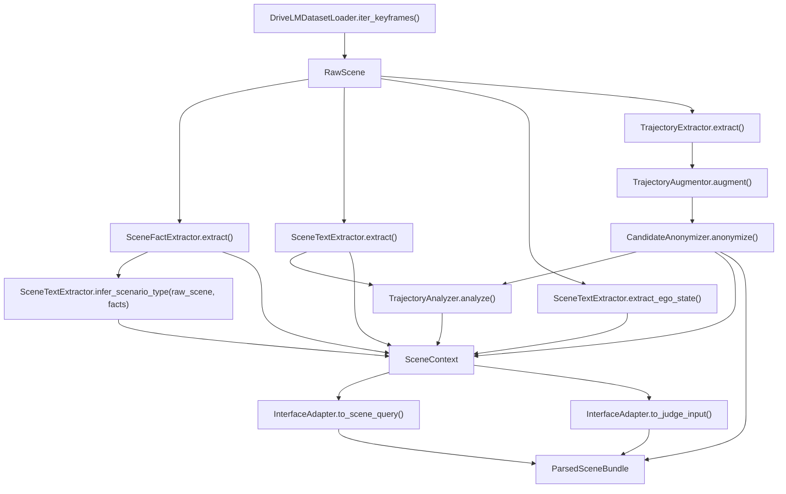

# Layer 1 函数与调用关系说明

**RegGround-AV 数据解析层代码阅读手册**

| 项目 | 内容 |
|---|---|
| 对应设计文档 | `docs/Layer1_功能与接口设计文档_v3.1.md` |
| 对应代码目录 | `src/layer1/` |
| 适用版本 | Layer 1 v3.2 Gate 3 候选实现（复冒烟通过前不冻结） |
| 主要读者 | 新加入开发者、Layer 2/3 对接人员、测试维护人员 |

---

## 1. 一句话定位

Layer 1 负责把 nuScenes、DriveLM QA 和 Map Expansion 数据解析成一个 `ParsedSceneBundle`：

- `context`: Layer 1 内部完整上下文，包含匿名候选轨迹和轨迹特征。
- `scene_query`: Layer 2 窄接口，只包含场景事实、关键词和场景类型，不含候选轨迹坐标。
- `judge_input`: Layer 3 窄接口，只包含 narrative 和轨迹语义特征，不含原始坐标和 benchmark 标签。
- `benchmark_labels`: benchmark 专用标签映射，保存匿名 ID 到内部 variant / expected verdict 的关系。

最推荐从两个 facade 函数开始读：

```python
from src.layer1 import parse_scene, parse_dataset
```

| 函数 | 用途 |
|---|---|
| `parse_scene(raw_scene, seed=42)` | 解析单个 keyframe，适合单测、debug、最小端到端样例 |
| `parse_dataset(nuscenes_root, drivelm_qa_path=...)` | 遍历 Boston-only DriveLM keyframes，逐个产出 `ParsedSceneBundle` |

---

## 2. 总体调用链



核心顺序：

1. `dataset_loader.py` 负责 I/O，把外部数据整理成 `RawScene`。
2. `scene_fact_extractor.py` 从 DriveLM status、nuScenes annotation 和 Map Expansion 中提取 `SceneFacts`。
3. `scene_text_extractor.py` 从 QA 文本中提取 narrative、keywords、ego speed 和 `ScenarioType`。
4. `trajectory_extractor.py` 从 dense `ego_poses` 重建真实轨迹。
5. `trajectory_augmentor.py` 生成 6 条候选轨迹。
6. `candidate_anonymizer.py` 打乱候选顺序并把 ID 改成 `traj_a`、`traj_b`。
7. `trajectory_analyzer.py` 把轨迹坐标转成 Layer 3 可读的数值语义摘要。
8. `interface_adapter.py` 生成 Layer 2/3 可见的最小接口。

---

## 3. 模块速查

| 模块 | 主要职责 | 主要输出 |
|---|---|---|
| `models.py` | 定义 Layer 1 所有数据模型、枚举和校验规则 | `RawScene`, `SceneContext`, `SceneQuery`, `JudgeInput`, `ParsedSceneBundle` |
| `facade.py` | 编排完整解析流程 | `ParsedSceneBundle` |
| `dataset_loader.py` | 加载 Boston-only DriveLM keyframes、ego pose、地图和标注 | `RawScene` |
| `scene_fact_extractor.py` | 提取结构化场景事实 | `SceneFacts` |
| `scene_text_extractor.py` | 提取 narrative、keywords、ego speed、scenario type | `SceneDescription`, `EgoState`, `ScenarioType` |
| `trajectory_extractor.py` | 将 ego pose 转为 keyframe 局部坐标轨迹 | `Trajectory(source=PLANNING)` |
| `trajectory_augmentor.py` | 基于真实轨迹生成候选轨迹 | `list[AugmentedTrajectory]` |
| `candidate_anonymizer.py` | 随机打乱并匿名化候选轨迹 ID | `list[Trajectory]`, `BenchmarkLabels` |
| `trajectory_analyzer.py` | 计算速度、空间和冲突区行为摘要 | `TrajectoryFeatures` |
| `leakage_guard.py` | 扫描和清洗标签词、合规结论词 | 安全文本或 `SceneValidationError` |
| `interface_adapter.py` | 从内部上下文导出下游窄接口 | `SceneQuery`, `JudgeInput` |
| `availability_spike.py` | 统计数据可得性 | `AvailabilityStats` |
| `exceptions.py` | 自定义异常层级 | `Layer1Error` 子类 |

---

## 4. models.py：核心数据结构

文件：`src/layer1/models.py`

### 4.1 枚举

| 类型 | 值 | 用途 |
|---|---|---|
| `TrajectorySource` | `prediction`, `planning`, `synthetic` | 标记轨迹来源；真实 ego pose 重建轨迹使用 `PLANNING` |
| `QACategory` | `perception`, `prediction`, `planning`, `behavior` | 表达 DriveLM QA 类别 |
| `LocationType` | `intersection`, `urban_road`, `unknown` | 场景位置粗分类 |
| `ScenarioType` | `red_light`, `yellow_light`, `pedestrian`, `oncoming`, `minor_road`, `emergency`, `unknown` | 法规触发场景类型，对齐 Layer 2 条件 |
| `TrajectoryVariantType` | `ground_truth`, `conservative`, `aggressive`, `illegal`, `suboptimal`, `hard_case` | benchmark 侧候选变体标签，严禁传入 Layer 2/3 |

### 4.2 轨迹与场景模型

| 模型 | 关键字段 | 说明 |
|---|---|---|
| `Waypoint` | `x`, `y`, `t` | 关键帧局部坐标，x 为车头方向，y 为左侧方向 |
| `Trajectory` | `traj_id`, `source`, `waypoints`, `confidence` | 候选轨迹对象；进入 `SceneContext` 后 ID 必须匿名 |
| `TrajectoryFeatures` | 速度、距离、横向偏移、冲突区行为、自然语言摘要 | Layer 3 可见的轨迹特征，不暴露原始坐标 |
| `AugmentedTrajectory` | `trajectory`, `variant_type`, `expected_verdict`, `generation_note` | 只在 Layer 1 内部和 benchmark 侧使用 |
| `ConflictZone` | `kind`, `polygon_xy`, `distance_from_ego_m`, `source_layer` | 来自地图的停止线、人行横道、让行线等冲突区 |
| `SceneFacts` | 红黄灯、行人横道、对向车、应急车辆、支路、路口、冲突区 | Layer 2 条件匹配主输入 |
| `SceneDescription` | `narrative`, `keywords`, `location_type` | 从 DriveLM QA 中提取的文本语义 |
| `EgoState` | `speed_mps` | 自车速度快照 |

### 4.3 接口隔离模型

| 模型 | 谁使用 | 是否含轨迹坐标 | 是否含 benchmark 标签 | 说明 |
|---|---|---|---|---|
| `RawScene` | Layer 1 内部 | 有 dense ego pose | 无 | loader 的输出，后续模块的原始输入 |
| `SceneContext` | Layer 1 内部/debug | 有匿名候选轨迹 | 无 | 内部统一上下文，不应直接传给 Layer 2/3 |
| `SceneQuery` | Layer 2 | 无 | 无 | 只含 `scene_id`, `frame_token`, `scenario_type`, `keywords`, `scene_facts` |
| `JudgeInput` | Layer 3 | 无原始坐标，只含特征 | 无 | 只含 narrative 和 `TrajectoryFeatures` |
| `BenchmarkLabels` | benchmark/evaluation | 无 | 有 | 保存匿名轨迹 ID 到内部标签的映射 |
| `ParsedSceneBundle` | 编排层 | 间接包含 | 有 | Layer 1 对外交付包 |

### 4.4 模型校验函数

| 函数 | 作用 |
|---|---|
| `Trajectory._validate_waypoints()` | 校验 waypoint 数量在 `[2, 200]` |
| `SceneContext._validate_candidates()` | 校验候选轨迹 ID 是 `traj_a` 格式，并校验 `trajectory_features` 与候选轨迹数量一致 |
| `_is_anonymous_traj_id()` | 判断轨迹 ID 是否符合匿名格式 |

---

## 5. facade.py：推荐入口与编排逻辑

文件：`src/layer1/facade.py`

### `parse_scene(raw_scene: RawScene, *, seed: int = 42) -> ParsedSceneBundle`

解析单个 keyframe 的主入口。

调用顺序：

1. 创建 `SceneFactExtractor`、`SceneTextExtractor`、`TrajectoryExtractor`、`TrajectoryAugmentor`、`CandidateAnonymizer`、`TrajectoryAnalyzer`、`InterfaceAdapter`。
2. `facts = SceneFactExtractor.extract(raw_scene)`。
3. `description = SceneTextExtractor.extract(raw_scene)`；如果抛 `SceneParseError`，降级为空 `SceneDescription()`。
4. `ego_state = SceneTextExtractor.extract_ego_state(raw_scene)`。
5. `scenario_type = SceneTextExtractor.infer_scenario_type(raw_scene, facts)`。
6. 分别提取 6 秒 `ground_truth` 与默认 12 秒 `path_trajectory`。
7. `TrajectoryAugmentor.augment(...)` 沿 `path_trajectory` 只修改速度剖面，并校验 `drivable_area`。
8. `anonymized_trajectories, benchmark_labels = CandidateAnonymizer.anonymize(candidates, ...)`。
9. 对每条匿名轨迹调用 `TrajectoryAnalyzer.analyze(trajectory, description)`。
10. 构造 `SceneContext`。
11. `InterfaceAdapter.to_scene_query(context)` 生成 Layer 2 入参。
12. `InterfaceAdapter.to_judge_input(context)` 生成 Layer 3 入参。
13. 返回 `ParsedSceneBundle`。

注意：

- `seed` 同时传给 `TrajectoryAugmentor` 和 `CandidateAnonymizer`，保证候选生成和匿名顺序可复现。
- `TrajectoryExtractor()` 使用 `future_horizon_s=6.0` 与 `path_horizon_s=12.0` 双窗口；Layer 2/3 仍只消费原有窄接口。

### `parse_dataset(...) -> Iterator[ParsedSceneBundle]`

遍历数据集的主入口。

参数：

| 参数 | 说明 |
|---|---|
| `nuscenes_root` | nuScenes 数据根目录 |
| `drivelm_qa_path` | DriveLM QA JSON 路径 |
| `future_horizon_s` | loader 预读未来 ego pose 的窗口，默认 6 秒 |
| `path_horizon_s` | 候选合成路径素材窗口，默认 12 秒 |
| `on_scene_error` | 单场景失败回调；为空则直接抛异常 |

内部流程：

1. 构造 `DriveLMDatasetLoader(...)`。
2. 遍历 `loader.iter_keyframes()`。
3. 对每个 `RawScene` 调用 `parse_scene(raw_scene)`。
4. 如果解析失败且提供了 `on_scene_error`，调用回调并跳过该场景；否则抛出异常。

---

## 6. dataset_loader.py：数据加载与 RawScene 构造

文件：`src/layer1/dataset_loader.py`

### Public API

| 函数 | 输入 | 输出 | 说明 |
|---|---|---|---|
| `DriveLMDatasetLoader.__init__()` | nuScenes root、DriveLM QA 路径、map name、版本、future horizon | loader 实例 | 校验路径，初始化 NuScenes、Boston 白名单、QA、Map、LIDAR_TOP 索引和 keyframe 索引 |
| `list_keyframes()` | 无 | `list[tuple[scene_token, sample_token]]` | 返回 Boston ∩ DriveLM 的 keyframes |
| `load_keyframe(scene_token, frame_token)` | scene token、sample token | `RawScene` | 加载一个 keyframe 的 QA、ego poses、地图记录和 annotation |
| `iter_keyframes()` | 无 | `Iterator[RawScene]` | 按 `list_keyframes()` 顺序逐个 yield `RawScene` |

### 主要内部函数

| 函数 | 作用 |
|---|---|
| `_build_boston_scene_whitelist()` | 遍历 nuScenes scene，通过 `scene.log_token -> log.location` 只保留 `boston-seaport` |
| `_load_qa_json()` | 读取 DriveLM QA JSON |
| `_build_drivelm_keyframe_index()` | 从 DriveLM 顶层 scene payload 中提取 keyframes，并与 Boston 白名单求交 |
| `_index_scene_level_keyframes()` | 兼容 `key_frames` 为 dict 或 list 的结构 |
| `_frame_token_from_payload()` | 优先从 `sample_token`、`frame_token`、`token` 取 keyframe token |
| `_build_lidar_sample_data_index()` | 建立 `sample_token -> LIDAR_TOP sample_data` 索引 |
| `_collect_ego_poses()` | 从 keyframe 沿 LIDAR_TOP `next` 链分别读取 6 秒 GT 与 12 秒路径窗口，最多 400 个原始 pose |
| `_get_lidar_sample_data_for_sample()` | 从 sample token 找到 LIDAR_TOP sample_data，索引没命中时查 nuScenes sample 表 |
| `_ego_pose_from_sample_data()` | 从 sample_data 查 ego_pose，并整理为轻量 dict |
| `_sample_data_channel()` | 获取 sample_data 的 sensor channel，支持从 calibrated_sensor / sensor 表反查 |
| `_init_map()` | 初始化 `NuScenesMap`，失败时返回 `None`，轻量环境可继续跑测试 |
| `_collect_map_records()` | 以 keyframe ego 位置为中心，在 50m 半径内查询地图层 |
| `_map_record()` | 读取单个 map layer record，并补充 polygon 坐标 |
| `_extract_polygon_xy()` | 从 map polygon token 提取二维 polygon 坐标 |
| `_collect_annotations()` | 从 sample 的 annotation token 读取 3D annotation，并补充 attribute names |
| `_attribute_names()` | attribute token 到 attribute name 的转换 |
| `_get_scene()` / `_get_sample()` | NuScenes 表访问封装，失败转 `SceneNotFoundError` |
| `_next_sample_token()` | 沿 sample 链兜底推进 |
| `_lookup_qa()` | 从 DriveLM keyframe 索引获取 QA payload |

### RawScene 内容

`load_keyframe()` 返回的 `RawScene` 包含：

- `scene_id`: nuScenes scene token。
- `frame_token`: nuScenes sample token。
- `source_file`: DriveLM QA 文件路径。
- `raw_json`: 当前 keyframe 的 DriveLM QA 和 key object payload。
- `location`: 固定为 `boston-seaport`。
- `ego_poses`: 当前 keyframe 起未来窗口内 dense ego poses。
- `map_records`: 按地图 layer 分组的 map records。
- `annotations`: 当前 keyframe 的 3D 标注摘要。
- `keyframe_index`: 当前实现为 0，因为 loader 已从 keyframe 开始收集 ego poses。

---

## 7. scene_fact_extractor.py：结构化事实

文件：`src/layer1/scene_fact_extractor.py`

### `SceneFactExtractor.extract(raw_scene) -> SceneFacts`

生成 Layer 2 条件匹配需要的结构化事实。

输入来源：

1. DriveLM `key_object_infos.*.Status`：红灯、黄灯。
2. Map Expansion：停止线、人行横道、让行线、多边形和路口线索。
3. nuScenes annotations：行人、车辆、应急车辆、移动属性和朝向。
4. 文本兜底：当缺少结构化 annotation 或地图几何时，从 QA 文本补充弱事实。

调用关系：

```text
extract()
  -> _traffic_light_status()
  -> _conflict_zones()
       -> _polygon_xy()
       -> _distance_to_point()
  -> _raw_annotations()
  -> _pedestrian_in_crosswalk()
       -> _attributes()
       -> _point_in_polygon()
  -> _oncoming_vehicle_moving()
       -> _quat_to_yaw()
       -> _angle_diff_deg()
  -> _emergency_vehicle_active()
  -> _all_text()
  -> _location_is_intersection()
  -> _ego_on_minor_road()
```

### 主要函数说明

| 函数 | 作用 |
|---|---|
| `_traffic_light_status()` | 从 DriveLM key object status 判断 `has_red_light` / `has_yellow_light` |
| `_conflict_zones()` | 从 `raw_scene.map_records` 构造 `ConflictZone` |
| `_polygon_xy()` | 兼容 `polygon_xy`、`polygon`、`coords`、`points` 字段 |
| `_raw_annotations()` | 当 `raw_scene.annotations` 为空时，从 raw_json 兜底读取 annotation |
| `_pedestrian_in_crosswalk()` | 移动行人的中心点落入 `ped_crossing` polygon 时返回 True |
| `_oncoming_vehicle_moving()` | 车辆 moving 且与 ego yaw 夹角大于 150 度时返回 True |
| `_emergency_vehicle_active()` | emergency / ambulance / police / fire 类车辆存在且 moving 时返回 True |
| `_attributes()` | 标准化 annotation attribute names |
| `_location_is_intersection()` | 根据 road_segment 或文本判断是否路口 |
| `_ego_on_minor_road()` | 根据 lane 类型或文本判断 ego 是否在支路 |
| `_all_text()` | 聚合 QA、顶层文本和 keywords 供兜底判断 |
| `_quat_to_yaw()` | nuScenes 四元数转 yaw |
| `_angle_diff_deg()` | 计算两个 yaw 的夹角 |
| `_point_in_polygon()` | Ray-casting 点在多边形内判断 |
| `_distance_to_point()` | polygon 顶点到 ego 位置的最小距离 |

---

## 8. scene_text_extractor.py：文本语义与场景类型

文件：`src/layer1/scene_text_extractor.py`

### Public API

| 函数 | 输出 | 说明 |
|---|---|---|
| `SceneTextExtractor.__init__(max_narrative_chars=3000)` | extractor 实例 | 设置 narrative 最大长度 |
| `extract(raw_scene)` | `SceneDescription` | 构造 narrative、keywords、location type |
| `extract_ego_state(raw_scene)` | `EgoState` | 优先由 ego pose 相邻帧速度估算，失败时从文本或 `ego_speed` 解析 |
| `infer_scenario_type(raw_scene, facts=None)` | `ScenarioType` | 优先用 `SceneFacts`，其次 traffic light status，最后关键词匹配 |

### 内部函数

| 函数 | 作用 |
|---|---|
| `_match_by_keywords()` | 按“信号灯类优先，让行类其次”的规则从文本匹配 scenario |
| `_build_narrative()` | 拼接 `qa_pairs[*].answer` 和顶层 `perception/prediction/planning/behavior`，截断并调用 `LeakageGuard.scrub_text()` |
| `_extract_keywords()` | 用 `SCENARIO_KEYWORD_MAP` 扫 narrative，并合并 raw_json 显式 keywords |
| `_infer_location_type()` | 根据 `LOCATION_KEYWORDS` 判断 intersection / urban road |
| `_parse_speed_from_text()` | 从 `ego_speed`、`km/h` 或 `m/s` 文本中解析速度 |

### 场景类型推断优先级

1. `facts.has_red_light`
2. `facts.has_yellow_light`
3. `facts.pedestrian_in_crosswalk`
4. `facts.oncoming_vehicle_moving`
5. `facts.ego_on_minor_road is True`
6. `facts.emergency_vehicle_active`
7. DriveLM traffic light key object status。
8. 文本关键词兜底。
9. 无命中返回 `ScenarioType.UNKNOWN`。

---

## 9. trajectory_extractor.py：真实轨迹重建

文件：`src/layer1/trajectory_extractor.py`

### `TrajectoryExtractor.__init__(future_horizon_s=6.0, path_horizon_s=12.0, min_waypoints=2)`

设置轨迹窗口和最少 waypoint 数。默认至少需要 20 个 ego poses。

### `extract(raw_scene) -> Trajectory`

把 `raw_scene.ego_poses` 转换为 keyframe 局部坐标系下的真实轨迹。

流程：

1. `extract()` 按 `future_horizon_s` 生成 6 秒 GT；`extract_path()` 按 `path_horizon_s` 生成较长路径素材。
2. 长路径超过 200 点时均匀降采样并保留末端；数据源不足时直接截断、不外推。
3. 以窗口第一帧为原点，完成 yaw 旋转和局部坐标变换。
4. `local_drivable_polygons()` 用同一变换处理 `drivable_area` 多边形。

### 内部函数

| 函数 | 作用 |
|---|---|
| `_select_window()` | 从 keyframe 起选择指定秒数窗口，原始读取最多 400 个 pose |
| `extract_path()` | 返回默认 12 秒真实空间路径素材 |
| `local_drivable_polygons()` | 将全局可行驶区域转换到 keyframe 局部坐标系 |
| `_quat_to_yaw()` | 四元数转 yaw |
| `_rot2d()` | 构造二维旋转矩阵 |

---

## 10. trajectory_augmentor.py：候选轨迹生成

文件：`src/layer1/trajectory_augmentor.py`

### `TrajectoryAugmentor.augment(...) -> list[AugmentedTrajectory]`

基于真实轨迹生成 6 条候选：

| 变体 | `expected_verdict` | 生成方式 |
|---|---|---|
| `GROUND_TRUTH` | `cleared` | 原始 ego pose 重建轨迹 |
| `CONSERVATIVE` | `cleared` | 同一路径 0.60x 速度剖面；红灯时若本向停止线可定位，则在线前 1.0 m 停车并保持 |
| `SUBOPTIMAL` | `cleared` | 同一路径轻微波动的速度剖面 |
| `AGGRESSIVE` | `cleared` | 同一路径 1.30x 速度剖面 |
| `HARD_CASE` | `cleared` | 同一路径中段 creeping 速度剖面 |
| `ILLEGAL` | `vetoed` 或 `exclude` | 按场景移除低速段或提高同一路径速度；行人 gap 未达 −0.3s 或特征退化时记 `no_violation_injectable`，不得修改几何 |

### `_make_illegal()` 场景策略

| 场景 | 行为 |
|---|---|
| `RED_LIGHT` | 同一路径使用高速且有巡航速度下限的剖面，避免在停止线前低速 |
| `YELLOW_LIGHT` | 同一路径使用 `1/0.7x` 速度剖面 |
| `PEDESTRIAN / ONCOMING / MINOR_ROAD / EMERGENCY` | 同一路径移除低速段，模拟未让行 |
| `UNKNOWN` | 同一路径使用通用 1.30x 速度剖面 |

### 其他内部函数

| 函数 | 作用 |
|---|---|
| `_resample_speed_profile()` | 沿弧长路径积分 `v(s)` 并在固定输出时间重采样 |
| `_path_curvatures()` | 差分估计曲率并施加 `v²κ <= a_lat_max` |
| `_validate_drivable_area()` | 逐 waypoint 做含边界的多边形包含校验，出界即拒绝 |
| `_build_trajectory()` | 坐标数组和时间数组转 `Trajectory(source=SYNTHETIC)` |
| `_make_augmented()` | 包装成 `AugmentedTrajectory` |
| `_illegal_note()` | 生成 benchmark 侧合成说明，不进入 Layer 2/3 |

---

## 11. candidate_anonymizer.py：匿名化与标签隔离

文件：`src/layer1/candidate_anonymizer.py`

### `CandidateAnonymizer.anonymize(...) -> tuple[list[Trajectory], BenchmarkLabels]`

输入 `list[AugmentedTrajectory]`，输出匿名轨迹列表和 benchmark-only 标签。

行为：

1. 用固定 seed 打乱候选顺序。
2. 把轨迹 ID 改成 `traj_a`, `traj_b`, `traj_c`。
3. 用 `Trajectory.model_copy(update={"traj_id": anonymous_id})` 生成匿名轨迹。
4. 生成 `CandidateBenchmarkLabel`，记录匿名 ID 到原始内部 ID、variant、expected verdict、difficulty 的映射。
5. 返回 `BenchmarkLabels(scene_id, frame_token, labels)`。

内部函数：

| 函数 | 作用 |
|---|---|
| `_anonymous_id(index)` | 0 -> `traj_a`，25 -> `traj_z`，26 -> `traj_aa` |
| `_difficulty(variant_type)` | `HARD_CASE` 为 hard，`ILLEGAL/SUBOPTIMAL` 为 medium，其余 easy |

关键隔离点：

- `variant_type` 和 `expected_verdict` 只留在 `BenchmarkLabels`。
- `SceneContext.candidate_trajectories` 只接收匿名后的 `Trajectory`。

---

## 12. trajectory_analyzer.py：轨迹特征摘要

文件：`src/layer1/trajectory_analyzer.py`

### `TrajectoryAnalyzer.analyze(trajectory, scene_description) -> TrajectoryFeatures`

将一条匿名候选轨迹转为 Layer 3 可见的数值语义特征。

计算内容：

- `max_speed_mps`
- `min_speed_mps`
- `mean_speed_mps`
- `total_distance_m`
- `max_lateral_offset_m`
- `n_waypoints`
- `conflict_zone_behavior`
- `natural_language_summary`

调用关系：

```text
analyze()
  -> _compute_speeds()
  -> _describe_conflict_zone()
  -> _build_summary()
  -> LeakageGuard.assert_safe_prompt_fragment()
```

内部函数：

| 函数 | 作用 |
|---|---|
| `_compute_speeds()` | 根据相邻 waypoint 距离和时间差计算速度，`dt==0` 标记为 NaN |
| `_describe_conflict_zone()` | 用后半段轨迹近似冲突区，描述进入速度、最低速度、离开速度和趋势 |
| `_build_summary()` | 拼接纯事实的自然语言摘要 |
| `check_banned_words()` | 测试辅助函数，检查中文合规结论词 |

安全约束：

- `natural_language_summary` 只能写数值事实。
- `conflict_zone_behavior` 和 summary 输出前都会经过 `LeakageGuard.assert_safe_prompt_fragment()`。

---

## 13. leakage_guard.py：泄露扫描

文件：`src/layer1/leakage_guard.py`

### 主要函数

| 函数 | 行为 | 当前调用方 |
|---|---|---|
| `find_banned_terms(text)` | 返回命中的泄露词，大小写不敏感 | 测试和安全检查 |
| `scrub_text(text)` | 把泄露词替换为 `[redacted]` | `SceneTextExtractor._build_narrative()` |
| `assert_safe_prompt_fragment(text)` | 若命中泄露词则抛 `SceneValidationError` | `TrajectoryAnalyzer.analyze()`, `InterfaceAdapter.to_judge_input()` |

`BANNED_TERMS` 包含：

- benchmark 标签词：`illegal`, `ground truth`, `vetoed`, `cleared`, `variant`
- 合规结论词：`violate`, `violation`, `compliant`, `non-compliant`
- 指令式法规结论：`should stop`, `must yield`
- 中文结论词：`违规`, `违反`, `合规`, `非法`, `应该`, `必须`

---

## 14. interface_adapter.py：下游窄接口

文件：`src/layer1/interface_adapter.py`

### `to_scene_query(context) -> SceneQuery`

生成 Layer 2 入参。

包含：

- `scene_id`
- `frame_token`
- `scenario_type`
- `keywords`
- `scene_facts`

不包含：

- `candidate_trajectories`
- `trajectory_features`
- `BenchmarkLabels`
- `TrajectoryVariantType`
- `expected_verdict`

### `to_judge_input(context) -> JudgeInput`

生成 Layer 3 入参。

包含：

- `scene_id`
- `frame_token`
- `narrative`
- `trajectory_features`

生成前会重新扫描：

- `context.description.narrative`
- 每条 `TrajectoryFeatures.natural_language_summary`
- 每条 `TrajectoryFeatures.conflict_zone_behavior`

不包含：

- 原始轨迹坐标 `waypoints`
- variant labels
- expected verdict
- benchmark mapping

---

## 15. availability_spike.py：数据可得性统计

文件：`src/layer1/availability_spike.py`

### `AvailabilityStats`

统计字段：

| 字段 | 说明 |
|---|---|
| `boston_drivelm_keyframes` | Boston ∩ DriveLM keyframe 总数 |
| `traffic_status_keyframes` | 有 DriveLM traffic light status 的帧数 |
| `red_light_keyframes` / `yellow_light_keyframes` / `green_light_keyframes` | 各信号灯相位帧数 |
| `pedestrian_in_crosswalk_keyframes` | 行人在横道内的帧数 |
| `emergency_vehicle_keyframes` | 应急车辆帧数 |
| `stop_line_geometry_keyframes` | 有 stop_line 地图几何的帧数 |
| `ped_crossing_geometry_keyframes` | 有 ped_crossing 地图几何的帧数 |
| `skipped_keyframes` | 加载或解析失败跳过的帧数 |
| `notes` | 样本不足提示 |

### `collect_availability_stats(nuscenes_root, drivelm_qa_path) -> AvailabilityStats`

流程：

1. 构造 `DriveLMDatasetLoader`。
2. 遍历 `loader.list_keyframes()`。
3. 对每个 keyframe 调 `loader.load_keyframe()` 和 `SceneFactExtractor.extract()`。
4. 汇总信号灯、行人横道、应急车辆、地图几何等可用性。
5. 如果 `red/yellow/pedestrian/emergency` 某类有效样本少于 20，在 `notes` 中提示是否从 MVP 裁剪。

### `_has_green_status(raw) -> bool`

统计辅助函数。检查 DriveLM `key_object_infos` 中是否存在 green light status。

---

## 16. exceptions.py：异常层级

文件：`src/layer1/exceptions.py`

所有异常都继承自 `Layer1Error`。

| 异常 | 典型来源 | 建议处理 |
|---|---|---|
| `DatasetNotFoundError` | nuScenes root 或 DriveLM QA 文件不存在 | 启动失败，终止流程 |
| `SceneNotFoundError` | scene token、frame token 或 DriveLM keyframe 不存在 | 单样本跳过或修正索引 |
| `SceneParseError` | QA JSON 为空或不可解析 | `parse_scene()` 对 description 可降级为空 |
| `TrajectoryExtractionError` | ego pose 窗口不足 | 单样本跳过或降低 min_waypoints |
| `SceneValidationError` | prompt 片段含泄露词，或模型约束失败 | 修正文本生成或过滤规则 |
| `TrajectoryAugmentationError` | 真实轨迹 waypoint 不足，无法合成候选 | 单样本跳过 |
| `TrajectoryAnalysisError` | 轨迹过短，无法提取特征 | 单样本跳过 |

---

## 17. __init__.py：包级导出

文件：`src/layer1/__init__.py`

当前包级入口导出：

```python
from src.layer1 import (
    BenchmarkLabels,
    JudgeInput,
    ParsedSceneBundle,
    ScenarioType,
    SceneContext,
    SceneDescription,
    SceneFacts,
    SceneQuery,
    parse_dataset,
    parse_scene,
)
```

使用建议：

- 外部编排层优先使用 `parse_dataset()` 或 `parse_scene()`。
- 下游层只消费 `bundle.scene_query` 和 `bundle.judge_input`。
- benchmark/evaluation 才读取 `bundle.benchmark_labels`。

---

## 18. 新人推荐阅读顺序

1. `models.py`：先理解所有对象和边界。
2. `facade.py`：看完整处理链如何串起来。
3. `dataset_loader.py`：理解数据如何进入 `RawScene`。
4. `scene_fact_extractor.py`：理解 Layer 2 需要的事实如何生成。
5. `scene_text_extractor.py`：理解 narrative、keywords 和 scenario 如何生成。
6. `trajectory_extractor.py`：理解真实轨迹如何从 ego pose 转到局部坐标。
7. `trajectory_augmentor.py`：理解候选轨迹如何生成。
8. `candidate_anonymizer.py`：理解标签隔离。
9. `trajectory_analyzer.py`：理解 Layer 3 看到什么。
10. `interface_adapter.py`：理解 Layer 2/3 的接口边界。
11. `leakage_guard.py`：理解泄露词防护。
12. `availability_spike.py`：理解实验前数据统计。

---

## 19. 常见开发任务入口

| 任务 | 优先修改位置 |
|---|---|
| 调整 Boston-only 或 keyframe 过滤 | `DriveLMDatasetLoader._build_boston_scene_whitelist()`、`_build_drivelm_keyframe_index()` |
| 调整 ego pose 预读窗口 | `DriveLMDatasetLoader._collect_ego_poses()` 和 `parse_dataset(future_horizon_s=..., path_horizon_s=...)` |
| 调整轨迹提取窗口或最小点数 | `TrajectoryExtractor.__init__()` |
| 增加地图事实 | `SceneFactExtractor.extract()` 及相关 `_xxx` helper |
| 增加文本关键词 | `SCENARIO_KEYWORD_MAP` 或 `LOCATION_KEYWORDS` |
| 调整 scenario 推断优先级 | `SceneTextExtractor.infer_scenario_type()` |
| 调整候选速度策略 | `TrajectoryAugmentor._illegal_speed_parameters()` 或 `_profile_multiplier()`；不得修改空间路径 |
| 调整匿名 ID 规则 | `CandidateAnonymizer._anonymous_id()` 和 `SceneContext._validate_candidates()` |
| 调整 prompt 泄露词 | `LeakageGuard.BANNED_TERMS` |
| 调整 Layer 2/3 可见字段 | `InterfaceAdapter` 和对应 Pydantic 模型 |
| 增加可用性统计项 | `AvailabilityStats` 和 `collect_availability_stats()` |

---

## 20. 最小使用示例

### 20.1 解析整个数据集

```python
from pathlib import Path

from src.layer1 import parse_dataset

for bundle in parse_dataset(
    Path("/path/to/nuscenes"),
    drivelm_qa_path=Path("/path/to/drivelm_qa.json"),
):
    scene_query = bundle.scene_query      # 给 Layer 2
    judge_input = bundle.judge_input      # 给 Layer 3
    labels = bundle.benchmark_labels      # 只给 benchmark/evaluation
```

### 20.2 单样本 debug

```python
from pathlib import Path

from src.layer1.facade import parse_scene
from src.layer1.models import RawScene

raw_scene = RawScene(
    scene_id="scene_token",
    frame_token="sample_token",
    source_file=Path("drivelm_qa.json"),
    raw_json={
        "qa_pairs": [
            {"answer": "The ego vehicle approaches a red traffic light."}
        ],
        "key_object_infos": {
            "tl_1": {"category": "traffic_light", "Status": "red"}
        },
    },
    ego_poses=[
        {
            "token": "pose_0",
            "timestamp": 0,
            "rotation": [1.0, 0.0, 0.0, 0.0],
            "translation": [0.0, 0.0, 0.0],
        },
        # 默认 TrajectoryExtractor 至少需要 20 个 dense ego pose
    ],
)

bundle = parse_scene(raw_scene)
```

---

## 21. 维护注意事项

- 不要把 `AugmentedTrajectory.variant_type` 或 `expected_verdict` 加进 `SceneContext`、`SceneQuery`、`JudgeInput`。
- 不要把 `Trajectory.waypoints` 加进 `JudgeInput`。
- 不要让 Layer 2/3 直接消费 `SceneContext`。
- 不要在 `TrajectoryFeatures.natural_language_summary` 中写“违规/合规/应该/必须”等判断，只写事实。
- 如果改了候选轨迹数量，要同步检查 `CandidateAnonymizer`、benchmark 评估和测试。
- 如果新增 `ScenarioType`，需要同步修改关键词表、事实提取、augmentor 策略、Layer 2 条件映射和测试。
- 如果修改泄露词表，要同步检查 `SceneTextExtractor`、`TrajectoryAnalyzer`、`InterfaceAdapter` 相关测试。

---

*文档结束。*
