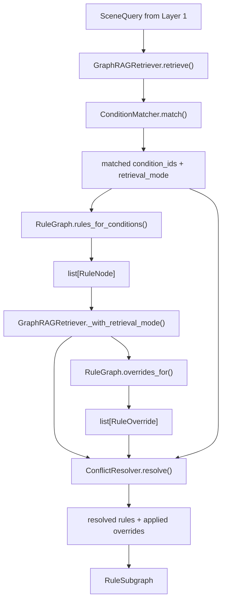
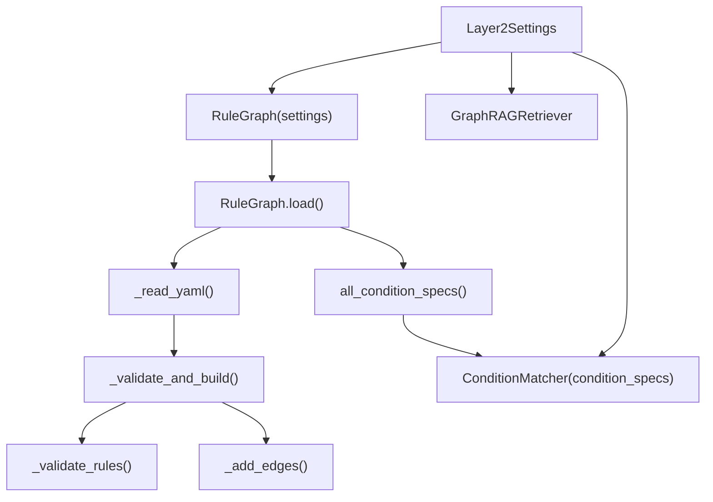

# Layer 2 函数与调用关系说明

**RegGround-AV 图谱检索层代码阅读手册**

| 项目 | 内容 |
|---|---|
| 对应设计文档 | `docs/Layer2_功能与接口设计文档_v3.0.md` |
| 对应代码目录 | `src/layer2/` |
| 对应图谱数据 | `data/layer2/rule_graph.yaml` |
| 适用版本 | 当前 Layer 2 v3.0 实现 |
| 主要读者 | 新加入开发者、Layer 1/3 对接人员、测试维护人员 |

---

## 1. 一句话定位

Layer 2 的职责是把 Layer 1 输出的 `SceneQuery` 映射为可追溯、可审计的 `RuleSubgraph`。

它只回答一个问题：

> 在当前结构化场景事实下，哪些法规规则可以被 Layer 3 引用？

它不做：

- 不读取完整 `SceneContext`。
- 不读取候选轨迹坐标、轨迹特征或 benchmark labels。
- 不判断任何候选轨迹是否违规。
- 不调用 LLM、向量检索、数据库或网络服务。

最推荐从这个类开始读：

```python
from src.layer2 import GraphRAGRetriever
```

| 入口 | 用途 |
|---|---|
| `GraphRAGRetriever(settings).retrieve(query)` | 生产推荐入口，可复用加载好的图 |
| `src.layer2.retrieve(query)` | 便捷函数；每次未传 retriever 时都会新建并加载图 |

---

## 2. 总体调用链



初始化阶段：



核心顺序：

1. `rule_graph.py` 加载并校验 YAML，构建 NetworkX 有向图。
2. `condition_matcher.py` 用 `SceneFacts`、`ScenarioType` 和 keywords 命中 `Condition`。
3. `rule_graph.py` 沿 `APPLIES_WHEN` 关系召回适用 `TrafficRule`，并收集 `RoadActor`、`Consequence`。
4. `rule_graph.py` 查找当前规则集合内可触发的 `OVERRIDES`。
5. `conflict_resolver.py` 标记被覆盖规则为 `OVERRIDDEN`。
6. `retriever.py` 组装 `RuleSubgraph` 并记录 telemetry。

---

## 3. 模块速查

| 模块 | 主要职责 | 主要输出 |
|---|---|---|
| `models.py` | 定义枚举、图节点模型、override 模型和 `RuleSubgraph` | `RuleNode`, `RuleOverride`, `RuleSubgraph` |
| `rule_graph.py` | 加载 YAML、校验图、构建 NetworkX、执行图遍历 | `RuleNode`, `RuleOverride`, `ConditionSpec` |
| `condition_matcher.py` | 将 `SceneQuery` 映射成 Condition IDs | `tuple[list[str], RetrievalMode]` |
| `conflict_resolver.py` | 应用 override，标记被覆盖规则 | resolved rules, applied overrides |
| `retriever.py` | 编排匹配、遍历、冲突消解和 telemetry | `RuleSubgraph` |
| `exceptions.py` | 定义启动/加载阶段异常 | `GraphDefinitionError`, `RuleGraphValidationError` |
| `__init__.py` | 包级导出和便捷 `retrieve()` 函数 | public Layer 2 API |

---

## 4. models.py：核心数据结构

文件：`src/layer2/models.py`

### 4.1 枚举

| 类型 | 值 | 用途 |
|---|---|---|
| `Severity` | `hard`, `soft` | 区分硬规则和软规则；Layer 3 通常对 hard 走强约束 |
| `RuleCategory` | `signal`, `yield` | MVP 规则类别：信号灯、让行 |
| `RetrievalMode` | `structured`, `keyword_fallback`, `mixed` | 标记本次 Condition 命中来源 |
| `RuleStatus` | `active`, `overridden` | 冲突消解后的规则状态 |
| `ActorType` | `vehicle`, `pedestrian`, `cyclist`, `emergency_vehicle` | RoadActor 类型 |

### 4.2 图节点与输出模型

| 模型 | 关键字段 | 说明 |
|---|---|---|
| `RoadActor` | `type`, `description`, `priority_level` | 对应 YAML 中 `actors` 节点 |
| `Consequence` | `type`, `description`, `severity_score` | 对应 YAML 中 `consequences` 节点 |
| `ConditionSpec` | `condition_id`, `description`, `keywords`, `fact_keys` | 对应 YAML 中 `conditions` 节点，供 matcher 使用 |
| `RuleOverride` | `overriding_rule_id`, `overridden_rule_id`, `condition_id`, `reason` | 规则覆盖关系的审计记录 |
| `RuleNode` | `node_id`, `code`, `description`, `severity`, `category`, `actors`, `consequences`, `matched_conditions`, `retrieved_via`, `status`, `overridden_by` | 单条法规规则的可追溯表示 |
| `RuleSubgraph` | `scene_id`, `frame_token`, `rules`, `matched_conditions`, `retrieval_mode`, `overrides_applied`, `query_duration_ms`, `graph_version`, `retrieval_timestamp` | Layer 2 最终输出 |

### 4.3 计算属性

| 属性 | 行为 |
|---|---|
| `RuleSubgraph.active_rules` | 返回 `status == ACTIVE` 的规则 |
| `RuleSubgraph.hard_rules` | 从 `active_rules` 中筛选 `Severity.HARD` |
| `RuleSubgraph.soft_rules` | 从 `active_rules` 中筛选 `Severity.SOFT` |

注意：

- `RuleNode` 和 `RuleSubgraph` 都是 frozen Pydantic 模型。
- 运行期不得对 `rule.matched_conditions.append(...)` 这类字段做原地 mutation。
- 如果要改 `RuleNode`，使用 `model_copy(update={...})`。
- 被 override 的规则保留在 `RuleSubgraph.rules` 中用于审计，但不会出现在 `active_rules`、`hard_rules`、`soft_rules` 中。

---

## 5. rule_graph.py：图加载、校验与遍历

文件：`src/layer2/rule_graph.py`

### 5.1 `Layer2Settings`

运行期配置，使用 `LAYER2_` 环境变量前缀。

| 字段 | 默认值 | 说明 |
|---|---|---|
| `rule_graph_path` | `data/layer2/rule_graph.yaml` | YAML 图谱文件路径 |
| `enable_keyword_fallback` | `True` | 是否启用关键词兜底/补充匹配 |

### 5.2 `RuleGraph.__init__(settings)`

只初始化空的 `nx.DiGraph` 和状态字段，不自动读取 YAML。

由 `GraphRAGRetriever.__init__()` 调用 `self._rule_graph.load()` 完成加载。

### 5.3 `RuleGraph.load() -> None`

启动期加载入口。

调用关系：

```text
load()
  -> _read_yaml()
  -> _validate_and_build()
       -> _validate_rules()
            -> _validate_refs()
                 -> _validate_ref()
       -> _add_edges()
```

行为：

1. 如果已经加载，记录 warning 并直接返回。
2. `_read_yaml()` 读取并解析 YAML。
3. `_validate_and_build()` 校验顶层和节点结构。
4. `_validate_rules()` 校验规则字段、引用和 override。
5. `_add_edges()` 将 YAML 关系写入 NetworkX 图。
6. 设置 `_loaded=True`。

### 5.4 Public Query API

| 函数 | 输入 | 输出 | 说明 |
|---|---|---|---|
| `version` | 无 | `str` | 当前图谱版本，即 YAML `graph_version` |
| `rules_for_conditions(condition_ids)` | matched condition IDs | `list[RuleNode]` | 查找有 `APPLIES_WHEN` 指向这些 Condition 的 TrafficRule |
| `overrides_for(rule_ids, condition_ids)` | 当前召回的 rule IDs 和 condition IDs | `list[RuleOverride]` | 返回当前规则集合内、当前条件下可触发的 override |
| `all_condition_specs()` | 无 | `dict[str, ConditionSpec]` | 导出所有 Condition 的 keywords 和 fact keys |

### 5.5 `rules_for_conditions()` 细节

流程：

1. 对输入 condition IDs 去重并排序。
2. 对每个 Condition 查入边。
3. 只接受 `edge["rel"] == "APPLIES_WHEN"` 且源节点 `kind == "TrafficRule"` 的边。
4. 先聚合 `cond_by_rule[rule_id].append(condition_id)`。
5. 最后按 `rule_id` 排序调用 `_build_rule_node()`。

这样做是为了避免修改 frozen `RuleNode`。

### 5.6 `overrides_for()` 细节

只有同时满足三件事才返回 override：

1. 覆盖方规则在当前召回规则集合中。
2. 被覆盖规则也在当前召回规则集合中。
3. override 的 `condition_id` 在当前 matched conditions 中。

典型例子：

```text
C-RED-PHASE + C-EMERGENCY-ACTIVE
  -> R-YLD-04 OVERRIDES R-SIG-01
```

### 5.7 内部函数说明

| 函数 | 作用 |
|---|---|
| `_read_yaml(path)` | 读取 YAML；文件不存在、不可读、格式错误或顶层非 mapping 时抛 `GraphDefinitionError` |
| `_validate_and_build(raw, graph_path)` | 校验 `graph_version`，添加 Condition/Behavior/Actor/Consequence/Rule 节点 |
| `_validate_rules(graph_path)` | 校验 Rule 的 severity、category、引用字段和 overrides |
| `_validate_refs()` | 校验某个引用列表中每个 ID 的存在性和节点类型 |
| `_validate_ref()` | 校验单个引用 ID |
| `_add_edges(raw)` | 根据 YAML 字段添加 `APPLIES_WHEN`、`PROHIBITS`、`REQUIRES`、`APPLIES_TO`、`LEADS_TO_CONSEQUENCE`、`EXCEPTION_WHEN`、`OVERRIDES`、`CO_OCCURS` 边 |
| `_build_rule_node(rule_id, matched_conditions, retrieval_mode)` | 从 TrafficRule 节点和出边构造 `RuleNode`，收集 actors 和 consequences |

---

## 6. condition_matcher.py：SceneQuery 到 Condition

文件：`src/layer2/condition_matcher.py`

### 6.1 常量映射

`FACT_TO_CONDITION` 是 `SceneFacts` 到图谱 Condition 的固定契约：

| SceneFacts 字段 | Condition ID |
|---|---|
| `has_red_light` | `C-RED-PHASE` |
| `has_yellow_light` | `C-YELLOW-PHASE` |
| `pedestrian_in_crosswalk` | `C-PED-IN-CROSSWALK` |
| `oncoming_vehicle_moving` | `C-ONCOMING-STRAIGHT` |
| `ego_on_minor_road` | `C-ON-MINOR-ROAD` |
| `emergency_vehicle_active` | `C-EMERGENCY-ACTIVE` |

`_SCENARIO_TO_CONDITION` 是 `ScenarioType` 到 Condition 的补充先验，只有 facts 无命中时才参与结构化匹配。

### 6.2 `ConditionMatcher.__init__(condition_specs, enable_keyword_fallback=True)`

输入来自 `RuleGraph.all_condition_specs()`。

初始化时会调用 `_build_fact_mapping()`，把固定 `FACT_TO_CONDITION` 和 YAML `fact_keys` 合并为实际使用的事实映射。

### 6.3 `match(query: SceneQuery) -> tuple[list[str], RetrievalMode]`

匹配入口。

当前实现流程：

1. `_conditions_from_facts(query.scene_facts)`：读取为 True 的事实，映射到 Condition。
2. 如果 facts 无命中，则 `_condition_from_scenario(query.scenario_type)` 使用 scenario 作为结构化补充先验。
3. 如果 facts 与 scenario 不一致，记录日志，但以 facts 为准。
4. 如果 `enable_keyword_fallback=True`，调用 `_conditions_from_keywords(query.keywords)`。
5. keyword 命中中已经由 structured 命中的 condition 会被去掉，剩余的作为补充。
6. 将 structured 与 keyword 合并、去重、排序。
7. `_mode(structured, keyword)` 返回检索模式。

检索模式规则：

| structured | keyword | mode |
|---|---|---|
| 有 | 无 | `STRUCTURED` |
| 无 | 有 | `KEYWORD_FALLBACK` |
| 有 | 有 | `MIXED` |
| 无 | 无 | `STRUCTURED` |

注意：

- 当前实现中关键词不仅能在 structured 为空时兜底，也能在 structured 已命中时补充额外条件，因此会产生 `MIXED`。
- 关键词匹配是大小写不敏感的子串包含匹配。
- 输出 condition IDs 始终排序，保证确定性。

### 6.4 内部函数说明

| 函数 | 作用 |
|---|---|
| `_build_fact_mapping(condition_specs)` | 合并固定 facts 映射与 YAML `fact_keys` |
| `_conditions_from_facts(facts)` | 遍历事实字段，为 True 时命中 Condition |
| `_condition_from_scenario(scenario_type)` | facts 为空时使用 scenario 作为补充先验 |
| `_conditions_from_keywords(keywords)` | 对英文 keywords 和 YAML condition keywords 做子串匹配 |
| `_mode(structured, keyword)` | 根据实际贡献来源计算 `RetrievalMode` |

---

## 7. conflict_resolver.py：规则冲突消解

文件：`src/layer2/conflict_resolver.py`

### `ConflictResolver.resolve(rules, matched_conditions, overrides)`

输入：

- `rules`: 当前召回的 `RuleNode` 列表。
- `matched_conditions`: 当前命中的 Condition IDs。
- `overrides`: `RuleGraph.overrides_for()` 返回的 override 列表。

输出：

```python
tuple[list[RuleNode], list[RuleOverride]]
```

行为：

1. 如果 rules 或 overrides 为空，直接返回原 rules 和空 applied list。
2. 构建 `rule_by_id`，确保 override 两端规则都在当前召回集合中。
3. 只应用 `override.condition_id in matched_conditions` 的 override。
4. 对命中的被覆盖规则，使用 `model_copy(update={...})` 生成新 `RuleNode`：
   - `status = RuleStatus.OVERRIDDEN`
   - `overridden_by = [覆盖方 rule_id]`
5. 返回 resolved rules 和实际 applied overrides。

排序策略：

- overrides 按 `(overridden_rule_id, overriding_rule_id, condition_id)` 排序处理。
- `overridden_by` 去重后排序，保证输出确定性。

当前实现说明：

- `EXCEPTION_WHEN` 边已由 `RuleGraph` 加载和校验，但 runtime 冲突消解当前只应用 `OVERRIDES` 返回的 `RuleOverride`。
- 被覆盖规则不会删除，而是保留在 `RuleSubgraph.rules` 中用于审计。

---

## 8. retriever.py：Layer 2 Facade

文件：`src/layer2/retriever.py`

### `GraphRAGRetriever.__init__(settings, *, rule_graph=None, matcher=None, conflict_resolver=None)`

初始化流程：

1. 保存 `Layer2Settings`。
2. 使用注入的 `RuleGraph`，或新建 `RuleGraph(settings)`。
3. 调用 `self._rule_graph.load()` 加载图。
4. `condition_specs = self._rule_graph.all_condition_specs()`。
5. 使用注入 matcher，或创建 `ConditionMatcher(condition_specs, enable_keyword_fallback=settings.enable_keyword_fallback)`。
6. 使用注入 resolver，或创建 `ConflictResolver()`。

依赖注入参数主要服务测试。

### `retrieve(query: SceneQuery) -> RuleSubgraph`

核心检索入口。

调用顺序：

```text
retrieve()
  -> ConditionMatcher.match()
  -> RuleGraph.rules_for_conditions()
  -> _with_retrieval_mode()
  -> RuleGraph.overrides_for()
  -> ConflictResolver.resolve()
  -> RuleSubgraph(...)
```

输出字段：

| 字段 | 来源 |
|---|---|
| `scene_id` | `query.scene_id` |
| `frame_token` | `query.frame_token` |
| `rules` | resolver 处理后的规则 |
| `matched_conditions` | matcher 输出 |
| `retrieval_mode` | matcher 输出 |
| `overrides_applied` | resolver 输出 |
| `query_duration_ms` | `time.perf_counter()` 测得 |
| `graph_version` | `RuleGraph.version` |
| `retrieval_timestamp` | `datetime.now(UTC)` |

运行期无命中：

- `condition_ids == []`
- `rules == []`
- `overrides_applied == []`
- 返回空 `RuleSubgraph`，不抛业务异常。

### `close() -> None`

当前只是记录日志。NetworkX 内存图无外部连接，无需释放资源。

### `_with_retrieval_mode(rules, mode)`

`RuleGraph.rules_for_conditions()` 默认构造 `retrieved_via=STRUCTURED` 的规则。

如果本次 mode 是 `KEYWORD_FALLBACK` 或 `MIXED`，这里会用 `model_copy(update={"retrieved_via": mode})` 生成新规则，避免修改 frozen 模型。

---

## 9. __init__.py：包级 API

文件：`src/layer2/__init__.py`

当前导出：

```python
from src.layer2 import (
    GraphRAGRetriever,
    Layer2Settings,
    ConditionSpec,
    RetrievalMode,
    RuleCategory,
    RuleNode,
    RuleOverride,
    RuleStatus,
    RuleSubgraph,
    SceneFacts,
    SceneQuery,
    ScenarioType,
    Severity,
    retrieve,
)
```

### `retrieve(query, *, retriever=None) -> RuleSubgraph`

便捷函数。

行为：

- 如果传入 `retriever`，直接调用 `retriever.retrieve(query)`。
- 如果不传，使用默认 `Layer2Settings()` 新建 `GraphRAGRetriever` 后检索。

建议：

- 生产和批量评估使用长生命周期 `GraphRAGRetriever`，避免重复加载 YAML。
- 单测、脚本或一次性 debug 可以使用包级 `retrieve()`。

---

## 10. exceptions.py：异常边界

文件：`src/layer2/exceptions.py`

| 异常 | 典型来源 | 处理建议 |
|---|---|---|
| `Layer2Error` | 所有 Layer 2 自定义异常基类 | 上层可统一捕获 |
| `GraphDefinitionError` | YAML 不存在、不可读、解析失败、为空、顶层结构非法 | 启动期 fatal，修复图谱文件 |
| `RuleGraphValidationError` | id 重复、悬空引用、非法 severity/category、override 指向不存在节点 | 启动期 fatal，修复 YAML schema |

边界：

- 图加载和校验阶段允许抛异常。
- `retrieve()` 阶段正常无命中返回空 `RuleSubgraph`。

---

## 11. rule_graph.yaml：图谱数据维护

文件：`data/layer2/rule_graph.yaml`

### 顶层结构

| 字段 | 说明 |
|---|---|
| `graph_version` | 输出到 `RuleSubgraph.graph_version` |
| `conditions` | 触发条件，包含英文 keywords 和 `fact_keys` |
| `behaviors` | 被禁止或要求的行为 |
| `actors` | 道路参与者 |
| `consequences` | 违规后果 |
| `rules` | 法规规则 |

### Rule 字段到图边的映射

| YAML 字段 | 图边 rel | 方向 |
|---|---|---|
| `applies_when` | `APPLIES_WHEN` | Rule -> Condition |
| `prohibits` | `PROHIBITS` | Rule -> Behavior |
| `requires` | `REQUIRES` | Rule -> Behavior |
| `applies_to` | `APPLIES_TO` | Rule -> RoadActor |
| `consequences` | `LEADS_TO_CONSEQUENCE` | Rule -> Consequence |
| `exception_when` | `EXCEPTION_WHEN` | Rule -> Condition |
| `overrides` | `OVERRIDES` | Rule -> Rule |
| `conditions[*].co_occurs` | `CO_OCCURS` | Condition -> Condition |

### 当前 MVP 条件

| Condition ID | fact key | 典型规则 |
|---|---|---|
| `C-RED-PHASE` | `has_red_light` | `R-SIG-01`, `R-SIG-03` |
| `C-YELLOW-PHASE` | `has_yellow_light` | `R-SIG-02`, `R-SIG-03` |
| `C-PED-IN-CROSSWALK` | `pedestrian_in_crosswalk` | `R-YLD-01`, `R-YLD-05` |
| `C-ONCOMING-STRAIGHT` | `oncoming_vehicle_moving` | `R-YLD-02`, `R-YLD-05` |
| `C-ON-MINOR-ROAD` | `ego_on_minor_road` | `R-YLD-03` |
| `C-EMERGENCY-ACTIVE` | `emergency_vehicle_active` | `R-YLD-04` |

### 当前 override

```text
R-YLD-04 OVERRIDES R-SIG-01 WHEN C-EMERGENCY-ACTIVE
```

含义：

- 同时命中红灯和执行任务特种车辆时，`R-SIG-01` 仍保留在 `rules` 中，但标记为 `OVERRIDDEN`。
- `active_rules` 中保留 `R-YLD-04` 和其他未被覆盖规则。

---

## 12. 新人推荐阅读顺序

1. `models.py`：先理解 `RuleSubgraph`、`RuleNode`、`RuleOverride`。
2. `retriever.py`：看完整检索链怎么串起来。
3. `condition_matcher.py`：理解 `SceneFacts` / scenario / keywords 如何命中 Condition。
4. `rule_graph.py`：理解 YAML 如何变成 NetworkX 图，以及规则如何召回。
5. `conflict_resolver.py`：理解 override 如何影响 `active_rules`。
6. `data/layer2/rule_graph.yaml`：理解当前 MVP 法规数据。
7. `tests/layer2/`：看每个模块的预期行为和边界条件。

---

## 13. 常见开发任务入口

| 任务 | 优先修改位置 |
|---|---|
| 增加新 Condition | `data/layer2/rule_graph.yaml` 的 `conditions`，必要时同步 `FACT_TO_CONDITION` |
| 增加新 SceneFacts 映射 | `condition_matcher.py` 的 `FACT_TO_CONDITION` 和 YAML `fact_keys` |
| 增加新规则 | `data/layer2/rule_graph.yaml` 的 `rules`，并确保引用节点存在 |
| 增加新 actor 或 consequence | YAML 的 `actors` / `consequences`，必要时扩展 `ActorType` |
| 调整关键词 fallback | `ConditionMatcher._conditions_from_keywords()` |
| 调整 scenario 补充先验 | `_SCENARIO_TO_CONDITION` 和 `_condition_from_scenario()` |
| 调整冲突消解 | `ConflictResolver.resolve()` 和 `RuleGraph.overrides_for()` |
| 增加 EXCEPTION_WHEN runtime 行为 | `RuleGraph` 已加载边，下一步在 `ConflictResolver` 中定义应用语义 |
| 调整图谱路径或关闭 keyword fallback | `Layer2Settings` 或环境变量 `LAYER2_RULE_GRAPH_PATH`、`LAYER2_ENABLE_KEYWORD_FALLBACK` |
| 调整 Layer 3 可见规则集合 | `RuleSubgraph.active_rules/hard_rules/soft_rules` |

---

## 14. 最小使用示例

### 14.1 复用 retriever

```python
from src.layer1.models import ScenarioType, SceneFacts, SceneQuery
from src.layer2 import GraphRAGRetriever, Layer2Settings

retriever = GraphRAGRetriever(Layer2Settings())

query = SceneQuery(
    scene_id="scene-001",
    frame_token="frame-001",
    scenario_type=ScenarioType.RED_LIGHT,
    keywords=["red light", "stop line"],
    scene_facts=SceneFacts(has_red_light=True),
)

subgraph = retriever.retrieve(query)
active_rule_ids = [rule.node_id for rule in subgraph.active_rules]
```

### 14.2 一次性便捷调用

```python
from src.layer1.models import ScenarioType, SceneFacts, SceneQuery
from src.layer2 import retrieve

subgraph = retrieve(
    SceneQuery(
        scene_id="scene-002",
        frame_token="frame-002",
        scenario_type=ScenarioType.UNKNOWN,
        keywords=["zebra crossing"],
        scene_facts=SceneFacts(),
    )
)
```

### 14.3 override 场景

```python
from src.layer1.models import ScenarioType, SceneFacts, SceneQuery
from src.layer2 import GraphRAGRetriever, Layer2Settings, RuleStatus

retriever = GraphRAGRetriever(Layer2Settings())
subgraph = retriever.retrieve(
    SceneQuery(
        scene_id="scene-emergency",
        frame_token="frame-emergency",
        scenario_type=ScenarioType.RED_LIGHT,
        keywords=[],
        scene_facts=SceneFacts(
            has_red_light=True,
            emergency_vehicle_active=True,
        ),
    )
)

overridden = [
    rule.node_id
    for rule in subgraph.rules
    if rule.status == RuleStatus.OVERRIDDEN
]
```

---

## 15. 维护注意事项

- 不要让 Layer 2 接收 `SceneContext`；入口必须是 `SceneQuery`。
- 不要在 Layer 2 引入 LLM、向量库、数据库或网络调用。
- 不要在 runtime 修改 frozen `RuleNode`；使用 `model_copy(update={...})`。
- 不要删除 overridden rules；保留在 `RuleSubgraph.rules` 供审计。
- Layer 3 默认应读取 `active_rules`、`hard_rules`、`soft_rules`，不要直接把 `rules` 当成可执行规则集合。
- 修改 YAML schema 后，要同步 `RuleGraph._validate_rules()`、`_add_edges()` 和 `tests/layer2/test_rule_graph.py`。
- 修改 condition 匹配逻辑后，要同步 `tests/layer2/test_condition_matcher.py` 和集成测试。
- 对外论文表述应使用 citation validity，不应把 Layer 2 检索结果天然等同于 citation accuracy。

---

*文档结束。*
