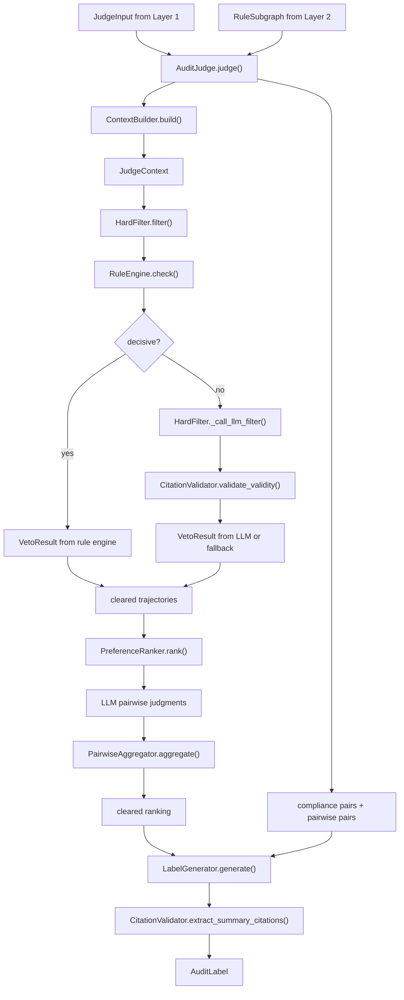
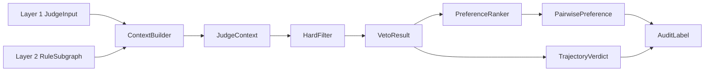

# Layer 3 函数与调用关系说明

**RegGround-AV 逻辑裁判层代码阅读手册**

| 项目 | 内容 |
|---|---|
| 对应设计文档 | `docs/Layer3_功能与接口设计文档_v3.0.md` |
| 对应代码目录 | `src/layer3/` |
| 适用版本 | 当前 Layer 3 v3.0 实现 |
| 主要读者 | 新加入开发者、Layer 1/2 对接人员、测试维护人员、实验复现人员 |

---

## 1. 一句话定位

Layer 3 的职责是把 Layer 1 输出的 `JudgeInput` 和 Layer 2 输出的 `RuleSubgraph` 合并成一个可审计的 `AuditLabel`。

它负责回答三个问题：

- 哪些候选轨迹触犯硬性法规，必须被一票否决？
- 剩余合规轨迹之间，哪条更优？
- 最终标签是否能用明确的法规 ID、推理链和自然语言摘要解释？

它不做：

- 不读取原始 nuScenes 坐标、地图或 DriveLM 原始 JSON。
- 不召回法规图谱；法规召回由 Layer 2 完成。
- 不使用 benchmark 标签或候选变体类型。
- 不把 LLM 输出直接当真；需要结构化校验和 citation 校验。

最推荐从这个类开始读：

```python
from src.layer3 import AuditJudge
```

| 入口 | 用途 |
|---|---|
| `AuditJudge(settings).judge(judge_input, subgraph)` | 生产推荐入口，可复用 LLM client 和各阶段组件 |
| `src.layer3.judge(judge_input, subgraph, settings=None)` | 便捷函数；每次调用都会创建一个 `AuditJudge` |

---

## 2. 总体调用链



核心顺序：

1. `ContextBuilder` 将 `JudgeInput` 和 `RuleSubgraph.active_rules` 拼成 prompt 上下文。
2. `HardFilter` 先用 `RuleEngine` 做确定性硬规则判定。
3. `RuleEngine` 无法确定的轨迹交给 LLM 硬过滤器，LLM 引用必须属于 `context.hard_rule_ids`。
4. `PreferenceRanker` 只对 `CLEARED` 轨迹做两两偏好比较。
5. `PairwiseAggregator` 将 pairwise 结果聚合成排序。
6. `AuditJudge` 自动补充合规优先于违规/不确定的 preference pairs。
7. `LabelGenerator` 生成自然语言摘要；摘要中的法规引用再次做 citation 校验。
8. `AuditLabel` 汇总 verdict、ranking、reasoning、diagnostics 和统计属性。

---

## 3. 模块速查

| 模块 | 主要职责 | 主要输出 |
|---|---|---|
| `models.py` | 定义 Layer 3 配置、枚举、中间结果和最终标签 | `Layer3Settings`, `VetoResult`, `PairwisePreference`, `AuditLabel` |
| `judge.py` | 编排完整裁判流程、处理降级和诊断信息 | `AuditLabel` |
| `context_builder.py` | 将 Layer 1/2 输入格式化成 LLM 上下文 | `JudgeContext` |
| `rule_engine.py` | 对明显停车/不停行为做确定性硬规则判定 | `RuleEngineDecision` |
| `hard_filter.py` | 规则引擎 + LLM 兜底的一票否决模块 | `list[VetoResult]`, `list[ReasoningStep]` |
| `preference_ranker.py` | 对合规轨迹做 LLM pairwise 偏好判断 | ranking, `PairwisePreference` |
| `pairwise_aggregator.py` | 将 pairwise 偏好聚合成全局排序 | `list[str]` |
| `label_generator.py` | 生成自然语言审计摘要，并提供兜底摘要 | summary text |
| `llm_client.py` | OpenAI / Anthropic 结构化输出与文本调用封装 | parsed model 或 text |
| `citation_validator.py` | 校验法规引用是否属于允许集合 | citation validity |
| `leakage_guard.py` | 防止 prompt 泄漏 benchmark 标签和动态结论词 | 安全检查或异常 |
| `prompt_loader.py` | 加载 system prompt 和 few-shot 示例 | prompt text |
| `exceptions.py` | 定义 Layer 3 异常层级 | `Layer3Error` 子类 |
| `experiments/` | 消融实验与人工标注评估辅助函数 | accuracy, kappa, tau |

---

## 4. models.py：核心数据结构

文件：`src/layer3/models.py`

### 4.1 枚举

| 类型 | 值 | 用途 |
|---|---|---|
| `VetoStatus` | `vetoed`, `cleared`, `uncertain` | 硬过滤阶段对单条轨迹的状态判断 |
| `JudgeStage` | `context_building`, `hard_filter`, `pairwise_ranking`, `label_generation` | 标记诊断和推理链所属阶段 |
| `ReportStatus` | `complete`, `partial`, `failed` | 标记最终报告完整程度 |
| `DecisionSource` | `rule_engine`, `llm`, `fallback` | 标记每个判断来自确定性规则、LLM 还是兜底 |

### 4.2 `Layer3Settings`

运行期配置，支持 `LAYER3_` 环境变量前缀覆盖。

| 字段 | 默认值 | 说明 |
|---|---|---|
| `llm_provider` | `openai_compatible` | 可选 `openai`、`anthropic` 或 `openai_compatible` |
| `llm_model` | `deepseek-v4-pro` | LLM API 模型别名 |
| `llm_model_version` | `DeepSeek-V4-Pro` | 实验配置记录的 provider 模型版本 |
| `llm_thinking_mode` | `enabled` | DeepSeek thinking 显式开关，主实验与消融保持一致 |
| `llm_api_key` | 空字符串 | API key，类型为 `SecretStr` |
| `llm_timeout_seconds` | `180.0` | 单次 LLM 调用超时时间，允许 OpenAI-compatible provider 较长排队 |
| `llm_max_retries` | `1` | 结构化输出或 citation 失败后的最大重试次数 |
| `llm_retry_backoff_base_seconds` | `3.0` | API 重试随机退避基数 |
| `llm_retry_backoff_multiplier` | `4.0` | 连续重试退避倍率 |
| `llm_structured_max_tokens` | `8192` | 结构化输出预算；DeepSeek thinking 与最终 JSON 共用此预算 |
| `llm_text_max_tokens` | `4096` | 自然语言摘要输出预算 |
| `hard_filter_temperature` | `0.0` | 硬过滤 LLM 温度 |
| `pairwise_ranker_temperature` | `0.0` | pairwise ranker LLM 温度 |
| `label_temperature` | `0.2` | label generator LLM 温度 |
| `max_trajectories_per_judge` | `10` | 单次裁判最多处理的候选轨迹数量 |
| `max_rules_in_context` | `20` | hard / soft rules 各自最多放入上下文的数量 |
| `max_pairwise_comparisons` | `45` | pairwise 比较数量上限 |
| `max_prompt_tokens` | `8000` | prompt 粗估 token 预算 |
| `enable_cot` | `True` | 当前配置字段保留；推理链由结构化字段承载 |
| `archive_llm_io` | `False` | 当前配置字段保留；代码中尚未落盘归档 |

### 4.3 中间模型

| 模型 | 关键字段 | 说明 |
|---|---|---|
| `JudgeContext` | scene、narrative、rules text、trajectories text、rule IDs、trajectory IDs、token 估算 | prompt 构建后的内部上下文 |
| `VetoResult` | `trajectory_id`, `status`, `violated_rule_ids`, `reason`, `decided_by` | 硬过滤阶段单条轨迹结果 |
| `PairwisePreference` | `preferred_id`, `dispreferred_id`, `basis`, `confidence`, `reasoning`, `referenced_rule_ids`, `decided_by` | 两条轨迹之间的偏好判断 |
| `ReasoningStep` | `stage`, `content`, `referenced_rule_ids` | 可审计推理链片段 |
| `TrajectoryVerdict` | `trajectory_id`, `veto`, `rank` | 单条轨迹最终 verdict；只有 cleared 轨迹可有 rank |
| `StageDiagnostics` | `stage`, `duration_ms`, `llm_tokens_used`, `succeeded`, `error_message` | 每个阶段的耗时、成功状态和错误信息 |

### 4.4 最终模型 `AuditLabel`

`AuditLabel` 是 Layer 3 对外输出。

| 字段 | 说明 |
|---|---|
| `scene_id`, `frame_token` | 场景标识 |
| `status` | `complete`、`partial` 或 `failed` |
| `chosen_trajectory_id` | 当前首选轨迹；无 cleared ranking 时为 `None` |
| `preference_ranking` | 全部轨迹排序，通常 cleared 在前，uncertain/vetoed 在后 |
| `preference_pairs` | 合规性偏好 pair + LLM pairwise pair |
| `verdicts` | 每条轨迹的 veto 状态和 rank |
| `natural_language_summary` | 面向人读的裁判摘要 |
| `legal_basis` | 本次标签涉及的法规 ID 集合，自动去重排序 |
| `reasoning_chain` | 阶段化推理链 |
| `stage_diagnostics` | 阶段诊断记录 |
| `citation_validity` | 摘要 citation 有效性，当前为 0 或 1 |
| `total_duration_ms`, `generated_at` | 运行耗时和生成时间 |

计算属性：

| 属性 | 行为 |
|---|---|
| `vetoed_count`, `cleared_count`, `uncertain_count` | 统计 verdict 中各状态数量 |
| `decided_by_rule_engine_count`, `decided_by_llm_count`, `decided_by_fallback_count` | 统计不同决策来源数量 |
| `pairwise_comparisons_count` | 统计 `basis == "pairwise_judgment"` 的 pair 数量 |
| `chosen_position` | `chosen_trajectory_id` 在 `preference_ranking` 中的位置；找不到则为 `None` |

### 4.5 模型校验规则

| 函数 | 作用 |
|---|---|
| `JudgeContext.active_rule_ids` | 合并 hard / soft rule IDs，并排序去重 |
| `VetoResult._unique()` | 禁止 `violated_rule_ids` 重复 |
| `VetoResult._consistency()` | `VETOED` 必须引用至少一条硬规则；`CLEARED` / `UNCERTAIN` 不允许带 violated rules |
| `PairwisePreference._unique_refs()` | 禁止 pairwise 引用规则重复 |
| `PairwisePreference._ids_are_distinct()` | 禁止 preferred 和 dispreferred 是同一条轨迹 |
| `ReasoningStep._unique_refs()` | 禁止 reasoning 引用规则重复 |
| `TrajectoryVerdict._consistency()` | vetoed / uncertain 轨迹不能有 rank |
| `AuditLabel._dedupe_and_sort()` | `legal_basis` 自动排序去重 |
| `AuditLabel._self_consistency()` | 校验 chosen、ranking、verdict、legal basis、citation 的自洽性 |
| `AuditLabel._collect_cited_rule_ids()` | 从 verdict、pairwise、reasoning 中收集全部被引用法规 |

---

## 5. judge.py：主编排器

文件：`src/layer3/judge.py`

### 5.1 `AuditJudge.__init__(settings, ...)`

初始化 Layer 3 全部组件。

可注入的依赖：

| 参数 | 默认构造 | 用途 |
|---|---|---|
| `llm_client` | `LLMClient(settings)` | 真实 LLM 调用或测试 mock |
| `context_builder` | `ContextBuilder(settings)` | prompt 上下文构造 |
| `hard_filter` | `HardFilter(settings, llm, RuleEngine(), CitationValidator())` | 一票否决 |
| `preference_ranker` | `PreferenceRanker(settings, llm, CitationValidator())` | pairwise 偏好排序 |
| `label_generator` | `LabelGenerator(settings, llm)` | 摘要生成 |
| `citation_validator` | `CitationValidator()` | citation 有效性校验 |

测试中通常注入 mock LLM 或 mock stage 组件，避免真实网络调用。

### 5.2 `judge(judge_input, subgraph) -> AuditLabel`

主入口。

调用顺序：

1. `_stage_context()` 构造 `JudgeContext`。
2. 如果上下文构造失败，直接 `_build_failure_label()`。
3. 按 `ctx.trajectory_ids` 的数量截断 `judge_input.trajectory_features`。
4. `_stage_hard_filter()` 生成每条轨迹的 `VetoResult` 和 hard-filter reasoning。
5. `_get_cleared_features()` 只取 `VetoStatus.CLEARED` 的轨迹进入 pairwise 阶段。
6. `_stage_pairwise_ranker()` 对 cleared 轨迹排序。
7. `_build_compliance_pairs()` 补充 cleared 优先于 vetoed / uncertain 的偏好 pair。
8. `_merge_ranking()` 将 cleared ranking、uncertain、vetoed 合并成完整 ranking。
9. `_build_verdicts()` 生成 `TrajectoryVerdict` 列表。
10. `_collect_legal_basis()` 汇总 verdict、pairwise 和 reasoning 中引用的法规 ID。
11. `_stage_label_generator()` 生成自然语言摘要。
12. `_validate_summary()` 校验摘要中的 `[R-...]` citation 是否属于当前 `subgraph.active_rules`。
13. 组装 `AuditLabel`；若组装失败，返回 failure label。

降级策略：

- context building 失败：返回 `ReportStatus.FAILED`。
- hard filter 失败：所有轨迹转为 `UNCERTAIN`，整体 `status=partial`。
- pairwise 失败：保留 cleared 原始顺序，整体 `status=partial`。
- label generator 失败：使用 fallback summary，整体 `status=partial`。
- summary citation 无效：替换为 fallback summary，并标记 `citation_validity=0.0`。

### 5.3 stage 函数

| 函数 | 输入 | 输出 | 失败行为 |
|---|---|---|---|
| `_stage_context()` | `JudgeInput`, `RuleSubgraph` | `JudgeContext | None`, diagnostics | 捕获 `ContextTooLargeError` 和其他异常 |
| `_stage_hard_filter()` | `JudgeContext`, features | veto results, diagnostics, reasoning | 异常时 `_uncertain_for_all()` |
| `_stage_pairwise_ranker()` | context, cleared IDs, cleared features | ranking, pairs, diagnostics, reasoning | 异常时返回 cleared 原始顺序 |
| `_stage_label_generator()` | input, subgraph, verdicts, pairs, reasoning | summary, diagnostics | 异常时 `LabelGenerator.fallback_summary()` |

### 5.4 辅助函数

| 函数 | 作用 |
|---|---|
| `_get_cleared_features()` | 根据 veto results 过滤出 cleared IDs 和对应 features |
| `_uncertain_for_all()` | 为全部轨迹生成 fallback `UNCERTAIN` 结果 |
| `_build_compliance_pairs()` | 生成 cleared 优先于 vetoed / uncertain 的 deterministic preference |
| `_merge_ranking()` | 合并 cleared ranking、uncertain IDs、vetoed IDs |
| `_build_verdicts()` | 给 cleared 轨迹写入 rank，vetoed / uncertain rank 为 `None` |
| `_collect_legal_basis()` | 汇总所有结构化对象中的法规引用 |
| `_validate_summary()` | 从摘要中提取 `[R-...]`，校验是否属于当前 active rules |
| `_build_failure_label()` | 构造最小失败标签 |
| `_elapsed_ms()` | 将 `perf_counter` 差值转为毫秒 |

---

## 6. context_builder.py：上下文构造

文件：`src/layer3/context_builder.py`

### `ContextBuilder.__init__(settings)`

保存 `Layer3Settings`，无副作用。

### `build(judge_input, subgraph) -> JudgeContext`

将 Layer 1/2 输入压缩成 LLM prompt 可用的内部上下文。

流程：

1. 读取 `subgraph.active_rules`。
2. 按 `Severity.HARD` 和 `Severity.SOFT` 拆分规则。
3. hard / soft rules 各自截断到 `settings.max_rules_in_context`。
4. `_sort_rules()` 按最高 consequence severity 降序、rule ID 升序排序。
5. `judge_input.trajectory_features` 截断到 `settings.max_trajectories_per_judge`。
6. `_trajectory_ids()` 按数量生成 `traj_a`, `traj_b`, ...。
7. `render_scene_facts_digest()` 生成场景要件文本，并声明信号相位仅为 t=0 快照、其后未知。
8. `_format_rules()` 生成 hard / soft rules 文本。
9. `_format_trajectories()` 生成轨迹特征文本。
10. `_estimate_tokens()` 按 2.5 字符约等于 1 token 粗估 prompt 长度。
11. 如果超预算，先丢弃 soft rules；仍超预算则抛 `ContextTooLargeError`。
12. `_assert_context_prompt_safe()` 统一检查 prompt leakage。
13. 返回 frozen `JudgeContext`。

当前实现注意点：

- Layer 3 不读取轨迹原始坐标，只读取 `TrajectoryFeatures`。
- 当前 `TrajectoryFeatures` 本身不携带轨迹 ID，因此 `ContextBuilder` 会按特征顺序重新生成 `traj_a`, `traj_b`, ...。
- `JudgeInput.narrative` 为空时，使用 `场景 {scene_id}` 作为兜底 narrative。
- prompt 安全检查会同时加载 hard filter、preference ranker 和 label generator 的 system prompt。

### 辅助函数

| 函数 | 作用 |
|---|---|
| `_sort_rules()` | 根据后果严重度和 rule ID 排序 |
| `_format_rules()` | 将 `RuleNode` 列表格式化为 prompt 文本 |
| `_format_trajectories()` | 将 `TrajectoryFeatures` 列表格式化为 prompt 文本 |
| `_trajectory_ids()` | 生成匿名轨迹 ID 序列 |
| `_alpha_suffix()` | 将 0, 1, 2 转成 `a`, `b`, `c`，超过 26 后生成多字母后缀 |
| `_estimate_tokens()` | 使用字符数 / 2.5 粗估 token 数 |
| `_assert_context_prompt_safe()` | 用 `LeakageGuard` 扫描 system prompt 和 user prompt |

---

## 7. rule_engine.py：确定性硬规则判定

文件：`src/layer3/rule_engine.py`

### `RuleEngineDecision`

| 字段 | 说明 |
|---|---|
| `trajectory_id` | 被判定轨迹 ID |
| `status` | `VetoStatus` |
| `violated_rule_ids` | 违规时引用的硬规则 ID |
| `reason` | 确定性判定原因 |
| `is_decisive` | 是否足够确定，可跳过 LLM |

### `RuleEngine.check(feature, context, traj_id) -> RuleEngineDecision`

对明显行为做启发式判定，避免所有轨迹都调用 LLM。

当前规则：

1. 如果 `context.hard_rule_ids` 为空，直接 `CLEARED`，理由为没有硬规则。
2. 从 `feature.conflict_zone_behavior` 中解析速度字段。
3. 如果解析不到冲突区速度，返回 `UNCERTAIN` 且 `is_decisive=False`。
4. 如果最小冲突区速度 `<= 0.01 m/s`，视为 full stop，返回 `CLEARED`。
5. 如果出现 slow rolling 或 restarted 等模糊行为，返回 `UNCERTAIN`。
6. 如果最小冲突区速度 `>= 3.0 m/s`，视为明显未让行 / 未停车，返回 `VETOED`。
7. 其他情况返回 `UNCERTAIN`。

重要阈值：

| 常量 | 值 | 含义 |
|---|---|---|
| `FULL_STOP_THRESHOLD_MPS` | `0.01` | 近似完全停止 |
| `STOP_THRESHOLD_MPS` | `0.2` | 低速/滚停判断辅助阈值 |
| `HIGH_SPEED_THRESHOLD_MPS` | `3.0` | 高速通过冲突区，明显违规 |

### 辅助函数

| 函数 | 作用 |
|---|---|
| `_uncertain()` | 构造非决定性 `UNCERTAIN` 结果 |
| `_parse_conflict_zone_speeds()` | 从冲突区行为文本中解析速度字典 |
| `_extract_speed()` | 按 label 提取单个速度值 |
| `_hard_rule_ids_for_obvious_violation()` | 明显违规时引用当前 context 的 hard rules |

---

## 8. hard_filter.py：一票否决

文件：`src/layer3/hard_filter.py`

### 内部结构化输出模型

| 模型 | 说明 |
|---|---|
| `_FilterItem` | LLM 对单条轨迹的结构化结果 |
| `_LLMFilterResponse` | LLM 返回的 `results` 容器 |

### `HardFilter.__init__(settings, llm_client, rule_engine=None, citation_validator=None)`

保存配置、LLM client、规则引擎和 citation validator。

`last_fallback_reason` 用于把 LLM 兜底失败原因传回 `AuditJudge._stage_hard_filter()`，进而影响 diagnostics 和 `ReportStatus.PARTIAL`。

### `filter(context, features) -> tuple[list[VetoResult], list[ReasoningStep]]`

硬过滤主入口。

流程：

1. 清空 `last_fallback_reason`。
2. 遍历 features，用 `_trajectory_id(context, idx)` 找到当前轨迹 ID。
3. 调用 `RuleEngine.check()`。
4. 如果 `decision.is_decisive=True`，用 `_from_engine_decision()` 转成 `VetoResult`。
5. 非决定性轨迹加入 `undecided`。
6. 如果存在 undecided，调用 `_call_llm_filter()`。
7. 校验 LLM 返回的轨迹 ID 必须等于 undecided ID 集合。
8. 将 LLM items 转成 `VetoResult(decided_by=LLM)`。
9. 如果 LLM、citation 或结构化校验失败，undecided 全部降级为 `UNCERTAIN(decided_by=FALLBACK)`。
10. 按原始 features 顺序返回结果，并为每条轨迹生成 `ReasoningStep`。

### `_call_llm_filter(context, undecided) -> _LLMFilterResponse`

LLM 硬过滤调用。

调用细节：

1. 加载 `hard_filter` system prompt。
2. 加载 `hard_filter` few-shot examples。
3. `_build_undecided_features_text()` 只放入 undecided 轨迹。
4. `LeakageGuard.assert_prompt_safe()` 检查 system/user prompt。
5. 调用 `LLMClient.complete_structured(..., response_model=_LLMFilterResponse)`。
6. 对每个 item 的 `violated_rule_ids` 调用 `CitationValidator.validate_validity()`。
7. citation 错误时，通过 `LLMClient._augment_with_error()` 将错误追加回 prompt 并重试。
8. 重试耗尽后抛 `LLMTimeoutError` 或原始 citation 异常。

### 辅助函数

| 函数 | 作用 |
|---|---|
| `_from_engine_decision()` | 将 `RuleEngineDecision` 转成 `VetoResult(decided_by=RULE_ENGINE)` |
| `_build_undecided_features_text()` | 格式化 undecided 轨迹特征 |
| `_validate_llm_result_ids()` | 校验 LLM 返回 ID 集合与 expected IDs 完全一致 |
| `_trajectory_id()` | 从 `context.trajectory_ids[idx]` 取轨迹 ID |

---

## 9. preference_ranker.py：合规轨迹偏好排序

文件：`src/layer3/preference_ranker.py`

### 内部结构化输出模型

| 模型 | 说明 |
|---|---|
| `_LLMPairwiseResponse` | LLM 对单个轨迹 pair 的偏好、置信度、推理和引用规则 |

### `PreferenceRanker.__init__(settings, llm_client, citation_validator=None)`

保存配置、LLM client、citation validator，并创建 `PairwiseAggregator`。

### `rank(context, cleared_features, cleared_ids) -> tuple[list[str], list[PairwisePreference], list[ReasoningStep]]`

只对 hard filter 后状态为 `CLEARED` 的轨迹执行。

流程：

1. 如果没有 cleared 轨迹，返回空 ranking。
2. 如果只有一条 cleared 轨迹，直接返回该 ID。
3. 校验 `cleared_ids` 必须是 `context.trajectory_ids` 的子集。
4. 构造 cleared 轨迹两两组合。
5. 组合数量截断到 `settings.max_pairwise_comparisons`。
6. 对每个 pair 调用 `_call_llm_pairwise()`。
7. `_validate_pairwise_output()` 校验 preferred/dispreferred ID 是否就是当前 pair。
8. `CitationValidator.validate_validity()` 校验 `referenced_rule_ids` 属于 `context.active_rule_ids`。
9. 调用 `PairwiseAggregator.aggregate()` 得到 ranking。
10. 为每个 pair 生成 `ReasoningStep(stage=PAIRWISE_RANKING)`。

### `_call_llm_pairwise(context, left_id, left_feature, right_id, right_feature)`

LLM pairwise 调用。

prompt 组成：

- `preference_ranker` system prompt。
- 场景 narrative。
- hard rules text。
- soft rules text。
- 当前两条轨迹的 `_feature_text()`。
- few-shot examples。
- JSON 输出要求。

如果 citation 无效，会将错误追加到 prompt 并重试。

### 辅助函数

| 函数 | 作用 |
|---|---|
| `_validate_pairwise_output()` | 校验 LLM 返回的两个轨迹 ID 与当前 pair 完全一致 |
| `_feature_text()` | 将单条 `TrajectoryFeatures` 格式化成 pairwise prompt 文本 |

---

## 10. pairwise_aggregator.py：pairwise 聚合

文件：`src/layer3/pairwise_aggregator.py`

### `PairwiseAggregator.aggregate(preferences, candidate_ids, method="majority") -> list[str]`

聚合入口。

| 参数 | 说明 |
|---|---|
| `preferences` | pairwise 偏好结果 |
| `candidate_ids` | 候选 ID 顺序；也作为 tie-breaker |
| `method` | 当前支持 `majority` 和 `bradley_terry` |

行为：

- `method == "majority"` 时调用 `aggregate_majority()`。
- `method == "bradley_terry"` 时调用 `aggregate_bradley_terry()`。
- 未知 method 会抛 `ValueError`。

### `aggregate_majority(preferences, candidate_ids) -> list[str]`

简单多数投票：

1. 每个候选初始分数为 0。
2. 每条 preference 给 `preferred_id` 加 1，给 `dispreferred_id` 减 1。
3. 按分数降序排序。
4. 分数相同按 `candidate_ids` 原始顺序打破平局。

### `aggregate_bradley_terry(preferences, candidate_ids) -> list[str]`

当前实现是 `aggregate_majority()` 的兼容占位。

也就是说，调用 `method="bradley_terry"` 目前不会执行真正的 Bradley-Terry 拟合，而是返回 majority 结果。

---

## 11. label_generator.py：摘要生成

文件：`src/layer3/label_generator.py`

### `LabelGenerator.__init__(settings, llm_client)`

保存配置和 LLM client。

### `generate(judge_input, subgraph, verdicts, preference_pairs, reasoning_chain) -> str`

生成自然语言审计摘要。

当前行为：

1. 尝试调用 `_generate_with_llm()`。
2. 如果 `LLMTimeoutError` 或 `StructuredOutputValidationError`，记录 warning。
3. 返回 `_fallback_summary()`。

### `fallback_summary(verdicts, preference_pairs) -> str`

公开兜底摘要函数，供 `AuditJudge._stage_label_generator()` 在异常时调用。

### `_generate_with_llm(...) -> str`

LLM 文本生成调用。

prompt 组成：

- `label_generator` system prompt。
- scene id。
- narrative。
- `_build_rules_text(subgraph)`。
- `_build_verdict_text(verdicts)`。
- `_build_pair_text(preference_pairs)`。
- `_build_reasoning_text(reasoning_chain)`。
- 输出要求：简明说明首选轨迹、否决理由和引用法规 ID。

### 辅助函数

| 函数 | 作用 |
|---|---|
| `_build_rules_text()` | 将 active rules 格式化为摘要可引用文本 |
| `_build_verdict_text()` | 格式化每条轨迹的 veto 状态和 rank |
| `_build_pair_text()` | 格式化 preference pairs |
| `_build_reasoning_text()` | 格式化 reasoning chain |
| `_fallback_summary()` | 根据 verdicts 和 pairs 生成稳定可用的中文摘要 |

---

## 12. llm_client.py：LLM 调用封装

文件：`src/layer3/llm_client.py`

### `LLMClient.__init__(settings)`

保存 `Layer3Settings`，并延迟创建底层 client。

### `complete_structured(system_prompt, user_prompt, response_model, temperature) -> tuple[T, int]`

结构化输出入口。

行为：

1. 根据 `settings.llm_provider` 分发到 OpenAI 或 Anthropic 实现。
2. 期望返回内容能被 `response_model` 校验。
3. 结构化解析失败时抛 `StructuredOutputValidationError`。
4. 短暂服务错误或超时最终抛 `LLMTimeoutError`。
5. 返回 Pydantic model 和 token 数。

### `complete_text(system_prompt, user_prompt, temperature) -> tuple[str, int]`

文本输出入口，用于 label generator。

### provider 私有实现

| 函数 | 作用 |
|---|---|
| `_build_client()` | 按 provider 构造 OpenAI 或 Anthropic SDK client |
| `_complete_structured_openai()` | OpenAI 结构化输出路径 |
| `_complete_structured_anthropic()` | Anthropic 结构化输出路径 |
| `_complete_text_openai()` | OpenAI 文本输出路径 |
| `_complete_text_anthropic()` | Anthropic 文本输出路径 |
| `_augment_with_error()` | 将上一轮错误追加到 user prompt，要求模型修正输出 |

注意：

- 当前 `LLMClient` 位于真实网络调用边界；单测通常使用 mock client。
- `llm_max_retries` 同时被 hard filter、preference ranker 和 client 内部重试逻辑使用。
- OpenAI / Anthropic SDK 是否可用，取决于运行环境安装的依赖。

---

## 13. citation_validator.py：引用校验

文件：`src/layer3/citation_validator.py`

### `CitationValidator.validate_validity(cited_ids, allowed_ids, scene_id="", stage="") -> None`

校验 LLM 或摘要引用的法规 ID 是否属于允许集合。

| 参数 | 说明 |
|---|---|
| `cited_ids` | 模型输出中引用的法规 ID |
| `allowed_ids` | 当前阶段允许引用的法规 ID 集合 |
| `scene_id` | 错误定位信息 |
| `stage` | 错误定位信息 |

如果发现 unknown IDs，会抛 `CitationValidityError`，异常中保留：

- `scene_id`
- `stage`
- `cited_ids`
- `allowed_ids`

### `extract_summary_citations(text) -> list[str]`

从自然语言摘要中提取形如 `[R-...]` 的法规引用。

当前主要由 `AuditJudge._validate_summary()` 使用。

---

## 14. leakage_guard.py：泄漏防护

文件：`src/layer3/leakage_guard.py`

### `LeakageGuard.find_banned_terms(text) -> list[str]`

扫描文本中是否包含禁止词。

禁止词分两类：

- benchmark / metadata 相关词，例如候选变体、ground truth、label 等。
- 动态结论词，例如 final compliance conclusion 一类不应提前写入 prompt 的结果性描述。

### `LeakageGuard.assert_prompt_safe(system_prompt, user_prompt) -> None`

合并 system prompt 和 user prompt 后扫描。

如果发现 banned terms，抛 `StructuredOutputValidationError`。

Layer 3 中调用位置：

- `ContextBuilder._assert_context_prompt_safe()`
- `HardFilter._call_llm_filter()`
- `PreferenceRanker._call_llm_pairwise()`
- `LabelGenerator._generate_with_llm()`

---

## 15. prompt_loader.py 与 prompts

文件：`src/layer3/prompt_loader.py`

### `load_system_prompt(stage: str) -> str`

从 `src/layer3/prompts/{stage}_system.txt` 读取 system prompt。

特点：

- 使用模块级 `_cache` 缓存文本。
- 找不到文件时抛 `FileNotFoundError`。

### `load_few_shot_examples(stage: str) -> str`

从 `src/layer3/prompts/few_shots/{stage}_examples.json` 读取 few-shot 示例。

特点：

- 找不到文件时返回空字符串。
- 直接返回文件原始文本，不做结构化解析。

当前 prompt 文件：

| 文件 | 使用者 |
|---|---|
| `prompts/hard_filter_system.txt` | `HardFilter._call_llm_filter()` |
| `prompts/preference_ranker_system.txt` | `PreferenceRanker._call_llm_pairwise()` |
| `prompts/label_generator_system.txt` | `LabelGenerator._generate_with_llm()` |
| `prompts/few_shots/hard_filter_examples.json` | hard filter few-shot |
| `prompts/few_shots/preference_ranker_examples.json` | pairwise ranker few-shot |

---

## 16. __init__.py 与 settings.py：包级 API

文件：`src/layer3/__init__.py`

对外导出：

- `AuditJudge`
- `Layer3Settings`
- `AuditLabel`
- `VetoStatus`
- `ReportStatus`
- `JudgeStage`
- `DecisionSource`
- `judge`

### `judge(judge_input, subgraph, settings=None) -> AuditLabel`

便捷函数：

1. 如果未传 settings，创建 `Layer3Settings()`。
2. 创建 `AuditJudge(settings)`。
3. 调用 `AuditJudge.judge(judge_input, subgraph)`。

文件：`src/layer3/settings.py`

当前只是重新导出 `Layer3Settings`，方便调用方从 `src.layer3.settings` 导入配置。

---

## 17. exceptions.py：异常层级

文件：`src/layer3/exceptions.py`

| 异常 | 典型来源 | 处理方式 |
|---|---|---|
| `Layer3Error` | 基类 | 供外部统一捕获 |
| `ContextTooLargeError` | `ContextBuilder.build()` prompt 超预算 | `AuditJudge` 返回 failed label |
| `LLMTimeoutError` | LLM 调用失败或重试耗尽 | 相关阶段 partial/fallback |
| `StructuredOutputValidationError` | LLM JSON 解析失败、ID 不匹配、prompt 泄漏 | 相关阶段 retry 或 fallback |
| `CitationValidityError` | 引用了不在允许集合中的法规 ID | 触发 retry 或 fallback summary |
| `CitationAccuracyEvaluationError` | 实验评估 citation accuracy 时使用 | 实验脚本处理 |
| `JudgeFatalError` | 预留的严重裁判异常 | 当前主流程较少直接使用 |

`CitationValidityError` 会记录 scene、stage、cited IDs 和 allowed IDs，便于定位具体幻觉引用。

---

## 18. experiments：实验和评估辅助函数

目录：`src/layer3/experiments/`

### `citation_accuracy.py`

| 函数 | 作用 |
|---|---|
| `citation_accuracy(predicted, expected)` | 计算每条轨迹预测引用法规集合与期望集合完全一致的比例；没有 expected 时返回 `0.0` |

### `ablation_2x2.py`

| 对象 | 作用 |
|---|---|
| `AblationCondition` | 描述一个消融条件 |
| `ABLATION_2X2` | 四组条件：full、去 GraphRAG、去 citation validation、baseline |

### `human_annotation_eval.py`

| 函数 | 作用 |
|---|---|
| `preference_pair_accuracy(predicted_pairs, expected_pairs)` | 计算预测 pairwise 偏好与人工标注的一致率 |
| `kendall_tau(predicted_ranking, expected_ranking)` | 计算两个排序的 Kendall tau |
| `cohens_kappa(rater_a, rater_b)` | 计算两个标注者的一致性 kappa |

---

## 19. 关键数据流与 ID 关系

### 19.1 输入输出关系



### 19.2 轨迹 ID

当前实现中，Layer 3 以 `JudgeInput.trajectory_features` 的顺序重新生成轨迹 ID：

```text
feature[0] -> traj_a
feature[1] -> traj_b
feature[2] -> traj_c
```

因此：

- `HardFilter`、`PreferenceRanker`、`AuditLabel` 中的 trajectory ID 全部来自 `JudgeContext.trajectory_ids`。
- 如果上游未来让 `TrajectoryFeatures` 自带 ID，需要同步调整 `ContextBuilder` 和相关测试。

### 19.3 法规 ID

法规 ID 流向：

```text
RuleSubgraph.active_rules
  -> ContextBuilder.hard_rule_ids / soft_rule_ids
  -> HardFilter 只能引用 hard_rule_ids
  -> PreferenceRanker 可以引用 active_rule_ids
  -> LabelGenerator 摘要可以引用 active_rule_ids
  -> AuditLabel.legal_basis
```

硬过滤阶段只允许引用 hard rules；偏好排序和摘要阶段可引用 hard + soft active rules。

---

## 20. 推荐阅读顺序

首次阅读建议：

1. `models.py`：先理解 `AuditLabel`、`VetoResult`、`PairwisePreference`。
2. `judge.py`：看完整 stage 编排和 fallback 策略。
3. `context_builder.py`：理解 Layer 1/2 如何进入 prompt。
4. `hard_filter.py` 和 `rule_engine.py`：理解一票否决路径。
5. `preference_ranker.py` 和 `pairwise_aggregator.py`：理解 cleared 轨迹排序。
6. `label_generator.py`：理解摘要生成和 fallback。
7. `citation_validator.py`、`leakage_guard.py`、`llm_client.py`：理解安全边界和 LLM 调用边界。
8. `tests/layer3/`：用测试样例验证上面的理解。

---

## 21. 常见修改任务索引

| 任务 | 优先修改位置 | 需要同步关注 |
|---|---|---|
| 增加新的硬规则启发式 | `rule_engine.py` | `tests/layer3/test_hard_filter.py`, `test_integration.py` |
| 修改 prompt 上下文格式 | `context_builder.py` | `leakage_guard.py`, prompts, context builder 测试 |
| 改 LLM 硬过滤输出 schema | `hard_filter.py` | prompt、mock responses、citation 测试 |
| 改 pairwise 输出 schema | `preference_ranker.py` | prompt、aggregator、mock responses |
| 实现真正 Bradley-Terry 聚合 | `pairwise_aggregator.py` | `tests/layer3/test_pairwise_aggregator.py` |
| 改摘要格式或 citation 规则 | `label_generator.py`, `citation_validator.py` | hallucination adversarial 测试 |
| 接入新的 LLM provider | `llm_client.py` | settings、mock client、超时和结构化输出测试 |
| 让 Layer 3 使用上游轨迹 ID | `context_builder.py` | `JudgeInput` / `TrajectoryFeatures` 模型、hard filter、ranker、tests |

---

## 22. 最小使用示例

### 22.1 推荐复用方式

```python
from src.layer3 import AuditJudge, Layer3Settings

settings = Layer3Settings()
judge = AuditJudge(settings)

label = judge.judge(judge_input, rule_subgraph)
print(label.chosen_trajectory_id)
print(label.preference_ranking)
print(label.natural_language_summary)
```

### 22.2 便捷函数方式

```python
from src.layer3 import judge

label = judge(judge_input, rule_subgraph)
```

便捷函数适合 notebook、demo 或最小测试；批量评测更推荐复用 `AuditJudge`，避免重复创建 client 和组件。

### 22.3 单测 mock LLM 的典型方式

```python
settings = Layer3Settings(llm_api_key="")
mock_llm = FakeLLMClient(...)
audit_judge = AuditJudge(settings, llm_client=mock_llm)

label = audit_judge.judge(judge_input, subgraph)
```

mock 时重点保证：

- `complete_structured()` 返回符合 `_LLMFilterResponse` 或 `_LLMPairwiseResponse` 的 Pydantic 对象。
- hard filter 引用只包含 hard rule IDs。
- pairwise 引用只包含 active rule IDs。

---

## 23. 维护注意事项

- Layer 3 的边界输入是 `JudgeInput` 和 `RuleSubgraph`，不要直接把 `SceneContext` 或 benchmark labels 传进来。
- `AuditLabel` 是 frozen Pydantic 模型，后处理时应创建新对象或使用 `model_copy(update=...)`。
- LLM 输出必须先过结构化校验，再过 citation 校验。
- hard filter 的 `VETOED` 必须引用至少一条硬规则，否则模型校验会失败。
- cleared / uncertain 不能携带 violated rules。
- vetoed / uncertain 不能出现在 pairwise ranking 的 rank 字段中。
- prompt 中不要出现 benchmark 变体、ground truth、expected verdict 等泄漏信息。
- 任何新增 prompt 或字段都应补充 adversarial hallucination / citation 相关测试。
