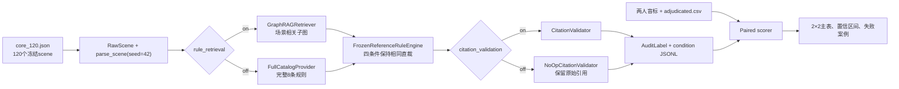

# RegGround-AV 2×2 消融实验开发手册 v1.0

> 日期：2026-07-16
> 目标：在不修改 `src/`、`tests/`、正式 runner、冻结评估集和正式首跑日志的前提下，完成“规则检索 × 引用校验”2×2 消融。
> 状态：当前仓库只有 `src/layer3/experiments/ablation_2x2.py` 的条件声明，尚不能直接运行四组实验。本手册给出独立实验目录、适配器、运行、验收和评分方案。

---

## 1. 最终决策

消融代码全部新增到独立目录：

```text
experiments/ablation_2x2_v1/
```

严禁为本实验修改：

```text
src/
tests/
data/layer2/rule_graph.yaml
artifacts/eval_set_v1.json
scripts/run_regground_v2_1.sh
src/layer3/prompts/
logs/eval_set_v1_full_v3_5.jsonl
human_annotation_v1/results/
human_annotation_v1/private/hidden_sidecar.jsonl
```

实验侧只通过以下现有接口复用生产管线：

- `src.audit_run_logger.run_record()`：复用 Layer 1 解析、准入、日志结构和 Layer 3 调用；
- `GraphRAGRetriever.retrieve()`：Full 与 No Validation 使用生产检索；
- `RuleGraph`、`ConflictResolver`、`RuleSubgraph`：构造无场景检索的完整规则目录；
- `AuditJudge` 的构造器注入点：注入实验侧 RuleEngine、CitationValidator、HardFilter 和 PreferenceRanker；
- `summarize_entries()`：生成与正式首跑一致的工程 telemetry 汇总。

该方案不修改生产代码，但会在实验目录中定义小型适配器和 `AuditJudge` 子类。所有私有方法覆盖必须被测试和源文件哈希钉住。

---

## 2. 实验问题与可支持的论文主张

2×2 实验回答两个问题：

1. 场景相关的法规检索，是否比向模型提供完整规则目录更有助于正确裁决和引用恰当性？
2. 引用校验与失败修复，是否降低无效引用，并带来多少重试、token 和延迟开销？

本实验可以支持：

- “规则检索改善了引用聚焦/恰当性”；
- “引用校验提高了最终输出的引用有效性”；
- “两个组件存在互补或交互作用”；
- “上述收益对应的调用量、token 和延迟成本”。

本实验不能单独支持：

- “系统达到或超过道路规划 SOTA”；
- “系统可直接用于车辆控制”；
- “纯 LLM 的法律知识一定弱于图谱”；
- “完整 DPO/RLAIF 训练有效”。

---

## 3. 四个实验条件

论文和代码统一把第一维称为 `rule_retrieval`，避免把“完整目录输入”误称为完全没有图谱。

| 条件名 | rule_retrieval | citation_validation | LLM 看到的法规 | 解释 |
|---|---:|---:|---|---|
| `full` | on | on | 当前场景检索到的 active rules | 完整系统条件 |
| `no_validation` | on | off | 当前场景检索到的 active rules | 只移除引用校验与修复 |
| `no_retrieval` | off | on | 固定完整规则目录 | 只移除场景相关规则筛选 |
| `baseline` | off | off | 固定完整规则目录 | 无检索、无引用校验 |

与现有声明的映射：

```text
full         -> full
ablation_a   -> no_validation
ablation_b   -> no_retrieval
baseline     -> baseline
```

### 3.1 为什么 Baseline 仍提供完整规则目录

当前输出协议要求 `R-SIG-01`、`R-YLD-01` 等项目内 rule ID。完全不给规则目录的纯 LLM 不知道这些内部 ID，也无法与引用校验形成同构的2×2。因此本实验的 Baseline 是“无场景检索基线”，不是“仅依赖模型参数知识的纯 LLM”。

如论文需要纯 LLM，应另设第五组，使用自由文本法规引用和独立人工核验；不得强行塞进本2×2。

### 3.2 公平性约束

四组必须保持以下项目完全一致：

- 同一批120个核心 scene；
- Layer 1 seed 固定为42；
- 同一模型、provider、base URL 和 prompt；
- 相同 timeout、retry、候选顺序和上下文预算；
- 相同 deterministic RuleEngine 结果；
- 相同候选级 deferred retry；
- 相同日志字段和评分代码。

四组唯一允许变化的是：LLM 收到“检索规则/完整规则目录”，以及 citation guard 是否执行。

---

## 4. 当前代码不能直接运行2×2的原因

1. `ABLATION_2X2` 没有被任何 runner 引用，只是四个 dataclass 常量。
2. `audit_run_logger.run_record()` 总是调用 `retriever.retrieve()`；标准 CLI 没有 condition 参数。
3. `AuditJudge.judge()` 拒绝空 `RuleSubgraph`，所以不能用空子图表示 no retrieval。
4. `HardFilter`、`PreferenceRanker` 和最终摘要都固定执行 CitationValidator。
5. 即使注入 no-op CitationValidator，`AuditJudge._validate_summary()` 内仍有“summary 引用必须进入 legal_basis”的额外修复逻辑，citation off 仍不完整。
6. 完整规则目录包含 `R-SIG-01`；若直接交给原 RuleEngine，非红灯场景也可能误触发红灯几何谓词。
7. 当前 `evaluation_report.py` 不读取人工 adjudicated 标签，不能产生论文需要的四组人工一致性指标。

因此，本实验需要实验侧 provider、RuleEngine wrapper、CitationValidator adapter、AuditJudge subclass、runner 和 scorer，但不需要修改生产代码。

---

## 5. 总体数据流



---

## 6. 独立实验目录

建议创建：

```text
experiments/ablation_2x2_v1/
├── README.md
├── config.py
├── build_units.py
├── adapters.py
├── run_ablation.py
├── score_ablation.py
├── verify_standard_tree.py
├── tests/
│   ├── test_conditions.py
│   ├── test_adapters.py
│   ├── test_units.py
│   └── test_scoring.py
├── units/
│   ├── core_120.json
│   └── smoke_3.json
├── manifests/
│   └── standard_tree_sha256.json
├── outputs/
│   ├── smoke/
│   └── full/
└── reports/
```

目录约束：

- 不把实验模块放入 `src/layer3/experiments/`；该目录属于标准项目包。
- 不把实验测试放入根目录 `tests/`；使用独立测试路径。
- 不向 `pyproject.toml`、`uv.lock` 增加依赖。
- 输出和断点文件只写入本实验目录。
- `outputs/` 中每个条件使用独立 JSONL，不互相拼接。

---

## 7. 冻结120个实验单元

### 7.1 数据源

只使用：

```text
human_annotation_v1/private/hidden_sidecar.jsonl
```

过滤条件：

```text
sample_group == "core"
```

当前已验证：

- core 记录数 = 120；
- unique frame_token = 120；
- unique scene_id = 120；
- stress 20条不进入聚合消融结果。

### 7.2 `core_120.json` 最小字段

```json
{
  "protocol_version": "ablation_2x2_v1",
  "seed": 42,
  "source_sidecar_sha256": "...",
  "source_run_sha256": "...",
  "units": [
    {
      "audit_id": "audit_001",
      "frame_token": "...",
      "scene_id": "...",
      "scenario_type": "pedestrian",
      "target_trajectory_id": "traj_b",
      "sampling_stratum": "llm_pedestrian"
    }
  ]
}
```

禁止写入 `core_120.json`：

- system verdict；
- benchmark expected verdict；
- variant type；
- 人工 verdict；
- chosen 结果。

这些字段不属于运行输入，只在评分时通过 `audit_id` 揭盲连接。

### 7.3 构建验收

`build_units.py` 必须检查：

```text
len(units) == 120
len(unique(frame_token)) == 120
len(unique(scene_id)) == 120
seed == 42
每个 frame_token 存在于 raw_scene_trainval.json
每个 frame_token 存在于 eval_set_v1.json
```

`smoke_3.json` 从 core 中确定性选择：

- 1个 `rule_engine/red_light`；
- 1个 `llm/pedestrian`；
- 1个 `llm/oncoming`。

不得根据模型结果手工挑选 smoke。

---

## 8. 标准项目防污染门禁

### 8.1 首次开发前建立哈希清单

`verify_standard_tree.py --freeze` 对以下文件计算逐文件 SHA-256：

```text
src/**/*.py
tests/**/*.py
src/layer3/prompts/*_system.txt
data/layer2/rule_graph.yaml
artifacts/eval_set_v1.json
pyproject.toml
uv.lock
```

保存为：

```text
experiments/ablation_2x2_v1/manifests/standard_tree_sha256.json
```

每次测试、smoke 和正式运行前执行：

```bash
uv run python experiments/ablation_2x2_v1/verify_standard_tree.py --check
```

任何哈希变化都必须停止实验。不要自动恢复文件，不要覆盖用户修改；先查明原因。

### 8.2 禁止的实现方式

- 不在生产类中加入 `if ablation`；
- 不新增 `LAYER3_USE_GRAPHRAG` 等生产环境变量；
- 不 monkeypatch 全局模块或函数；
- 不复制和修改整份 `audit_run_logger.py`；
- 不改 prompt 来适配某个条件；
- 不让四个条件使用不同的候选或重试预算；
- 不在看到结果后删除“难看”的场景。

---

## 9. 实验适配器设计

所有适配器写在：

```text
experiments/ablation_2x2_v1/adapters.py
```

### 9.1 `FullCatalogProvider`

目的：不执行场景相关规则筛选，但向 LLM 提供合法、固定、可引用的完整规则目录。

构建步骤：

1. `RuleGraph(Layer2Settings()).load()`；
2. 读取 `all_condition_specs()` 的全部 condition ID；
3. 调用公共方法 `rules_for_conditions(all_condition_ids)` 得到当前8条规则；
4. 对每个 scene，使用生产 `GraphRAGRetriever` 生成 shadow subgraph，仅取得真实 `matched_conditions` 和 override 条件；
5. 使用 `RuleGraph.overrides_for()` 与 `ConflictResolver.resolve()` 对完整目录应用真实 override；
6. 组装新的 `RuleSubgraph`，其中 LLM 上下文仍是完整目录，而非场景筛选结果。

shadow retrieval 只能用于：

- 保留 production override 语义；
- 固定 RuleEngine 参考条件；
- 记录场景真实 matched conditions。

shadow retrieval 的筛选结果不得作为 no-retrieval 条件的 LLM 法规上下文。

伪代码：

```python
class FullCatalogProvider:
    def __init__(self, settings):
        self.graph = RuleGraph(settings)
        self.graph.load()
        self.shadow = GraphRAGRetriever(settings)
        all_conditions = sorted(self.graph.all_condition_specs())
        self.all_rules = self.graph.rules_for_conditions(all_conditions)

    def retrieve(self, query):
        shadow = self.shadow.retrieve(query)
        all_ids = [rule.node_id for rule in self.all_rules]
        overrides = self.graph.overrides_for(all_ids, shadow.matched_conditions)
        rules, applied = ConflictResolver().resolve(
            self.all_rules,
            shadow.matched_conditions,
            overrides,
        )
        return RuleSubgraph(
            scene_id=query.scene_id,
            frame_token=query.frame_token,
            rules=rules,
            matched_conditions=shadow.matched_conditions,
            retrieval_mode=RetrievalMode.STRUCTURED,
            overrides_applied=applied,
            query_duration_ms=0,
            graph_version=self.graph.version,
            retrieval_timestamp=datetime.now(UTC),
        )
```

实验日志必须另外记录：

```text
rule_context_mode = full_catalog
shadow_retrieval_exposed_to_llm = false
catalog_rule_ids = 8个固定ID
```

### 9.2 `FrozenReferenceRuleEngine`

隐藏风险：如果 no-retrieval 条件把全部规则直接交给原 `RuleEngine`，所有场景上下文都会包含 `R-SIG-01`，从而可能在非红灯场景错误执行红灯停止线谓词。

解决：在运行四组条件前，用 production retriever 为120个 frame 计算：

```text
frame_token -> production active hard_rule_ids
```

实验 wrapper 只在 RuleEngine 内部将 `context.hard_rule_ids` 替换为该冻结参考集合，然后调用原 `RuleEngine.check()`。LLM 仍看到当前实验条件的规则上下文。

```python
class FrozenReferenceRuleEngine:
    def __init__(self, hard_ids_by_frame):
        self.base = RuleEngine()
        self.hard_ids_by_frame = hard_ids_by_frame

    def check(self, features, context, traj_id):
        frozen = self.hard_ids_by_frame[context.frame_token]
        engine_context = context.model_copy(
            update={"hard_rule_ids": list(frozen)}
        )
        return self.base.check(features, engine_context, traj_id)
```

必须用测试锁定：同一 frame、同一 trajectory 在四条件下的 RuleEngine decision 完全一致。

### 9.3 `NoOpCitationValidator`

```python
class NoOpCitationValidator(CitationValidator):
    def validate_validity(self, cited_ids, allowed_ids, **kwargs):
        return None
```

保留父类 `extract_summary_citations()`，只关闭拦截和重试。

### 9.4 `AblationAuditJudge`

只注入 no-op validator 仍不够。生产 `AuditJudge._validate_summary()` 内还有一条独立约束：summary citations 必须包含在 `legal_basis`，否则会触发 fallback summary。因此 citation off 条件必须在实验子类中覆盖该方法。

citation on：调用 `super()._validate_summary(...)`。
citation off：

1. 保留原始 summary；
2. 不触发 fallback；
3. 把 summary refs 合并进输出 legal_basis，仅用于完整保存原始引用；
4. 以完整8条规则 ID 重新计算原始 catalog validity；
5. 不生成 `CitationRepairDetail`。

伪代码：

```python
class AblationAuditJudge(AuditJudge):
    def __init__(self, *args, citation_enforced, catalog_ids, **kwargs):
        super().__init__(*args, **kwargs)
        self.citation_enforced = citation_enforced
        self.catalog_ids = set(catalog_ids)

    def _validate_summary(self, summary, legal_basis, subgraph, verdicts, pairs):
        if self.citation_enforced:
            return super()._validate_summary(
                summary, legal_basis, subgraph, verdicts, pairs
            )
        refs = set(self._citation_validator.extract_summary_citations(summary))
        raw_ids = set(legal_basis) | refs
        validity = 1.0 if not raw_ids else len(raw_ids & self.catalog_ids) / len(raw_ids)
        return summary, sorted(raw_ids), validity, None
```

这是唯一需要覆盖的生产私有方法。必须在 manifest 记录 `src/layer3/judge.py` SHA-256，并通过单元测试证明 citation off 不执行摘要修复。

### 9.5 共享依赖注入

同一 condition 必须创建一个共享 LLMClient 和一个共享 validator，并显式注入：

```python
validator = CitationValidator() if condition.citation_validation else NoOpCitationValidator()
llm = LLMClient(settings)
rule_engine = FrozenReferenceRuleEngine(reference_hard_ids)
hard_filter = HardFilter(settings, llm, rule_engine=rule_engine, citation_validator=validator)
ranker = PreferenceRanker(settings, llm, citation_validator=validator)
judge = AblationAuditJudge(
    settings,
    llm_client=llm,
    hard_filter=hard_filter,
    preference_ranker=ranker,
    citation_validator=validator,
    citation_enforced=condition.citation_validation,
    catalog_ids=catalog_ids,
)
```

不得只向 `AuditJudge` 注入 validator，却让 HardFilter 或 PreferenceRanker 自行创建另一实例。

---

## 10. Runner 设计

### 10.1 复用 `run_record()`

`run_record()` 实际只要求 retriever/provider 提供：

```python
retrieve(scene_query) -> RuleSubgraph
```

因此实验 provider 可通过鸭子类型传入，无需修改生产类型注解。每个 condition 创建：

- 一个规则 provider；
- 一个共享 judge；
- 一个独立 JSONL 输出文件。

推荐复用：

```python
from src.audit_run_logger import run_record, summarize_entries
```

实验 runner 自行负责：

- 读取 `core_120.json`；
- 按 frame_token 从 `raw_scene_trainval.json` 取记录；
- 写实验 manifest；
- 断点续跑和 frame_token 去重；
- 调用 `run_record()`；
- 写 summary。

不要调用标准 `audit_run_logger.main()`，因为它没有 condition/provider 注入点。

### 10.2 配对区组运行顺序

为降低8–10小时内模型服务状态漂移，推荐按 scene 作为区组运行四条件，而不是先跑完120个 Full 再跑下一组。

基础顺序：

```text
[full, no_validation, no_retrieval, baseline]
```

每个 frame 根据稳定哈希旋转起点：

```python
offset = int(sha256(frame_token).hexdigest(), 16) % 4
condition_order = base[offset:] + base[:offset]
```

这样每个条件在整批运行中较均衡地出现在第1–4位置。四个输出仍分别写入：

```text
outputs/full/full.jsonl
outputs/full/no_validation.jsonl
outputs/full/no_retrieval.jsonl
outputs/full/baseline.jsonl
```

断点恢复时，以 `(condition, frame_token)` 为完成键。

### 10.3 输出 manifest 必备字段

每个 condition JSONL 第一行必须包含：

```text
protocol_version
condition_name
rule_retrieval
citation_validation
rule_context_mode
shadow_retrieval_exposed_to_llm=false
git_commit
standard_tree_manifest_sha256
input_sha256
core_units_sha256
human_sidecar_sha256
rule_graph_sha256
prompt_sha256
judge_py_sha256
model/provider/base_url摘要
seed/temperature/timeout/retry/context预算
catalog_rule_ids
started_at
output_path
```

不得记录 API key 原文。

### 10.4 运行时必须保留的原始信息

- `final_label.verdicts`；
- `preference_pairs`；
- `legal_basis`；
- natural-language summary；
- `citation_failures.raw_citations`；
- stage diagnostics；
- LLM calls、input/output token、retry、duration；
- active rule IDs 和全部 RuleSubgraph；
- fallback/deferred 状态。

关闭 citation validation 时，原始无效引用不得被静默删除。

---

## 11. 测试计划

测试只放在：

```text
experiments/ablation_2x2_v1/tests/
```

运行：

```bash
uv run pytest experiments/ablation_2x2_v1/tests -q
```

### 11.1 必须通过的单元测试

1. 四个 condition 名称和开关组合唯一且完整。
2. `core_120.json` 恰好120条、120个 frame、120个 scene。
3. Full 与 No Validation 对同一 scene 返回完全相同的 RuleSubgraph rule IDs。
4. No Retrieval 与 Baseline 对同一普通 scene 提供相同完整目录。
5. 完整目录包含 YAML 中全部8个 rule ID。
6. active override 在完整目录条件中仍正确生效。
7. citation on 对 `R-FAKE-01` 抛出 CitationValidityError。
8. citation off 接受 `R-FAKE-01`，不触发 citation repair。
9. citation off 的 summary 不被替换成 fallback summary。
10. FrozenReferenceRuleEngine 在四条件下对同一轨迹输出一致。
11. 非红灯 scene 在完整目录条件下不会误触发红灯谓词。
12. 实验 manifest 不包含 API key。
13. 四个 JSONL 不出现重复 frame_token。
14. 标准项目哈希门禁能检测任意 `.py` 改动。

### 11.2 必跑的原项目回归

虽然不修改标准项目，正式消融前仍执行：

```bash
PYTHONDONTWRITEBYTECODE=1 uv run pytest -q
PYTHONDONTWRITEBYTECODE=1 uv run ruff check src tests
PYTHONDONTWRITEBYTECODE=1 uv run mypy --strict --explicit-package-bases src
git diff --check
```

验收仍应为301项测试通过、Ruff通过、mypy零错误。

---

## 12. Smoke 运行

### 12.1 运行前

```bash
uv run python experiments/ablation_2x2_v1/verify_standard_tree.py --check
uv run python experiments/ablation_2x2_v1/build_units.py --check
uv run pytest experiments/ablation_2x2_v1/tests -q
```

### 12.2 运行命令

```bash
uv run python experiments/ablation_2x2_v1/run_ablation.py \
  --units experiments/ablation_2x2_v1/units/smoke_3.json \
  --conditions all \
  --output-dir experiments/ablation_2x2_v1/outputs/smoke \
  --serial
```

### 12.3 Smoke 验收线

- 3 scene × 4 condition = 12条 record；
- 四个条件均0 failure；
- 0 duplicate frame；
- 0 admission skip；
- Full 与 No Validation 的 rule IDs 相同；
- No Retrieval 与 Baseline 的 rule IDs 相同；
- no-retrieval 条件的 RuleEngine decision 与 Full 相同；
- citation off 不产生 CitationRepair；
- 四份 manifest 的模型和运行配置一致；
- 输出中没有 benchmark 或人工标签进入 prompt。

Smoke 未通过时不得启动120 scene。

---

## 13. 正式120 scene运行

```bash
uv run python experiments/ablation_2x2_v1/run_ablation.py \
  --units experiments/ablation_2x2_v1/units/core_120.json \
  --conditions all \
  --output-dir experiments/ablation_2x2_v1/outputs/full \
  --serial
```

预计规模：

- 480个 condition-scene 单元；
- 每个单元仍处理该 scene 的全部候选；
- 按现有首跑速度估计约8–10小时；
- 预计约4,000次 LLM 调用，实际以 telemetry 为准；
- 建议 tmux/nohup 运行，但四组必须属于同一实验会话和同一代码版本。

正式验收：

- 每个 condition 恰好120条 record；
- 120个 frame_token 集合完全相同；
- 四组均无重复；
- failure=0；
- degraded 应为0；
- 如出现基础设施 degraded，先查因，再对四组整批重跑；
- 不允许只补跑表现差的 condition；
- 中途修改任何实验代码后，旧输出作废，四组全部从头重跑。

如果最终有少量不可恢复缺失，准确率采用四条件共同完整的 paired units；同时必须单列每组缺失数量和原因，不得静默删除。

---

## 14. 人工标注与揭盲后的评分

2×2开发和运行可以与两名标注者并行；正确性评分必须等人工标注完成。

### 14.1 揭盲顺序

1. 冻结 `rater_a_completed.xlsx` 和 `rater_b_completed.xlsx`，记录 SHA-256；
2. 在两人讨论前计算 inter-rater Cohen’s κ；
3. 讨论分歧，生成 `adjudicated.csv`；
4. 通过 `audit_id` 与 hidden sidecar 连接 frame_token 和 target trajectory；
5. 再连接四个 condition JSONL；
6. 评分只读取120个 core，20个 stress 单独做案例分析。

### 14.2 人工字段语义

```text
human_verdict
human_applicable_rule_ids
human_violated_rule_ids
human_confidence
human_reason
```

- `human_applicable_rule_ids` 衡量 citation appropriateness；
- `human_violated_rule_ids` 只用于确认的违规引用；
- cleared/uncertain 的 violated IDs 应为 `NONE`。

### 14.3 主指标

| 指标 | 粒度 | 计算说明 |
|---|---|---|
| Verdict accuracy | 候选 | 四组目标候选 verdict vs adjudicated verdict |
| Macro-F1 | 候选 | cleared/vetoed/uncertain 三分类 |
| Veto precision/recall/F1 | 候选 | 重点安全指标 |
| Uncertain rate | 候选 | 不把低 uncertain 当作天然更好 |
| Catalog citation validity | 引用 | rule ID 是否存在于固定8条规则目录 |
| Context citation validity | 引用 | rule ID 是否属于该条件实际提供的 active context |
| Citation applicability precision | 引用 | cited IDs 与 human applicable IDs 的匹配 |
| Violated-rule exact match | vetoed候选 | cited violated IDs 与 human violated IDs 完全一致 |
| LLM calls/tokens/duration | scene/condition | 来自 stage diagnostics |
| Failure/degraded | scene/condition | 工程稳定性指标 |

注意：人工目前只标注每个 scene 的一个 target candidate，因此不能用这120条直接宣称“系统 chosen 与人工 top-1 一致”。该指标必须等待独立偏好排序标注。

### 14.4 Citation validity 必须离线重算

不能只相信 `final_label.citation_validity`：

- citation on 条件可能已经修复原始无效引用；
- citation off 条件必须保留原始引用；
- Full 与 No Retrieval 的 allowed set 不同。

至少报告两项：

1. `raw_generation_validity`：校验/修复前模型首次生成引用的有效率；
2. `final_output_validity`：最终 AuditLabel 中引用的有效率。

Full 的原始引用可从 `citation_failures.raw_citations` 恢复；无失败时使用最终引用。citation off 条件直接使用最终保留的原始引用。

### 14.5 分层与加权

core 抽样为90个原 LLM strata + 30个原 RuleEngine strata，RuleEngine 相对总体被超采样。因此：

- 必须分别报告 sampling stratum 结果；
- 简单平均只表示该120样本；
- 若估计原始1,554候选总体，应按原输出的来源比例加权：LLM 1325/1554，RuleEngine 229/1554；
- 20个压力案例不得进入加权总体。

### 14.6 不确定性

最低要求：为四组主指标报告95% bootstrap confidence interval。比较 Full 与其他条件时使用同一 `audit_id` 的 paired bootstrap；不要把四组当作独立样本。

---

## 15. 论文主表模板

| Condition | Verdict Acc ↑ | Macro-F1 ↑ | Veto F1 ↑ | Raw Citation Validity ↑ | Final Citation Validity ↑ | Citation Applicability ↑ | Uncertain Rate | LLM Calls ↓ | Tokens ↓ | Duration ↓ |
|---|---:|---:|---:|---:|---:|---:|---:|---:|---:|---:|
| Full |  |  |  |  |  |  |  |  |  |  |
| No Validation |  |  |  |  |  |  |  |  |  |  |
| No Retrieval |  |  |  |  |  |  |  |  |  |  |
| Baseline |  |  |  |  |  |  |  |  |  |  |

表格只填写完成 paired QA 后的结果。不要提前写“Full最佳”等结论。

---

## 16. 结果解释规则

### 16.1 可接受的结论

- Full 的 citation applicability 高于 No Retrieval：场景相关检索有助于规则聚焦。
- Full 的 final citation validity 高于 No Validation：校验有效拦截无效引用。
- No Validation 的 raw validity 已较高：GraphRAG 上下文本身对引用生成有帮助。
- Citation validation 增加 retry/token/延迟：这是可靠性与成本的权衡。

### 16.2 禁止的过度结论

- 仅凭 final validity=100% 就说模型“不产生幻觉”；
- 把构造性拦截结果当成模型自然能力；
- 把 uncertain 降低直接解释为准确率提高；
- 用20个压力案例计算总体百分比；
- 用同源 benchmark 评价 RuleEngine accuracy；
- 把无检索完整目录基线写成“无任何法规信息的纯 LLM”。

---

## 17. 开发与运行排期

| 时间 | 工作 | 退出条件 |
|---|---|---|
| Day 1 上午 | 目录、units、哈希门禁、四条件配置 | 120 units冻结 |
| Day 1 下午 | provider、validator、RuleEngine wrapper | 适配器单测通过 |
| Day 2 上午 | judge subclass、runner、manifest | fake LLM集成测试通过 |
| Day 2 下午 | scorer骨架、3 scene smoke | 12/12 record成功 |
| Day 3 | 120 scene四条件正式运行 | 4×120完整输出 |
| 人工结果返回后1天 | κ、adjudication、评分、主表 | 报告和表格可写入论文 |

人工标注与 Day 1–3 可并行。

---

## 18. 最终验收清单

### 代码隔离

- [ ] 所有新代码仅位于 `experiments/ablation_2x2_v1/`；
- [ ] 标准项目哈希门禁通过；
- [ ] `src/`、`tests/`、prompt、rule graph、eval set 均未修改；
- [ ] 不新增依赖；
- [ ] 不记录 API key。

### 实验正确性

- [ ] 四条件只改变两个预注册开关；
- [ ] RuleEngine 决策在四条件保持一致；
- [ ] no-retrieval LLM 上下文为完整目录；
- [ ] shadow retrieval 未暴露给 LLM；
- [ ] citation off 三个阶段均不拦截、不重试、不修复引用；
- [ ] citation on 仍使用生产校验逻辑；
- [ ] 120个 frame 集合完全相同；
- [ ] 四条件运行顺序确定且平衡。

### 数据与统计

- [ ] core=120，stress=20分开；
- [ ] 两人先独立标注并计算κ；
- [ ] adjudication 后才揭盲评分；
- [ ] 四组按 `audit_id` 配对比较；
- [ ] 引用有效性离线重算；
- [ ] RuleEngine/LLM sampling strata分层报告；
- [ ] 主指标提供95% paired bootstrap CI；
- [ ] no-choosable、degraded、fallback单列报告。

### 运行纪律

- [ ] smoke通过后才启动正式运行；
- [ ] 任一条件代码变化后四组全部重跑；
- [ ] 不选择性补跑表现差的条件；
- [ ] 不根据结果删除场景；
- [ ] 每份输出都能追溯到 units、代码、prompt、图谱和模型哈希。

---

## 19. 完成定义

只有同时满足以下条件，才可宣布2×2消融完成：

1. 独立实验测试全绿，原项目301项测试、Ruff 和 mypy 仍全绿；
2. 3 scene × 4 condition smoke 为12/12成功；
3. 四个正式 JSONL 各含120个相同 frame，无重复、无失败；
4. 人工标注已完成独立一致性计算和 adjudication；
5. scorer 只对 paired core units 计算主指标，stress单列；
6. 主表、置信区间、成本表和至少两个失败案例已生成；
7. 标准项目文件哈希与实验启动前完全一致。

满足以上条件后，论文中可把该实验描述为：

> 在冻结的120场景人工验证子集上，我们采用配对2×2设计，分别控制场景相关规则检索和引用校验。四个条件共享相同候选、模型配置、确定性规则引擎结果与运行预算，并以人工裁决、引用恰当性及调用成本进行比较。
