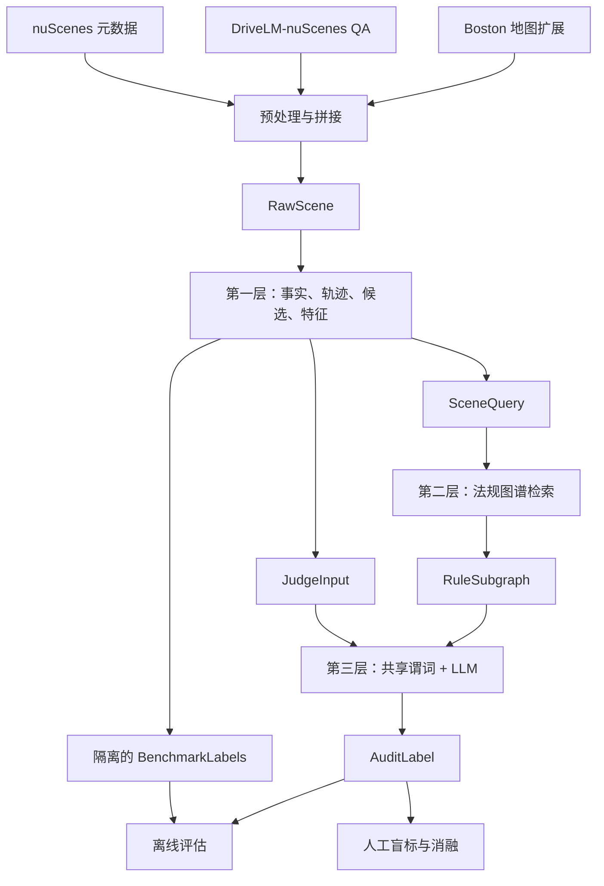

# RegGround-AV 完整项目指南：从数据到法规接地轨迹审计

> 本文面向第一次接触本项目的开发者、研究者和评审者，目标是从研究问题、数据预处理、技术选型、三层实现、实验设计、结果解释到复现操作，完整说明 RegGround-AV 当前版本。文中以仓库现有代码、冻结 v2 运行和已归档材料为准；历史设计与当前实现冲突时，以代码和冻结运行清单为准。

## 1. 先用一分钟理解项目

RegGround-AV 是一个**离线自动驾驶候选轨迹审计与偏好标注系统**。给定一个驾驶关键帧及其未来轨迹窗口，系统会：

1. 从 nuScenes、DriveLM-nuScenes 和地图中重建场景；
2. 在真实空间路径上生成多种速度行为候选；
3. 抽取信号灯、行人、对向车、停止线、冲突区等结构化事实；
4. 从法规图谱检索当前场景适用的规则；
5. 用共享几何谓词直裁证据充分的候选；
6. 把边界候选交给带法规上下文的 LLM；
7. 只在确认可接受的候选之间做成对偏好比较；
8. 输出可追溯的裁决、排序、法规引用、失败原因和运行诊断。

它解决的不是“让大模型直接开车”，而是一个更窄、更可审计的问题：**怎样自动产生可用于偏好学习或离线审计的驾驶合规标签，同时在证据不足时允许弃权。**

项目不用于车辆实时控制，输出也不代表完整交通法规意见。

## 2. 为什么要做这个项目

自动驾驶偏好数据通常有两种来源：昂贵的人工标注，或自由形式的 LLM 裁判。前者成本高，后者容易出现三类问题：

- 没有看到法规触发要件，却仍给出确定结论；
- 引用了不存在、不适用或不在当前检索集合中的规则；
- 把“信息不足”错误地压成“合规”或“违规”。

本项目的 v1 运行提供了直接证据：工程上 259/259 单元完成、零失败，但候选级 `uncertain` 达 58.4%，最终只有 13/259 单元可评分。系统“跑通”并不等于监督信号“可用”。

因此 v2 把裁决拆成三个互补角色：

- **确定性谓词**负责证据充分的极端情形；
- **法规接地 LLM**负责阈值带、语义判断和偏好排序；
- **人工盲标**负责给自动系统提供独立外部背书。

核心方法论是：**事实接地、法规接地、行为接地、有效域接地，同时保持标签隔离。**

## 3. 系统边界与术语

### 3.1 系统输入和输出

输入不是摄像头视频，而是预处理后的 `RawScene`：DriveLM 当前帧文本、nuScenes 自车位姿、3D 对象标注、对象未来轨迹和附近地图几何。

输出是 `AuditLabel`，主要包括：

- 每条匿名候选的 `cleared`、`vetoed` 或 `uncertain`；
- 最终选择的候选和完整排序；
- 成对偏好关系；
- 引用的法规编号；
- 自然语言摘要与推理步骤；
- 每阶段耗时、调用次数、重试、降级和连接异常。

### 3.2 三种裁决状态

| 状态 | 含义 | 是否参加偏好排序 |
|---|---|---:|
| `cleared` | 当前可见证据下没有硬规则阻断 | 是 |
| `vetoed` | 有充分证据违反适用硬规则，且必须引用规则 | 否 |
| `uncertain` | 证据不足、存在边界或调用降级，不能可靠二值裁决 | 否 |

`uncertain` 是安全机制，不是异常值。系统不会把它回落成 `cleared`。

### 3.3 三种统计单位

项目中容易混淆三种单位：

- **物理场景**：nuScenes 的 `scene_token`；
- **评估单元**：`scene_token × scenario_type`，同一物理场景可贡献多个法规类型；
- **候选轨迹**：一个评估单元内的 GT 与合成变体。

任何比例都应明确分母属于哪一层。

## 4. 总体架构



最关键的边界是：

- `SceneQuery` 给法规检索看结构化场景事实，不给候选坐标和 benchmark；
- `JudgeInput` 给裁判看中性事实摘要和匿名轨迹特征，不给候选来源与期望标签；
- `BenchmarkLabels` 只允许评估代码读取。

## 5. 技术选型与理由

| 组件 | 选型 | 选择原因 |
|---|---|---|
| 语言与环境 | Python 3.12、`uv` | 科学计算和数据生态成熟；锁定依赖，便于复现 |
| 数据模型 | Pydantic v2、`pydantic-settings` | 严格类型校验、不可变模型、环境变量配置；多数模型启用 `strict=True` 与 `extra="forbid"` |
| 数值计算 | NumPy 1.26 系列 | 轨迹重采样、速度剖面、曲率和几何计算；保持与 nuScenes 工具兼容 |
| 数据访问 | `nuscenes-devkit` + 自定义拼接脚本 | 使用官方数据结构，同时把运行期依赖压缩成可测试的 `RawScene` |
| 法规图谱 | YAML + NetworkX | 图规模小、规则需要人工审计；确定性内存图比向量数据库更透明、更易做精确引用 |
| LLM 接口 | OpenAI、Anthropic 和 OpenAI 兼容接口 | 同一裁判层可切换托管模型；正式 v2 使用 OpenAI 兼容方式调用 DeepSeek |
| 结构化输出 | Pydantic 响应模型 | 对轨迹编号、状态、置信度和引用进行强校验 |
| 运行日志 | 追加式 JSONL + SHA-256 清单 | 支持断点续跑、逐条审计和输入/代码/prompt 溯源 |
| 测试与静态检查 | pytest、ruff、mypy | 覆盖行为回归、代码规范和类型边界 |
| 人工标注 | XLSX + 独立 sidecar | 标注者只看到盲态信息；系统标签和候选身份保存在私有侧车文件中 |

项目没有把全部内容塞进一个 prompt，也没有使用向量相似度检索法规。原因是当前法规图只有 5 个条件、7 条规则，任务更需要确定性、可解释和可复核，而不是近似召回能力。

## 6. 原始数据从哪里来

### 6.1 nuScenes

nuScenes 提供：

- `scene`、`log`：场景与地点；
- `sample`、`sample_data`：关键帧与高频传感器帧关系；
- `ego_pose`：自车全局位置、朝向和时间戳；
- `sample_annotation`、`instance`、`category`、`attribute`：交通参与者、类别、状态和跨帧链；
- `calibrated_sensor`、`sensor`：定位 `LIDAR_TOP` 通道。

本项目只读取元数据、地图和标注，不需要在主流水线读取图像与点云文件。

### 6.2 DriveLM-nuScenes

DriveLM-nuScenes 在 nuScenes 上增加图结构问答。它不是自由聊天记录，而是围绕关键对象组织的感知、预测、规划、行为和运动 QA。

在本项目中，DriveLM 主要提供：

- 当前帧的场景自然语言描述；
- 关键对象类别和状态；
- 信号灯相位 `Status`，这是当前相位的唯一来源；
- 与 nuScenes 对齐的 `scene_token` 和 `sample_token`。

DriveLM 的灯态只代表 keyframe 的 `t=0` 快照，不包含未来相位变化。

### 6.3 nuScenes 地图扩展

Boston 地图提供：

- `stop_line`：停止线代理多边形；
- `ped_crossing`：人行横道多边形；
- `traffic_light`：交通灯位置和朝向，但不含灯态；
- `road_segment`、`lane`：路口与道路语境；
- `drivable_area`：候选可行驶区域校验。

主实验只保留 `boston-seaport`。新加坡采用左行交通，与当前右行法规假设不一致，因此永久排除，不作为缺数据时的替代来源。

## 7. 数据预处理：从原始表到 RawScene

预处理入口为 `input.py`。

### 7.1 建立索引与地点过滤

脚本读取 11 张必要的 nuScenes JSON 表，按 token 建立内存索引，并通过 `scene → log → location` 只保留 Boston Seaport 场景。

### 7.2 对齐 DriveLM

DriveLM 顶层 scene token 与 nuScenes `scene.token` 对齐，内部 keyframe token 与 `sample.token` 对齐。适配器会把 QA 展平，并规范化 `key_object_infos`，使后续层不依赖 DriveLM 原始 JSON 的多种写法。

### 7.3 重建自车轨迹

从关键帧对应的 `LIDAR_TOP` 开始，优先沿 `sample_data.next` 读取高频位姿；断链时退回 `sample.next`。每个位置保留：

- 时间戳；
- 三维平移；
- 四元数朝向。

候选裁决窗口为未来约 6 秒，候选合成可使用约 12 秒长路径素材。高频位姿通常接近 20 Hz，因此 6 秒窗口约有 120 个航点。

### 7.4 重建交通参与者轨迹

当前关键帧的每个 `sample_annotation` 会补充：

- 类别名称；
- 属性名称；
- 尺寸、位置和朝向；
- 沿 annotation `next` 链得到的未来位置序列。

这些轨迹用于计算行人或对向车辆何时进入共同冲突区。

### 7.5 裁剪附近地图

脚本为地图节点和多边形建索引，沿自车候选路径选取覆盖锚点，再保留附近约 50 米内的停止线、横道、道路、车道和可行驶区域。地图坐标仍在全局系，进入第一层后再转到关键帧自车局部坐标系。

### 7.6 RawScene 的作用

最终每个关键帧写成一个 `RawScene`，包含：

- `scene_id`、`frame_token` 和来源文件；
- DriveLM 当前帧文本与对象信息；
- 6 秒自车位姿与可选 12 秒长路径位姿；
- 附近地图记录；
- 当前对象及未来 track；
- 当前 keyframe 在位姿序列中的位置。

这样做的好处是：正式 runner 不再反复访问分散原始表，第一层的大部分组件也可以使用小型 fixture 独立测试。

## 8. 第一层：场景事实、轨迹与候选

核心入口是 `src.layer1.facade.parse_scene()`。一次调用返回 `ParsedSceneBundle`，内部包含 `SceneContext`、`SceneQuery`、`JudgeInput` 和 `BenchmarkLabels`。

### 8.1 结构化事实 SceneFacts

`SceneFactExtractor` 从三类数据生成事实：

| 字段 | 来源与语义 |
|---|---|
| `has_red_light` / `has_yellow_light` | DriveLM 交通元素的状态 |
| `traffic_light_status_source` | 灯态来自 DriveLM 还是不可得 |
| `ego_turn_intent` | 6 秒轨迹累计航向变化；左、右、直行或未知 |
| `pedestrian_in_crosswalk` | 行人是否位于地图横道 |
| `pedestrian_in_forward_crosswalk` | 行人所在横道是否与自车前进路径相交 |
| `pedestrian_moving` | 属性或跨帧位移是否支持“正在移动” |
| `oncoming_vehicle_moving` | 车辆类别、运动状态和相对朝向是否构成对向移动对象 |
| `location_is_intersection` | 地图道路段与文本共同提供的路口语境 |
| `ego_on_minor_road` | 支路/让行路段语境 |
| `conflict_zones` | 局部坐标系中的停止线、横道等多边形 |
| `ego_displacement_m` | 当前窗口内自车位移，用于低信息过滤 |
| `window_insufficient` | 航点不足 60 或有效时间不足约 6 秒 |

事实层只描述“义务是否可能触发”，不直接说“违规”。

### 8.2 场景分类与准入

`SceneTextExtractor` 结合结构化事实推断 `scenario_type`。当前正式 MVP 的主体为：

- `red_light`；
- `pedestrian`；
- `oncoming`。

准入逻辑位于 `src/admission.py`，按顺序排除：

1. yellow 和 emergency 的范围裁剪；
2. 短窗口；
3. 未知场景；
4. 自车位移小于 1 米的低信息帧；
5. 没有任何可映射到法规条件的结构化事实。

### 8.3 轨迹坐标系

`TrajectoryExtractor` 把全局位姿转换成关键帧局部坐标系：

- 原点为 keyframe 自车位置；
- x 轴沿车头前方；
- y 轴向左；
- t 为相对 keyframe 的秒数。

这种统一坐标系让不同场景可使用同一套速度、横向偏移和冲突区几何逻辑。

### 8.4 候选轨迹如何生成

每个准入单元通常产生 6 条候选：

| 类型 | 基本语义 |
|---|---|
| GT | 由真实 ego pose 重建 |
| conservative | 同一路径使用较慢速度，并在适用场景尝试在线前停车 |
| suboptimal | 同一路径使用轻微波动、犹豫式速度剖面 |
| aggressive | 同一路径使用较快速度剖面 |
| hard_case | 中段临界缓行，用于制造边界判断 |
| illegal | 根据场景改变到达时机，尝试形成明确违规 |

候选生成遵循两条重要约束：

- **不改变真实空间路径**，只修改沿路径的速度进度；
- 曲率处速度受最大横向加速度约 3.5 m/s² 限制，并通过可行驶区域门禁。

行人违规候选会进行双向时机搜索：优先尝试减速，再尝试加速，使候选到达时间落入行人占区窗口，目标 `min_time_gap_s ≤ -0.3s`。物理约束下仍无法制造违规时，标记 `no_violation_injectable`，不能移动样本池或伪造标签。

### 8.5 轨迹特征

`TrajectoryAnalyzer` 将坐标转成 LLM 可见的中性特征：

- 最大、最小、平均速度；
- 总行程、最大横向偏移和航点数；
- 是否完整停车及停车时长；
- 是否进入冲突区、进入时刻、区内最低速度；
- 分停止线/横道记录的进入、终点位置、侵入深度和线前停车；
- 中性自然语言摘要。

`AgentInteractionAnalyzer` 再为每条候选计算：

- 自车到达共同冲突区的时间；
- 行人/对向车占区时间窗；
- 最小时间间隔和最近时空距离；
- `ego_first`、`agent_first`、`temporal_overlap` 或 `no_shared_zone`。

每条候选最多保留 3 个最相关对象，控制 prompt 长度。

### 8.6 benchmark 与退化检测

候选的 `variant_type` 只是生成意图，不直接等于标签。`BenchmarkBuilder` 必须从最终几何特征重新计算 `expected_verdict`。

系统把 LLM 可见、已舍入的特征计算成哈希。若两个候选在可见层完全相同，则后生成候选标记为退化；illegal 退化时使用 `no_violation_injectable`，其他退化使用 `injection_degenerate`。短窗口、不可注入、谓词不可判和 GT 预检查失败都进入带类型的 `exclude_reason`。

### 8.7 候选匿名化与泄露隔离

`CandidateAnonymizer` 根据 seed、场景和帧 token 做确定性打乱，将内部候选改名为 `traj_a`、`traj_b` 等。第三层看不到：

- GT 或合成来源；
- conservative、illegal 等变体名；
- benchmark 期望标签；
- 原始航点坐标。

匿名 ID 与隐藏标签的映射只保存在 `BenchmarkLabels`。

## 9. 第二层：法规图谱与确定性检索

### 9.1 为什么使用图谱

法规判断不是只检索一段文字，还要表达条件、行为、参与者、后果和规则优先关系。图谱使每条规则都能回答：

- 什么条件下适用；
- 禁止什么行为；
- 约束哪些参与者；
- 违反后果是什么；
- 是否被更具体规则覆盖。

### 9.2 当前生产图谱

`data/layer2/rule_graph.yaml` 当前版本含：

- 5 个条件：红灯、黄灯、横道行人、对向车辆、支路；
- 7 条规则：3 条信号类、4 条让行类；
- hard 与 soft 两种严重度；
- 生产图当前没有 override，但代码保留完整冲突消解能力供测试和未来扩展。

图谱中的 rule ID，如 `R-SIG-01`、`R-YLD-01`，是系统引用的稳定主键；`code` 保存法规来源描述。

### 9.3 检索过程

`GraphRAGRetriever` 执行：

1. 从 `SceneFacts` 的布尔字段确定命中的 Condition；
2. 只有结构化事实完全没有命中时，才启用 DriveLM 英文关键词 fallback；
3. 按 Condition 遍历得到规则；
4. 应用 override/exception 冲突消解；
5. 返回 `RuleSubgraph`，其中保留检索模式、命中条件、规则状态、图谱版本和耗时。

结构化匹配优先于关键词，是为了避免文本中提到“left turn”就被误认为确有对向冲突。

## 10. 共享谓词与规则引擎

共享谓词位于 `src/compliance_predicates.py`，由在线 `RuleEngine` 与离线 `BenchmarkBuilder` 共用。

### 10.1 三值语义

| 结果 | 在线处理 | benchmark 处理 |
|---|---|---|
| `DECISIVE_VETO` | 规则引擎直接 `vetoed` | `expected_verdict=vetoed` |
| `DECISIVE_CLEAR` | 规则引擎直接 `cleared` | `expected_verdict=cleared` |
| `NOT_DECIDABLE` | 交给 LLM | `expected_verdict=exclude` |

不可判不等于合规，也不等于系统错误。

### 10.2 红灯停止线谓词

红灯谓词的分支为：

1. 非红灯或无本向停止线：不可判；
2. keyframe 起点已越线：不可判，禁止直接否决；
3. 红灯右转：按简化豁免交给语义层；
4. 2 秒有效窗内越线、侵入至少 0.15 米、且线前未完整停车：否决；
5. 全程未越线且线前完整停车：放行；
6. 其他缓行、临界侵入或有效窗外行为：不可判。

### 10.3 行人横道谓词

行人谓词要求前方横道内存在移动行人：

- 候选在线前完整停车：放行；
- 候选与行人在共同冲突区时间重叠且未提前停车：否决；
- 最小时间间隔大于 3 秒：放行；
- 缺交互、无共同冲突区或处于边界带：不可判。

`R-YLD-02` 对向左转让行目前没有共享直裁谓词，必须依赖 LLM 与人工验证。

### 10.4 循环性边界

规则引擎和 benchmark 共用谓词可以消除实现漂移，但也意味着自动 benchmark 不能证明谓词本身正确。故自动满分只能称为**构造一致性**，不能称为系统准确率。谓词需要人工几何盲审和 `predicate_human_agreement` 外部背书。

## 11. 第三层：法规接地 LLM 裁判

核心入口为 `AuditJudge.judge(JudgeInput, RuleSubgraph)`。

### 11.1 上下文构建

`ContextBuilder` 只使用活跃规则，按后果严重度排序，并拼接：

- 场景叙述；
- `SceneFactsDigest` 中性要件；
- hard/soft 法规文本；
- 匿名候选特征。

默认上限为 10 条候选、每类 20 条规则、8000 token。超过预算时先移除 soft rules；仍超限则失败关闭，不静默截断关键证据。

### 11.2 SceneFactsDigest

第三层只看到结构化事实的安全投影：信号相位和来源、转向意图、停止线距离、前方横道行人、行人运动状态、对向车辆和路口语境。它看不到多边形坐标、候选类型和 benchmark。

生产措辞明确写出：“信号灯相位为 keyframe 时刻 `t=0` 快照，其后相位未知”。这一有效域声明是 v2 降低虚假确定性的关键。

### 11.3 硬过滤阶段

每条候选先进入 `RuleEngine`：

- 谓词可直裁时不调用 LLM；
- 谓词不可判时，单候选调用结构化 LLM；
- `vetoed` 必须至少引用一条当前 hard rule；
- `cleared` 和 `uncertain` 不允许携带“违反规则”引用。

传输或结构化输出失败的候选进入最多 3 轮延迟清扫；最终仍失败才以 `fallback/uncertain` 保存。模型主动给出的 `uncertain` 不补跑。

### 11.4 引用校验

`CitationValidator` 校验所有 rule ID 是否属于当前活跃可引用集合。越界引用会触发修复或降级，并把首次错误引用、允许集合和终态引用写入诊断。

需要注意：`citation_validity=1` 只说明“引用 ID 在允许集合中”，不自动说明引用内容与事实完全匹配；后者是 citation accuracy，需要人工评估。

### 11.5 成对偏好排序

只有 `cleared` 候选进入 `PreferenceRanker`。系统对所有可用候选对做 LLM 比较，默认最多 45 对，并行上限 5。每次比较输出：

- preferred / dispreferred ID；
- 置信度；
- 理由；
- 参考规则。

默认使用多数胜场聚合为全序，ID 字典序只用于平分时稳定打破。`uncertain` 不进入任何 preference pair。

### 11.6 标签生成与最终一致性

`LabelGenerator` 生成简短审计摘要。`AuditLabel` 在构造时强制检查：

- 选中项必须是 `cleared`；
- `cleared` 排在 `uncertain` 前，`uncertain` 排在 `vetoed` 前；
- veto 必须引用规则；
- preference pair 不得包含 uncertain；
- 摘要中的规则引用必须被 `legal_basis` 覆盖；
- 未降级时，pair 数必须与候选组合数一致。

## 12. 运行编排、日志与恢复

`src/audit_run_logger.py` 串联三层：

1. 读取 prepared `RawScene`；
2. 如指定冻结 eval set，则校验输入 SHA、分类代码指纹和 token 完整性；
3. 第一层解析；
4. 应用 admission；
5. 第二层检索；
6. 依据 override 后活跃规则重打 benchmark；
7. 第三层裁判；
8. 追加写入 JSONL。

JSONL 包含：

- `manifest`：代码、输入、图谱、prompt、模型和评估集指纹；
- `record`：单元完整结果；
- `summary`：总量、失败、调用、选择与评估结构；
- `event`：例如断点恢复事件。

固定输出路径支持按 `frame_token` 恢复，但只能恢复同一代码和输入语义的运行。发现影响结果的 bug 后必须新建版本并从头跑，不能拼接两个 commit 的结果。

## 13. 冻结评估集是怎样生成的

### 13.1 评估单元选择

`availability_spike` 与正式 runner 共用分类和 admission 代码。冻结过程：

1. 排除 10 个用于开发的 nuScenes mini 场景；
2. 对每个 `scene_token × scenario_type` 分组；
3. 选择 6 秒窗口内自车位移最大的 frame；
4. 平手时取更早时间戳，再按 token 字典序；
5. 双跑并要求报告和 eval set 逐字节一致；
6. 保存输入 SHA、分类代码 SHA、生成 commit 和选择规则。

选择过程没有随机性；seed 42 只用于候选生成和匿名化。

### 13.2 v2 的三级规模

冻结列表有 259 个评估单元。v2 准入结果为：

- 85 个进入裁判；
- 174 个跳过：unknown 109、短窗口 47、yellow 12、emergency 6；
- 85 个裁判单元生成 510 条候选裁定，即每单元 6 条候选。

85 个单元中，58 个属于结构可评分池，其中 20 个形成至少一对明确 cleared/vetoed 候选；另 27 个属于结构不可评分池。覆盖比例只是版本基线，不是 pass/fail 指标。

## 14. 评估指标如何解释

### 14.1 裁决指标

- 违规检出率；
- 错误否决率；
- 弃权率；
- 按 `scenario_type × difficulty` 分层；
- 按 `decided_by=rule_engine/llm/fallback` 分层。

### 14.2 选择指标

- `illegal_chosen`：是否选择了已否决候选；
- `chosen_acceptable_rate`：是否选入可接受集合；
- GT top-1/top-2：只作为参考，不假设 GT 是唯一最优；
- 无可选候选数。

### 14.3 引用指标

- citation validity：引用是否属于允许集合；
- citation accuracy：引用是否真实适用当前事实；
- citation repair：拦截层是否修改了越界引用；
- hallucination rate：在消融中结合 validity 与人工适用性评级。

### 14.4 人工一致性指标

- 三分类 Cohen’s kappa；
- 偏好对一致率；
- 选择 top-1 一致率；
- Kendall’s tau；
- 谓词与人工的 agreement。

## 15. 冻结 v2 的主要结果

### 15.1 运行规模

- 259 个冻结单元全部处理，零失败；
- 85 个单元进入裁判；
- 墙钟时间 4.14 小时；
- 795 次 LLM 调用：hard filter 382、pairwise 328、label 85；
- 输入约 174 万 token，输出约 101 万 token；
- 510 条候选中，规则引擎裁 128 条，LLM 裁 382 条。

### 15.2 行为结果

- 总 `uncertain`：176/510，34.5%；
- 行人场景 `uncertain`：8.3%，v1 为 71.3%；
- 红灯：42.7%；
- 对向车：22.6%；
- selected 71 个，无可选候选 14 个；
- illegal-chosen 为 0/85。

118 条决定性 benchmark 期望全部由规则引擎裁决，自动 VDR=1、FVR=0、pair=58/58 是同源构造结果，只能报告为构造一致性。

### 15.3 保守偏好

被选中的 71 条候选中，conservative 为 39 条，占 55%。这是合规优先和防御性偏好权重的结果，不是直接的软件错误，但可能把下游偏好学习推向过度保守驾驶。阻塞、通行效率和后车追尾风险尚未通过权重敏感性实验验证。

## 16. 影子评估：为什么仍需要 LLM

影子评估在 118 条规则引擎决定性候选上关闭规则引擎，保持输入与 benchmark 不变，让 LLM 独立判断：

- 一致率 81/118，68.6%；
- 弃权 36/118，30.5%；
- 排除弃权后一致率 81/82，98.8%；
- false veto 为 0；
- 行人轴一致率 88.9%，红灯轴 59.8%。

这表明 LLM 的主要弱点是审慎弃权，尤其集中在红灯相位有效域，而不是大量错误否决。它也证明 LLM 仍承担了生产系统 75% 的候选裁决和全部成对偏好排序，规则引擎并没有取代 LLM。

## 17. 人工盲标体系

人工标注坚持“输入对齐”：标注者只看系统裁判可见的 `JudgeInput`，不是全知地查看隐藏坐标和 benchmark。

当前标注设计包括：

- 8 行校准轮，不进入正式统计；
- 180 条核心 verdict 样本：144 条来自 LLM 主池，36 条来自谓词层；
- 20 条压力案例，与核心样本混洗成 200 行；
- borderline 占 54/180，即 30%；
- 36 场偏好工作簿；
- 5 条措辞敏感补充仲裁样本。

系统真实标签、候选来源与抽样原因保存在 `private/` sidecar，不能发给标注者。回收后先校验工作簿完整性，再计算 IAA，最后合议生成 gold。

仓库已存在标注回收文件和合议骨架，但在最终校验、IAA 与合议 gold 完整归档前，不应对外报告人工准确率。

## 18. 2×2 消融实验

消融只研究 LLM 环节中的两个机制：法规检索和引用回校验。四条件为：

| 条件 | 法规检索 | 引用校验 |
|---|---:|---:|
| full | 开 | 强制 |
| no_validation | 开 | 只观察 |
| no_rag | 关 | 强制 |
| baseline | 关 | 只观察 |

四条件全部关闭规则引擎，保证同一批候选都由 LLM 判断。模型、温度、候选顺序、digest 和其他配置保持一致。

正式单元来自 verdict 与 preference 人工 gold 的 frame 并集，共 82 个 frame 单元。只有 gold 冻结后才能计算 kappa、tau、citation accuracy 和 hallucination rate；dry-run 数字不得进入论文结果。

## 19. 可复现性与质量门禁

### 19.1 依赖安装

```bash
uv sync --extra dev
```

### 19.2 本地检查

```bash
PYTHONDONTWRITEBYTECODE=1 uv run pytest -q
PYTHONDONTWRITEBYTECODE=1 uv run ruff check src tests
PYTHONDONTWRITEBYTECODE=1 uv run mypy --explicit-package-bases src
git diff --check
```

冻结 v2 实现核验曾记录 318 passed、ruff 通过、51 个源文件 mypy 零错误。但全仓覆盖率为 74.76%，低于配置的 85% 门槛；该事实不能被忽略或通过调整 omit 规避。

### 19.3 准备 RawScene

```bash
uv run python input.py \
  --source-root /实际路径/nuScenes/v1.0-trainval \
  --drivelm-qa-path /实际路径/DriveLM/v1_0_train_nus.json \
  --map-expansion-path /实际路径/MapExpansion/boston-seaport.json \
  --output data/layer1/raw_scene_trainval.json \
  --horizon-s 6 \
  --path-horizon-s 12 \
  --min-poses 20
```

### 19.4 冒烟运行

```bash
uv run python -m src.audit_run_logger \
  --input data/layer1/raw_scene_dataset_mini.json \
  --serial \
  --limit 10 \
  --output logs/mini_smoke.jsonl
```

真实 LLM 运行前必须设置服务商、模型、地址和密钥。密钥不得进入 README、日志、manifest 或 Git。

### 19.5 正式运行

```bash
export LAYER3_LLM_API_KEY=实际密钥
bash scripts/run_regground_v2_1.sh logs/eval_set_v2_new.jsonl
```

脚本固定使用 `data/layer1/raw_scene_trainval.json`、`artifacts/eval_set_v1.json`、seed 42 和串行模式，结束后以 benchmark v2 生成报告。

## 20. 当前已知问题与论文边界

### 20.1 A133 停止线几何口径

当前 `governing_stop_line_signed_m` 的实现与字段所声明的“沿车头方向、停止线法向有符号投影”不一致；侵入深度也实际计算为多边形内部点到任意边的最近欧氏距离。该问题还影响 conservative 候选的停车目标，因此不能只改显示文字。

修复必须：

- 升级版本；
- 重新生成候选；
- 重跑 benchmark 和正式实验；
- 与冻结 v2 分开统计。

### 20.2 对向车辆有效证据缺失

某些场景中 `oncoming_vehicle_moving=true`，但没有可渲染的对向车共同冲突区交互。若缺失被静默省略，LLM 可能把“没看到危险数字”误当作“安全”。后续应显式渲染“交互证据不可得”。

### 20.3 规则触发粒度

图谱条件 `C-ONCOMING-STRAIGHT` 当前主要绑定 `oncoming_vehicle_moving`，没有把自车必须左转直接写入 condition 的 `fact_keys`。这可能召回不适用的左转让行规则，限制 citation precision。

### 20.4 地域与法规简化

- 中国右行法规语义与 Boston 道路几何组合属于概念验证；
- 红灯右转按简化豁免处理；
- yellow 与 emergency 不进入主聚合指标；
- 当前图谱不代表完整法规库。

### 20.5 数据与模型限制

- DriveLM 相位只有瞬时快照；
- 对向场景没有共享直裁谓词；
- 托管模型可能发生版本漂移且通常不提供完全可复现 seed；
- 尚未用这些标签完成下游 DPO/RLAIF 训练并证明真实驾驶收益；
- 过度保守偏好尚未进行系统权重敏感性分析。

## 21. 新开发者建议阅读顺序

1. 先读本文和根目录 `README.md`；
2. 查看 `src/layer1/models.py`，建立数据模型全貌；
3. 跟读 `parse_scene()`，理解第一层数据流；
4. 查看 `data/layer2/rule_graph.yaml` 和 `GraphRAGRetriever`；
5. 查看 `compliance_predicates.py` 与 `RuleEngine`；
6. 跟读 `AuditJudge.judge()`；
7. 查看冻结日志的一条 `record` 和最终 `summary`；
8. 最后读人工标注、影子评估和 A133 材料。

## 22. 常见误解

### “有规则引擎，为什么还要 LLM？”

规则引擎只处理证据充分的红灯/行人极端样本。冻结 v2 中 382/510 候选仍由 LLM 裁决，328 次偏好比较也全部由 LLM 完成。

### “citation validity 是 1，是否代表没有幻觉？”

不是。它只证明 rule ID 没有越过允许集合；事实支持是否准确、规则是否真正适用，还需 citation accuracy 和人工审查。

### “illegal 变体一定是违规标签吗？”

不是。variant 只是生成意图，最终标签必须由几何特征重算；注入失败时明确 exclude。

### “GT 一定是最优轨迹吗？”

不是。真实驾驶轨迹可能合法但不最优，也可能因为关键帧切点或代理几何无法评分。本项目使用可接受集合，不把 GT 当唯一答案。

### “uncertain 越少越好吗？”

不一定。合理弃权说明系统识别了信息边界。目标是减少可避免的弃权，同时不把真实欠定问题压成虚假确定结论。

## 23. 关键文件索引

| 文件或目录 | 作用 |
|---|---|
| `input.py` | 原始 nuScenes、DriveLM、地图拼接 |
| `src/layer1/facade.py` | 第一层总入口 |
| `src/layer1/models.py` | 第一层与跨层数据模型 |
| `src/layer1/scene_fact_extractor.py` | 结构化事实 |
| `src/layer1/trajectory_augmentor.py` | 候选速度剖面合成 |
| `src/layer1/trajectory_analyzer.py` | 候选几何与行为特征 |
| `src/layer1/agent_interaction.py` | 行人/对向车时空交互 |
| `src/layer1/benchmark_builder.py` | 候选 benchmark 构造 |
| `data/layer2/rule_graph.yaml` | 生产法规图谱 |
| `src/layer2/retriever.py` | 图谱检索编排 |
| `src/compliance_predicates.py` | 共享合规谓词 |
| `src/layer3/judge.py` | 第三层总入口 |
| `src/layer3/hard_filter.py` | 规则引擎与 LLM 候选裁决 |
| `src/layer3/preference_ranker.py` | 成对偏好排序 |
| `src/audit_run_logger.py` | 正式运行和 JSONL 日志 |
| `src/evaluation_report.py` | 分层评估 |
| `human_annotation_v2/` | 人工盲标与 gold 流程 |
| `experiments/ablation_2x2/` | 2×2 消融实验臂 |
| `paper/A133_停止线几何口径_论文补充素材.md` | 当前几何缺陷和影响分析 |

## 24. 相关文档

- `README.md`：日常开发入口；
- `docs/论文素材汇总_v2.md`：冻结 v2 数字与论文口径；
- `docs/RegGround-AV_修订实现手册_v2.0.md`：v2 修订规格；
- `docs/RegGround-AV_实验配置_v2.0.md`：冻结实验参数；
- `docs/RegGround-AV_v2_实现核验记录.md`：工程核验；
- `human_annotation_v2/README.md`：人工盲标协议；
- `experiments/ablation_2x2/README.md`：消融正式操作；
- `results/shadow_no_rule_engine_v2/agreement_report.md`：影子评估结果。

---

本文档描述的是当前仓库和冻结 v2 的真实状态。后续若完成 A133 修复、人工 gold 或正式消融，应同步更新版本口径、关键数字和“当前状态”，但不得覆盖或回写冻结 v2 的历史结果。
